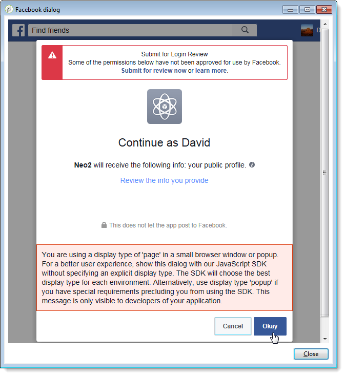
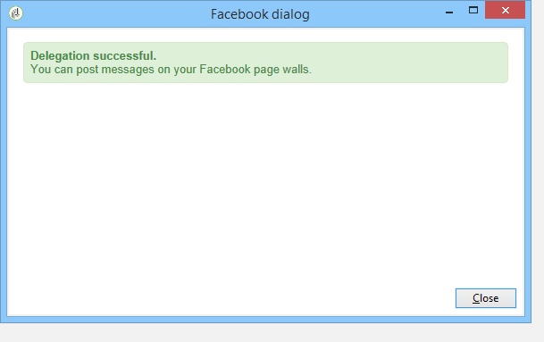

# 在 Facebook 動態上發佈{#publishing-on-facebook-walls}

為了讓Adobe Campaign能夠將出版物傳送至Facebook塗鴉牆，您需要將這些頁面的寫入存取權委派給Adobe Campaign。 這包括下列設定步驟：

1. 使用一或多個頁面建立Facebook帳戶。
1. 建立用於傳送校樣的測試Facebook頁面。
1. 建立 Facebook 應用程式.
1. 在Adobe Campaign中輸入Facebook應用程式設定，位於 **[!UICONTROL Facebook routing]** 外部帳戶。

## 先決條件 {#prerequisites}

首先，請建立Facebook帳戶和數個頁面：這些將用於發送出版物。

* 若要建立Facebook帳戶，請使用 [https://www.facebook.com](https://www.facebook.com) 連結。
* 若要建立Facebook頁面，請使用 [https://www.facebook.com/pages/create](https://www.facebook.com/pages/create) 連結。

   建議您使用相同的Facebook帳戶管理所有頁面。 這樣，您只需要一個Facebook應用程式和一個外部帳戶，即可在帳戶的所有頁面上寫入。

   

## 建立測試Facebook頁面 {#creating-a-test-facebook-page}

建議您建立私人Facebook頁面以傳送發佈校樣(如需詳細資訊，請參閱 [本節](../../social/using/publishing-on-facebook.md#sending-the-proof).

1. 登入您用來管理頁面的Facebook帳戶。
1. 建立新的Facebook頁面。
1. 按一下 **[!UICONTROL Settings]** 按鈕。
1. 在 **[!UICONTROL General]** 頁簽，修改頁面的可見性參數：檢查 **[!UICONTROL Page unpublished]** 框。
1. 按一下 **[!UICONTROL Save Changes]** 按鈕。

## 建立 Facebook 應用程式 {#creating-a-facebook-application}

為了讓Adobe Campaign能夠在您頁面的塗鴉牆上發佈，您需要建立Facebook應用程式。 若要這麼做，請套用下列步驟：

1. 登入您用來管理頁面的Facebook帳戶。
1. 在您的瀏覽器中輸入下列地址： [https://developers.facebook.com/apps](https://developers.facebook.com/apps).

   >[!CAUTION]
   >
   >根據您擁有的帳戶類型，可能需要一個或多個授權。
   >
   >若要建立Facebook應用程式，您需要 **已驗證** Facebook帳戶。

1. 按一下 **[!UICONTROL Add a New App]** 按鈕。 輸入應用程式名稱和聯絡人電子郵件，然後傳遞安全性檢查。

   

1. 在 **[!UICONTROL Settings > Basic]**，按一下 **[!UICONTROL Add a platform]** ，然後選取 **[!UICONTROL Facebook Web Games]** 類型。

   

1. 在 **[!UICONTROL Products]** 區段中，檢查您是否看到 **[!UICONTROL Facebook Login]** 產品。 否則，請新增新產品並選取 **[!UICONTROL Facebook Login]**.

   

1. 建立應用程式後，選取 **[!UICONTROL App Review]** 標籤並發佈應用程式。

   

## 委派寫入存取權至Adobe Campaign {#delegating-write-access-to-adobe-campaign}

若要委派Adobe Campaign的寫入存取權以張貼至頁面的塗鴉牆上，您必須輸入先前建立之Facebook應用程式的參數。

此步驟需要同時存取您的Adobe Campaign主控台和登入Facebook帳戶（您用於頁面管理）的網際網路瀏覽器：

>[!CAUTION]
>
>Adobe Campaign運算子必須擁有執行此設定的管理權限。

* **Facebook**:選取先前建立的應用程式( [https://developers.facebook.com/apps](https://developers.facebook.com/apps))，然後選取 **[!UICONTROL Settings > Basic]** 標籤。

   

   >[!NOTE]
   >
   >若 **[!UICONTROL Facebook Web Games]** 區段，請按一下 **[!UICONTROL Add Platform]** 按鈕，然後選擇 **[!UICONTROL Facebook Web Games]**.

* **Adobe Campaign**:前往 **[!UICONTROL Administration > Platform > External Accounts]** 樹的節點，選擇 **[!UICONTROL Facebook routing]** 外部帳戶，然後按一下 **[!UICONTROL Connector]** 標籤。

   

1. 在Adobe Campaign主控台中，複製 **[!UICONTROL Secure Canvas URL]** 欄位並貼入 **[!UICONTROL Secure Web Games URL (https)]** facebook欄位(在 **[!UICONTROL Facebook Web Games]** 區段)。

   

   >[!CAUTION]
   >
   >您在任何情況下都不得使用不安全的URL。

   複製此URL並貼到 **[!UICONTROL Products]** > **[!UICONTROL Facebook Login]** > **[!UICONTROL Settings]** > **[!UICONTROL Valid OAuth Redirect URIs]**. 若要檢查URL是否有效，請儲存應用程式，複製URL並貼到 **[!UICONTROL Redirect URI to Check]** 欄位並按一下 **[!UICONTROL Check URI]**.

   

1. 在Facebook上，複製 **[!UICONTROL App ID]** 和 **[!UICONTROL App Secret]** 欄位，並貼到主控台的相符欄位中。

   

1. 在Facebook上，按一下 **[!UICONTROL Save Changes]** 按鈕。
1. 前往Adobe Campaign主控台，儲存外部帳戶。

   >[!NOTE]
   >
   >此 **[!UICONTROL Marketing URL]** 欄位為選填。

1. 在Adobe Campaign主控台中，按一下 **[!UICONTROL Request the authorization from the application]** 連結 **[!UICONTROL Connector]** 標籤。 此 **[!UICONTROL Synchronize Facebook pages]** 工作流程會自動觸發，並收集管理員管理的所有Facebook頁面。 [深入瞭解](#synchronizing-facebook-pages)。

   

   >[!NOTE]
   >
   >依預設，頁面會新增至 **[!UICONTROL Facebook]** 服務資料夾，可透過 **[!UICONTROL Profiles and Targets > Services and Subscriptions]** 節點。 此 **[!UICONTROL Folder]** 欄位 **[!UICONTROL Connector]** 標籤中，您可以變更同步後建立Facebook頁面的服務資料夾。 您也可以選取要在Adobe Campaign中同步的Facebook頁面，這要感謝 **[!UICONTROL Filter]** 欄位。 如果將此欄位留空，管理員管理的所有Facebook頁面都會同步。

1. 隨即顯示對話方塊，其中包含各種Facebook權限設定。 這可讓Adobe Campaign將出版物傳送至Facebook帳戶頁面。

   接受各種權限要求。

   

1. Adobe Campaign有權在Facebook帳戶頁面的塗鴉牆上發佈。

   

>[!NOTE]
>
>如果Facebook帳戶管理數個頁面，只需設定一個外部帳戶，以便在Facebook帳戶的任何頁面上寫入即可。 對於每個新的Facebook帳戶，您需要建立新 **[!UICONTROL Routing]** 輸入外部帳戶。

此 **[!UICONTROL Synchronization of Facebook pages]** 工作流程會同步由Facebook帳戶管理的所有頁面，讓您透過Adobe Campaign直接張貼在其塗鴉牆上。 [深入瞭解](#synchronizing-facebook-pages)。

## 同步Facebook頁面 {#synchronizing-facebook-pages}

此 **[!UICONTROL Synchronization of Facebook pages]** 工作流程，可透過 **[!UICONTROL Administration > Production > Technical workflows > Managing social networks]** 節點，可讓您同步(在Adobe Campaign中)先前設定之Facebook帳戶的頁面。 依預設，此工作流程會設定為每天或每當管理員按一下 **[!UICONTROL Request an authorization from the application]** 「服務配置」螢幕中的連結。 [深入瞭解](#delegating-write-access-to-adobe-campaign)。

同步完成後，收集的頁面會顯示在外部帳戶中輸入的服務資料夾中。 [了解更多](#delegating-write-access-to-adobe-campaign)).

依預設，頁面會新增至的根 **[!UICONTROL Facebook]** 可透過 **[!UICONTROL Profiles and Targets > Services and subscriptions]** 功能表。

您現在可以直接透過Adobe Campaign在Facebook頁面的塗鴉牆上發佈。 [深入瞭解](#publishing-on-facebook-walls)。
