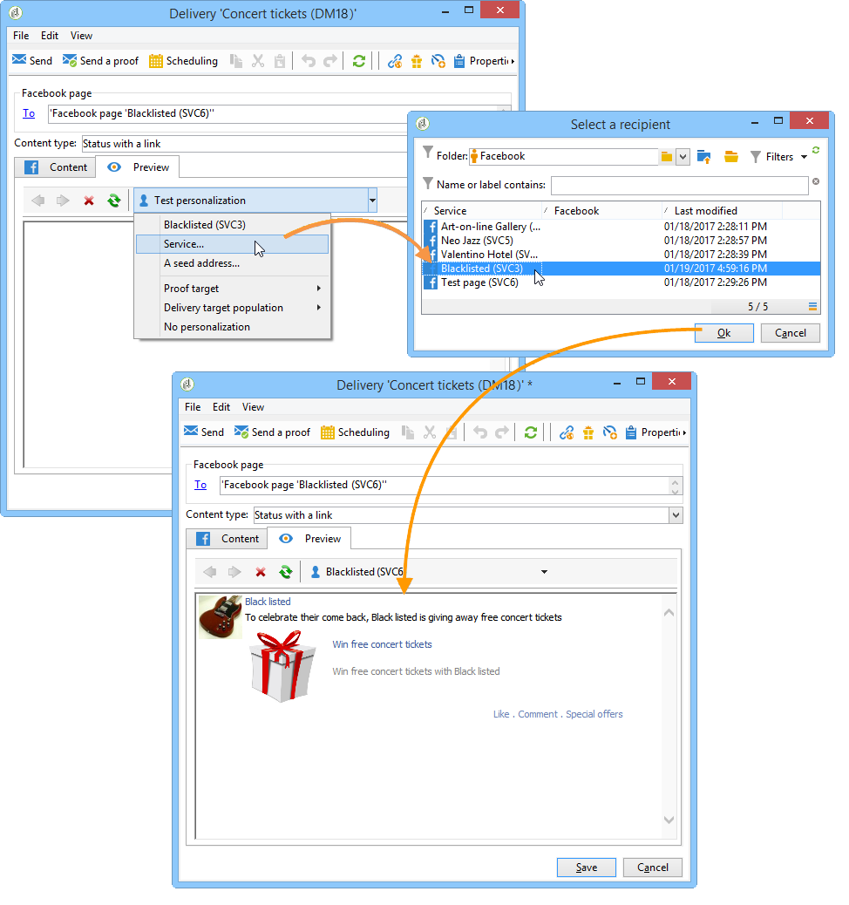

# 在 Facebook 上發佈{#publishing-on-facebook}

完成設定後， Social Marketing可讓您將出版物張貼在Facebook頁面的塗鴉牆上。

## 限制 {#limitations}

facebook固有下列限制。

* 訊息不得超過1,000個字元。
* 不支援HTML。

## 建立傳送 {#creating-the-delivery}

使用&#x200B;**[!UICONTROL Publish to a brand page]**&#x200B;傳遞範本建立新傳遞。

## 選擇主目標{#selecting-the-main-target}

您需要選取要張貼出版物的頁面。

1. 按一下&#x200B;**[!UICONTROL To]**&#x200B;連結。

   

1. 按一下 **[!UICONTROL Add]** 按鈕。

   

1. 選取 **[!UICONTROL A Facebook page]**。

   

1. 在&#x200B;**[!UICONTROL Folder]**&#x200B;欄位中，選取包含Facebook頁面的服務資料夾。 預設情況下，頁面儲存在&#x200B;**[!UICONTROL Facebook]**&#x200B;服務資料夾的根目錄中。 然後選取您要張貼的Facebook頁面。

   

## 選擇校樣目標{#selecting-the-proof-target}

**[!UICONTROL Target of the proofs]**&#x200B;標籤可讓您定義要在傳送出去之前，用於測試傳送的Facebook頁面。 為此，建議您建立專用的Facebook私人頁面。 如需建立私人Facebook頁面的詳細資訊，請參閱[建立測試Facebook頁面](../../social/using/publishing-on-facebook-walls.md#creating-a-test-facebook-page)。 若要選取校樣目標，請套用與主要目標相同的步驟：[選擇主目標](#selecting-the-main-target)。

>[!NOTE]
>
>如果您對所有傳送使用相同的Facebook測試頁面，可以在&#x200B;**[!UICONTROL Publish to a brand page]**&#x200B;傳送範本中儲存校樣目標，該範本可透過&#x200B;**[!UICONTROL Resources > Templates > Delivery templates]**&#x200B;節點存取。 預設會為每個新傳送輸入校樣目標。

## 定義對象{#defining-the-audience}

如果您想使用本機區段來調整已授權檢視出版物的公開類型，建議您為每個區段建立一個Facebook頁面(例如：Adobe Campaign巴黎、Adobe Campaign倫敦等)。

不過，您也可以使用Facebook使用的對象篩選條件。 **[!UICONTROL Select target window]**&#x200B;的&#x200B;**[!UICONTROL Audience]**&#x200B;標籤提供四個篩選器：

* **[!UICONTROL Country]**
* **[!UICONTROL Regions]**
* **[!UICONTROL Cities]**
* **[!UICONTROL Languages]**

>[!IMPORTANT]
>
>請謹慎使用此函式。 在傳送報表中，**[!UICONTROL Number of fans]**&#x200B;指標不會考慮這些Facebook篩選器。
>
>Facebook可能會變更對象篩選器清單及其值。

## 定義訊息內容{#defining-message-content}

使用&#x200B;**[!UICONTROL Content type]**&#x200B;下拉式選單選取發佈類型。

可使用下列類型的傳送：

* a **[!UICONTROL Status]**
* a **[!UICONTROL Status with a link]**
* a **[!UICONTROL Status with a YouTube link]**
* a **[!UICONTROL Photo album]**

### 發佈狀態{#publishing-a-status}

狀態類型傳送只能包含文字，如下列範例所示：

在輸入區域中輸入發佈狀態。

### 發佈具有連結{#publishing-a-status-with-a-link}的狀態

具有連結的狀態類型傳遞可包含文字、影像和連結。 下節詳細說明傳送編輯畫面欄位與Facebook上最終發佈之間的對稱性：

輸入各種欄位：

>[!IMPORTANT]
>
>所有URL都必須以&#x200B;**&quot;http://&quot;**&#x200B;或&#x200B;**&quot;https://&quot;**&#x200B;開頭。

1. 在&#x200B;**[!UICONTROL Status]**&#x200B;欄位中，輸入將顯示在頁面名稱下的文字。
1. 在&#x200B;**[!UICONTROL Name]**&#x200B;欄位中，輸入發佈標題。
1. 在&#x200B;**[!UICONTROL Link]**&#x200B;欄位中，輸入發佈指向的URL。

   >[!NOTE]
   >
   >如果您想將&#x200B;**[!UICONTROL Link]**&#x200B;欄位新增至Facebook應用程式的URL以加以促銷，建議您將其調整為符合智慧型手機顯示條件：
   >
   >1. 選擇Facebook應用程式[https://developers.facebook.com/apps](https://developers.facebook.com/apps)，然後選擇&#x200B;**[!UICONTROL Settings > Basic]**&#x200B;頁簽。
   >1. 輸入&#x200B;**[!UICONTROL Namespace]**&#x200B;欄位。
   >1. 輸入&#x200B;**[!UICONTROL Mobile Site URL]**&#x200B;欄位：當使用者按一下智慧型手機上的發佈連結時，Facebook會自動將他們重新導向至此欄位中定義的URL。
   >1. 建立您的Web應用程式，讓Facebook顯示器根據所使用裝置（智慧型手機或PC）的功能個人化。
   >1. 透過Adobe Campaign主控台前往發佈的&#x200B;**[!UICONTROL Link]**&#x200B;欄位，輸入&#x200B;**[!UICONTROL Canvas page]**&#x200B;欄位的URL。

1. 在&#x200B;**[!UICONTROL Image]**&#x200B;欄位中，輸入要顯示在發佈左側的影像URL。

   >[!IMPORTANT]
   >
   >影像必須托管於公開網際網路網站，Facebook才能上傳。

1. 在&#x200B;**[!UICONTROL Caption]**&#x200B;欄位中，輸入要出現在發佈結尾的文字。
1. 前往&#x200B;**[!UICONTROL Description]**&#x200B;欄位，並輸入要顯示在標題下的文字。

### 使用YouTube連結{#publishing-a-status-with-a-youtube-link}發佈狀態

此類內容可讓您發佈YouTube影片的連結。 就像具有一般連結的狀態一樣，您可以定義狀態、名稱、註解、說明和其他連結。 影像由Facebook自動新增。 傳遞編輯螢幕的欄位與Facebook上最終出版物之間的對稱性詳述如下：

輸入各種欄位：

>[!IMPORTANT]
>
>所有URL都必須以&#x200B;**&quot;http://&quot;**&#x200B;或&#x200B;**&quot;https://&quot;**&#x200B;開頭。

1. 在&#x200B;**[!UICONTROL Status]**&#x200B;欄位中，輸入將顯示在頁面名稱下的文字。
1. 在&#x200B;**[!UICONTROL Name]**&#x200B;欄位中，輸入發佈標題。
1. 在&#x200B;**[!UICONTROL Video code]**&#x200B;欄位中，輸入YouTube視訊的程式碼。 例如，對於&#39;https://www.youtube.com/watch?v=abc123456&#39;連結，視訊程式碼為&#39;abc123456&#39;。
1. 在&#x200B;**[!UICONTROL Caption]**&#x200B;欄位中，輸入要出現在發佈結尾的文字。
1. 前往&#x200B;**[!UICONTROL Description]**&#x200B;欄位，並輸入要顯示在標題下的文字。

### 發佈相簿{#publishing-a-photo-album}

這類內容可讓您發佈相簿。 您可以新增相簿的名稱和說明，以及每張像片的註解。 傳遞編輯螢幕的欄位與Facebook上最終出版物之間的對稱性詳述如下：

輸入各種欄位：

1. 首先，輸入&#x200B;**[!UICONTROL Album name]**。
1. 然後輸入要顯示在照片上方的&#x200B;**[!UICONTROL Description]**。
1. 要添加照片，請按一下&#x200B;**[!UICONTROL Add]**&#x200B;按鈕，選擇照片，然後按一下&#x200B;**[!UICONTROL Open]**。
1. 每張像片都可新增註解。

## 預覽 {#previewing}

**[!UICONTROL Preview]**&#x200B;標籤可讓您檢視發佈的呈現。

1. 按一下&#x200B;**[!UICONTROL Preview]**&#x200B;標籤。
1. 按一下&#x200B;**[!UICONTROL Test personalization]**&#x200B;下拉式功能表，然後選取&#x200B;**[!UICONTROL Service]**。
1. 在&#x200B;**[!UICONTROL Folder]**&#x200B;欄位中，選取包含Facebook頁面的服務資料夾。 預設情況下，頁面會儲存在&#x200B;**[!UICONTROL Facebook]**&#x200B;服務資料夾的根目錄中。
1. 選取您要測試預覽的Facebook頁面。

>[!NOTE]
>
>預覽可能會與最終的Facebook出版物稍有不同。 我們強烈建議在最終傳送前傳送校樣，以精確轉譯發佈。 請參閱[傳送校樣](#sending-the-proof)。

## 配置跟蹤{#configuring-tracking}

您可以在傳送報告及傳送與服務的&#x200B;**[!UICONTROL Edit > Tracking]**&#x200B;標籤中檢視追蹤。

傳送中所含URL的點按次數由Adobe Campaign測量。 按&#x200B;**[!UICONTROL Like]**&#x200B;按鈕的點按次數、留言數和風扇數由Facebook測量。

追蹤設定與電子郵件傳送的相同。 如需詳細資訊，請參閱[本章節](../../delivery/using/about-delivery-monitoring.md)。

>[!NOTE]
>
>在&#x200B;**[!UICONTROL Publish to a brand page]**&#x200B;傳遞範本中，預設會啟用追蹤。

## 傳送校樣{#sending-the-proof}

我們強烈建議您在最終傳送前傳送出版物的校樣，以在私人Facebook測試頁面上檢視出版物的確切轉譯。 如需建立私人Facebook測試頁面的詳細資訊，請參閱[建立測試Facebook頁面](../../social/using/publishing-on-facebook-walls.md#creating-a-test-facebook-page)。 在[選取校樣目標](#selecting-the-proof-target)中會詳細說明選取目標校樣的步驟。

校樣傳送與電子郵件傳送相同。 請參閱[本節](../../delivery/using/steps-validating-the-delivery.md#sending-a-proof)。

## 傳送訊息{#sending-the-message}

1. 內容獲核准後，按一下&#x200B;**[!UICONTROL Send]**&#x200B;按鈕。
1. 選擇&#x200B;**[!UICONTROL Deliver as soon as possible]**&#x200B;並按一下&#x200B;**[!UICONTROL Analyze]**&#x200B;按鈕。

   >[!NOTE]
   >
   >**[!UICONTROL Postpone the delivery]**&#x200B;選項可讓您將傳送延遲至之後的日期。

   

1. 分析完成後，檢查結果。
1. 按一下&#x200B;**[!UICONTROL Confirm delivery]**，然後按一下&#x200B;**[!UICONTROL Yes]**。

   
