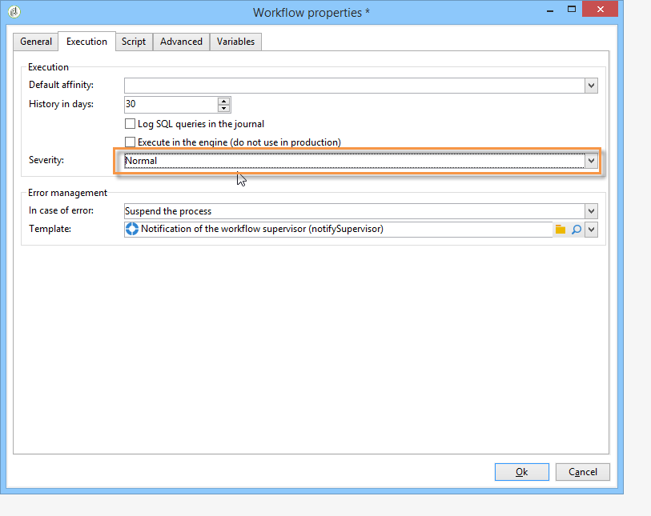

# 開始工作流程{#starting-workflows}

透過&#x200B;**[!UICONTROL Administration > Production > Technical workflows > Managing social networks]**&#x200B;節點存取的&#x200B;**[!UICONTROL Managing social networks]**&#x200B;工作流程可讓您將Adobe Campaign與Twitter和Facebook同步。

第一次使用Social Marketing時，系統會預設停止這些工作流程。 按一下工具列中的&#x200B;**[!UICONTROL Start]**&#x200B;按鈕以啟動它們。

如果您不想使用某個社交網路，建議您不要開始相符的工作流程。 為避免收到說明生產工作流程已停止的警告，請在相關工作流程屬性的&#x200B;**[!UICONTROL Execution]**&#x200B;標籤中選取嚴重性層級&#x200B;**[!UICONTROL Normal]**。

