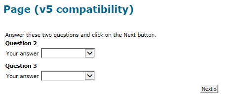

# 設計調查{#building-a-survey}

## 建立新調查 {#creating-a-new-survey}

本章詳細說明 **調查** 使用Adobe Campaign輸入表單，以及可用的選項和設定。 Adobe Campaign可讓您讓使用者能使用此調查，並在資料庫中收集和封存答案。

網路表單可透過 **[!UICONTROL Resources > Online > Web applications]** 樹的節點。 若要建立調查，請按一下 **[!UICONTROL New]** 按鈕，或按一下右鍵該清單並選擇 **[!UICONTROL New]**.

選取調查範本(**[!UICONTROL newSurvey]** )。

表單的頁面是使用特殊編輯器建立，可讓您定義和設定（文字）輸入欄位、選取欄位（清單、核取方塊等） 和靜態元素(影像、HTML內容等)。 可以在「容器」中收集，並根據需求排布。 [了解更多](#adding-questions)).

>[!NOTE]
>
>有關如何定義內容和建立網頁表單螢幕佈局的詳細資訊，請參閱 [此文檔](../../web/using/about-web-forms.md).

## 新增欄位 {#adding-fields}

表單中的欄位可讓使用者輸入資訊並選取選項。 對於表單中的每個頁面，都會透過工具列中的第一個按鈕，使用 **[!UICONTROL Add using the wizard]** 功能表。

>[!NOTE]
>
>您也可以按一下滑鼠右鍵並插入輸入區域。 預設情況下，區域將插入到選定樹的末端。 使用工具列中的箭頭來移動它。

### 欄位類型 {#types-of-fields}

將欄位新增至調查時，您需要選取其類型。 可以使用以下選項：

1. **[!UICONTROL Answer a question]**:此選項可讓您宣告新欄位（稱為「已封存欄位」）以儲存答案。 在這種情況下，即使參與者多次填入表單，也會保存所收集的所有值。 此儲存模式僅在 **調查**. [了解更多資訊](../../surveys/using/managing-answers.md#storing-collected-answers)。
1. **[!UICONTROL Edit a recipient]**:此選項可讓您選取資料庫中的欄位。 在這種情況下，用戶答案將儲存在此欄位中。 對於每個參與者，僅保留最後保存的值，並將其添加到配置檔案資料中。
1. **[!UICONTROL Add a variable]**:此選項可讓您建立設定，以便資訊不會儲存在資料庫中。 局部變數可在上游宣告。 您也可以在建立欄位時直接新增欄位。
1. **[!UICONTROL Import an existing question]**:此選項可讓您匯入其他調查中建立的現有問題。

   >[!NOTE]
   >
   >儲存模式和欄位匯入在 [本節](../../surveys/using/managing-answers.md#storing-collected-answers).

要新增的欄位的性質（下拉式清單、文字欄位、核取方塊等） 會適應所選儲存模式。 您可以使用 **[!UICONTROL Type]** 欄位 **[!UICONTROL General]** 標籤，但請務必與資料類型保持一致。

各種可用欄位類型在 [本節](../../web/using/about-web-forms.md).

## 調查特定元素 {#survey-specific-elements}

線上調查以Web應用程式功能為基礎。 以下詳細說明調查專用功能。

### 多選 {#multiple-choice}

針對 **[!UICONTROL Multiple choice]** 類型控制項，您可以定義最小和最大選擇數。 例如，此選項可讓您至少強制選取 **2** 值和 **4** 值：

如果選取的數量太大或太小，則會顯示適當的訊息。

>[!NOTE]
>
>在此情況下，使用複選框來選擇選項。 只能使用一個選項時，會使用選項按鈕。

對應的設定如下：

此外，此輸入欄位的儲存位置必須是 **[!UICONTROL Multiple values]** type **封存欄位**:

>[!CAUTION]
>
>* 此功能僅適用於 **調查** 鍵入表單。
>* 此選項與隨機問題顯示不相容。 [了解更多資訊](#adding-questions)。

### 新增問題 {#adding-questions}

容器有兩種類型：標準和問題。 標準容器可用來設定頁面配置和頁面中的條件式顯示。 [了解更多資訊](../../web/using/about-web-forms.md)。

使用 **問題** 容器，將問題新增至頁面並在階層中插入下方的可能答案。 可在報表中分析使用者對此類容器中問題的回應。

>[!CAUTION]
>
>絕不插入 **問題** 容器下方 **問題** 容器。

在標籤欄位中輸入問題的標籤。 在此情況下，將應用表單樣式表中的樣式。 選取 **[!UICONTROL Enter the title in HTML format]** 選項加以個人化。 這可讓您存取HTML編輯器。

>[!NOTE]
>
>請參閱 [此文檔](../../web/using/about-web-forms.md) 以取得使用HTML編輯器的詳細資訊。

例如：

在上述範例中，呈現的方式如下：

>[!NOTE]
>
>每個問題都有 **問題** 類型容器。

您可以啟用Adobe Campaign隨機繪製問題。 接著，您就可以在設定視窗底部的欄位中，指定要在頁面中顯示的問題數。

呈現會如下所示：

重新整理頁面時，顯示的問題不同。

>[!CAUTION]
>
>隨機顯示問題時(**[!UICONTROL Display randomly]** 選項)，請留意勿使用多個選擇問題，其中一或多個選擇是強制性的。
