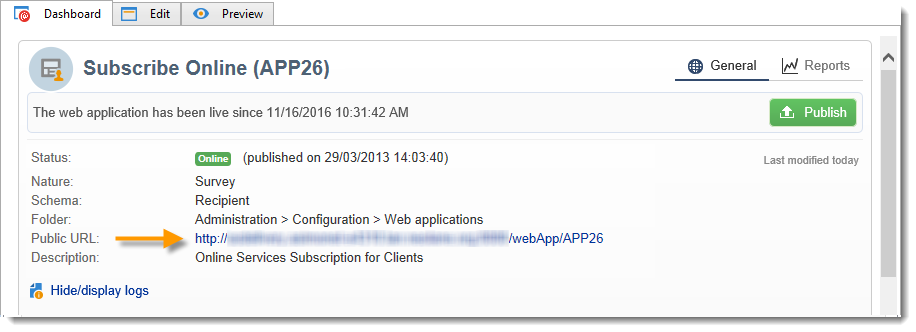

# 建立調查的關鍵步驟{#getting-started-with-surveys}

以下快速概述使用下列內建範本建立簡單調查的主要步驟：

這些步驟為：

1. [步驟1 — 建立調查](#step-1---creating-a-survey)，
1. [步驟2 — 選取範本](#step-2---selecting-the-template)，
1. [步驟3 — 建立調查](#step-3---building-the-survey)，
1. [步驟4 — 建立頁面內容](#step-4---creating-the-page-content)，
1. [步驟5 — 儲存調查資料](#step-5---storing-the-survey-data-)，
1. [步驟6 — 發佈頁面](#step-6---publishing-the-pages)，
1. [步驟7 — 分享您的線上意見調查](#step-7---sharing-your-online-survey).

## 步驟1 — 建立調查 {#step-1---creating-a-survey}

若要建立新的問卷，請前往 **[!UICONTROL Campaigns]** 或 **[!UICONTROL Profiles and targets]** 標籤並按一下 **[!UICONTROL Web Applications]** 功能表。 按一下 **[!UICONTROL Create]** 表單清單上方的按鈕。

## 步驟2 — 選取範本 {#step-2---selecting-the-template}

選取意見調查範本，然後指定意見調查的名稱。 一般使用者不會看到此名稱，但可讓您在Adobe Campaign中識別調查。 按一下 **[!UICONTROL Save]** 將問卷新增至Web應用程式清單。

## 步驟3 — 建立調查 {#step-3---building-the-survey}

調查會建置在定位下列元素的圖表中：將建立內容的頁面、資料預先載入和儲存步驟，以及測試階段。 也可以插入指令碼和查詢。

若要建置圖表，請按一下 **[!UICONTROL Edit]** 問卷形式。

調查必須包含 **至少** 下列三個元件：頁面、儲存方塊和結束頁面。

* 若要建立頁面，請選取 **[!UICONTROL Page]** 物件放在編輯器的左側區段中，並將其放在中間區段中，如下所示：

  

* 接下來，選取 **[!UICONTROL Storage]** 物件並放置在頁面的輸出轉變上。
* 最後，選取 **[!UICONTROL End]** 物件並放置在儲存方塊的輸出轉變的末端，以取得下列圖表：

  

## 步驟4 — 建立頁面內容 {#step-4---creating-the-page-content}

在以下範例中，我們使用 **[!UICONTROL Page (v5 compatibility)]** 輸入page。 此型別的頁面可透過 **[!UICONTROL Edit]** 標籤。

* **新增輸入欄位**

  若要建立頁面內容，您必須編輯頁面：若要這麼做，請連按兩下 **[!UICONTROL Page]** 物件。 按一下工具列中的第一個圖示以開啟欄位建立精靈。 若要建立使用者名稱輸入欄位，以儲存在收件者設定檔的相符欄位中，請選取 **[!UICONTROL Edit a recipient]**.

  

  按一下 **[!UICONTROL Next]** 按鈕來選取資料庫中資料儲存的欄位。 在此案例中，「姓氏」欄位。

  

  按一下 **[!UICONTROL Finish]** 以確認欄位建立。

  根據預設，當資訊儲存在資料庫中已存在的欄位中時，欄位會採用所選欄位的名稱，即此範例中的「姓氏」。 您可以修改此標籤，如下所示：

  

  現在為使用者帳號建立輸入欄位。 重複操作並選取「帳戶號碼」。 欄位。

  套用相同的程式，新增欄位讓使用者輸入電子郵件地址。

* **建立問題**

  若要建立問題，請以滑鼠右鍵按一下樹狀結構中的最後一個元素，然後選取 **[!UICONTROL Containers > Question]** ，或按一下 **[!UICONTROL Containers]** 圖示並選取 **[!UICONTROL Question]**.

  

  輸入問題的標籤，並將答案欄位插入為問題的子分支。 要執行此操作，當您建立答案欄位時，必須選取連結到問題的節點。 新增 **[!UICONTROL drop-down listx]** 使用 **[!UICONTROL Selection controls]** 圖示或按一下滑鼠右鍵，如下所示：

  

  選取儲存空間：選取分項清單欄位以自動擷取值（在此案例中為電子郵件格式）。

  

  在 **[!UICONTROL General]** 索引標籤，按一下 **[!UICONTROL Initialize the list of values from the database]** 連結：會自動輸入值表。

  

  按一下 **[!UICONTROL OK]** 關閉編輯器，以及 **[!UICONTROL Save]** 以儲存變更。

  >[!NOTE]
  >
  >您可以利用「 」中的「 」選項，針對每個欄位或問題調整頁面版面以符合您的需求 **[!UICONTROL Advanced]** 標籤。 調查畫面的版面配置詳見 [本節](../../web/using/about-web-forms.md).

  在詳細資訊畫面中，按一下 **[!UICONTROL Preview]** 索引標籤以檢視您剛建立的問卷的呈現。

  

## 步驟5 — 儲存調查資料 {#step-5---storing-the-survey-data-}

儲存方塊可讓您將使用者回應儲存在資料庫中。 您必須選取調解金鑰，以識別資料庫中已存在的設定檔。

要執行此操作，請編輯該方塊並選取在儲存資料時用作調解金鑰的欄位。

在以下範例中，當儲存（確認）發生時，如果設定檔以與表單中輸入相同的帳號儲存在資料庫中，則會更新設定檔。 如果設定檔不存在，則會建立設定檔。

按一下 **[!UICONTROL OK]** 確認，然後按一下 **[!UICONTROL Save]** 儲存意見調查

## 步驟6 — 發佈頁面 {#step-6---publishing-the-pages}

使用者若要存取HTML頁面，應用程式必須可供使用。 它必須不再處於編輯階段，而是處於生產階段。 若要在生產環境中放置調查，您必須將其發佈。 操作步驟：

* 按一下 **[!UICONTROL Publish]** 按鈕位於調查儀表板上方。
* 按一下 **[!UICONTROL Start]** 以啟動出版物並關閉精靈。

  

  調查的狀態變更為： **線上**.

  

## 步驟7 — 分享您的線上意見調查 {#step-7---sharing-your-online-survey}

調查一旦投入生產，就可在伺服器上存取，而且您可以提供。 用於存取調查的URL會顯示在控制面板上。

例如，若要傳送調查，您可以傳送包含目標人口存取連結的訊息，或將調查存取URL放在網頁上。

然後您可以透過報告和記錄來監視使用者回應。 另請參閱 [回應追蹤](../../surveys/using/publish-track-and-use-collected-data.md#response-tracking).

>[!CAUTION]
>
>公開URL包含調查的內部名稱。 修改內部名稱時，URL會自動更新：所有調查連結也必須更新。
>
>如果已經傳送包含表單連結的傳遞，此連結將不再有效。
