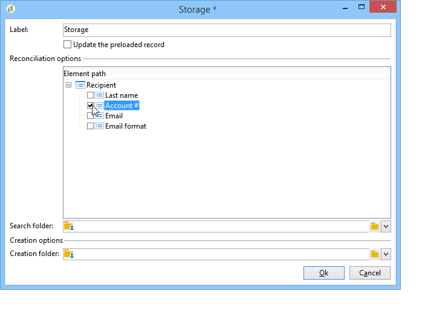

# 建立調查的關鍵步驟{#getting-started-with-surveys}

下面是使用以下內置模板建立簡單調查的主要步驟的快速概述：

這些步驟包括：

1. [步驟1 — 建立調查](#step-1---creating-a-survey)。
1. [步驟2 — 選擇模板](#step-2---selecting-the-template)。
1. [步驟3 — 構建調查](#step-3---building-the-survey)。
1. [步驟4 — 建立頁面內容](#step-4---creating-the-page-content)。
1. [步驟5 — 儲存調查資料](#step-5---storing-the-survey-data-)。
1. [步驟6 — 發佈頁面](#step-6---publishing-the-pages)。
1. [步驟7 — 共用您的線上調查](#step-7---sharing-your-online-survey)。

## 步驟1 — 建立調查 {#step-1---creating-a-survey}

要建立新調查，請轉至 **[!UICONTROL Campaigns]** 或 **[!UICONTROL Profiles and targets]** ，然後按一下 **[!UICONTROL Web Applications]** 的子菜單。 按一下 **[!UICONTROL Create]** 按鈕。

## 步驟2 — 選擇模板 {#step-2---selecting-the-template}

選擇調查模板，然後為調查指定名稱。 最終用戶將看不到此名稱，但它允許在Adobe Campaign內查明該調查。 按一下 **[!UICONTROL Save]** 將調查添加到Web應用程式清單。

## 步驟3 — 構建調查 {#step-3---building-the-survey}

調查以下元素所在的圖表構建：建立內容的頁面、資料預載入和保存步驟以及測試階段。 也可插入指令碼和查詢。

要生成圖表，請按一下 **[!UICONTROL Edit]** 調查的形式。

調查必須包含 **至少** 以下三個元件：頁面、儲存框和結束頁面。

* 要建立頁面，請選擇 **[!UICONTROL Page]** 對象位於編輯器的左側部分中，並將其放入中間部分，如下所示：

   

* 接下來，選擇 **[!UICONTROL Storage]** 對象，並將其置於頁面的輸出轉換中。
* 最後，選擇 **[!UICONTROL End]** 將對象放置在儲存盒輸出轉換的末尾，得到如下圖：

   

## 步驟4 — 建立頁面內容 {#step-4---creating-the-page-content}

在以下示例中，我們使用 **[!UICONTROL Page (v5 compatibility)]** 的雙曲餘切值。 此類型的頁面通過 **[!UICONTROL Edit]** 頁籤。

* **添加輸入欄位**

   要建立頁面內容，必須編輯它：要執行此操作，請按兩下 **[!UICONTROL Page]** 的雙曲餘切值。 按一下工具欄中的第一個表徵圖以開啟欄位建立嚮導。 要為要儲存在收件人配置檔案的匹配欄位中的用戶名建立輸入欄位，請選擇 **[!UICONTROL Edit a recipient]**。

   

   按一下 **[!UICONTROL Next]** 按鈕，選擇資料庫中資料儲存的欄位。 在本例中，為「姓」欄位。

   

   按一下 **[!UICONTROL Finish]** 確認欄位建立。

   預設情況下，當資訊儲存在資料庫中已存在的欄位中時，該欄位將使用選定欄位的名稱，即此示例中的「姓」。 您可以修改此標籤，如下所示：

   

   現在，為用戶帳戶號建立一個條目欄位。 重複該操作，然後選擇「帳戶編號」。 的子菜單。

   應用相同過程，為用戶添加一個欄位以輸入電子郵件地址。

* **建立問題**

   要建立問題，請按一下右鍵樹中的最後一個元素，然後選擇 **[!UICONTROL Containers > Question]** ，或按一下 **[!UICONTROL Containers]** 表徵圖 **[!UICONTROL Question]**。

   

   輸入問題的標籤，並將答案欄位作為問題的子分支插入。 為此，在建立回答欄位時必須選擇連結到問題的節點。 添加 **[!UICONTROL drop-down listx]** 使用 **[!UICONTROL Selection controls]** 表徵圖或按一下右鍵，如下所示：

   

   選擇儲存空間：選擇枚舉欄位以自動檢索值（本例中為電子郵件格式）。

   

   在 **[!UICONTROL General]** 頁籤 **[!UICONTROL Initialize the list of values from the database]** 連結：值表會自動輸入。

   

   按一下 **[!UICONTROL OK]** 關閉編輯器， **[!UICONTROL Save]** 的子菜單。

   >[!NOTE]
   >
   >對於每個欄位或問題，您都可以調整頁面佈局以適應您的需要，這要歸功於 **[!UICONTROL Advanced]** 頁籤。 在「Survey Sceens(Survey Sceens)」中， [此部分](../../web/using/about-web-forms.md)。

   在詳細資訊螢幕中，按一下 **[!UICONTROL Preview]** 頁籤，查看您剛剛建立的測量的呈現。

   

## 步驟5 — 儲存調查資料 {#step-5---storing-the-survey-data-}

儲存框用於將用戶響應保存在資料庫中。 必須選擇協調鍵以標識資料庫中已有的配置檔案。

為此，請編輯該框並選擇儲存資料時用作協調鍵的欄位。

在下例中，在保存（確認）時，如果將配置檔案保存在資料庫中，並且其帳號與表單中的一個輸入相同，則將更新配置檔案。 如果配置檔案不存在，將建立它。

按一下 **[!UICONTROL OK]** 確認，然後按一下 **[!UICONTROL Save]** 保存調查

## 步驟6 — 發佈頁面 {#step-6---publishing-the-pages}

要使用戶能夠訪問HTML頁，必須使應用程式可用。 它必須不再處於編輯階段，而是在生產階段。 要將調查投入生產，必須發佈它。 操作步驟：

* 按一下 **[!UICONTROL Publish]** 按鈕。
* 按一下 **[!UICONTROL Start]** 啟動發佈並關閉嚮導。

   

   調查狀態更改為： **線上**。

   

## 步驟7 — 共用您的線上調查 {#step-7---sharing-your-online-survey}

一旦投入生產，即可在伺服器上訪問調查，並且您可以提供調查。 用於訪問調查的URL顯示在儀表板上。

要傳送調查，您可以發送包含目標群體訪問連結的消息，或將調查訪問URL放在網頁上。

然後，您可以通過報告和日誌監視用戶響應。 請參閱 [響應跟蹤](../../surveys/using/publish--track-and-use-collected-data.md#response-tracking)。

>[!CAUTION]
>
>公共URL包括調查的內部名稱。 修改內部名稱后，URL將自動更新：還必須更新指向調查的所有連結。
>
>如果已發送包含表單連結的交貨，則此連結將不再有效。
