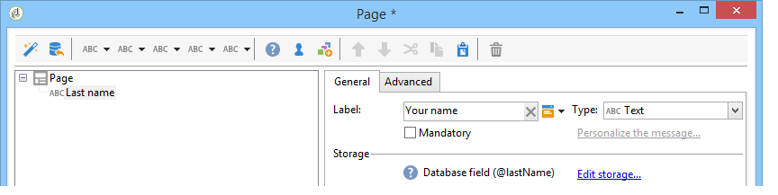

# 建立調查的關鍵步驟{#getting-started-with-surveys}

以下是使用下列內建範本，快速概述建立簡單調查的主要步驟：

這些步驟為：

1. [步驟1 — 建立調查](#step-1---creating-a-survey),
1. [步驟2 — 選取範本](#step-2---selecting-the-template),
1. [步驟3 — 建立調查](#step-3---building-the-survey),
1. [步驟4 — 建立頁面內容](#step-4---creating-the-page-content),
1. [步驟5 — 儲存調查資料](#step-5---storing-the-survey-data-),
1. [步驟6 — 發佈頁面](#step-6---publishing-the-pages),
1. [第7步 — 共用您的線上意見調查](#step-7---sharing-your-online-survey).

## 步驟1 — 建立調查 {#step-1---creating-a-survey}

若要建立新調查，請前往 **[!UICONTROL Campaigns]** 或 **[!UICONTROL Profiles and targets]** ，然後按一下 **[!UICONTROL Web Applications]** 功能表。 按一下 **[!UICONTROL Create]** 按鈕。

## 步驟2 — 選取範本 {#step-2---selecting-the-template}

選取調查範本，然後為調查命名。 一般使用者不會看到此名稱，但可在Adobe Campaign中識別調查。 按一下 **[!UICONTROL Save]** 將調查新增至Web應用程式清單。

## 步驟3 — 建立調查 {#step-3---building-the-survey}

調查是以下元素所在的圖表所建立：建立內容的頁面、資料預先載入和儲存步驟，以及測試階段。 也可以插入指令碼和查詢。

若要建立圖表，請按一下 **[!UICONTROL Edit]** 調查的形式。

調查必須包含 **至少** 以下三個元件：頁面、儲存盒和結束頁面。

* 若要建立頁面，請選取 **[!UICONTROL Page]** 物件（在編輯器的左側區段中），並將其存放在中間區段，如下所示：

   

* 下一步，選取 **[!UICONTROL Storage]** 物件，並將其置於頁面的輸出轉變中。
* 最後，選取 **[!UICONTROL End]** 對象並將其置於儲存盒的輸出轉變的末尾，以獲得以下圖表：

   

## 步驟4 — 建立頁面內容 {#step-4---creating-the-page-content}

在下列範例中，我們使用 **[!UICONTROL Page (v5 compatibility)]** 類型頁面。 此類型的頁面可透過 **[!UICONTROL Edit]** 標籤。

* **新增輸入欄位**

   若要建立頁面內容，您必須加以編輯：若要這麼做，請連按兩下 **[!UICONTROL Page]** 物件。 按一下工具列中的第一個圖示，以開啟欄位建立精靈。 要為要儲存在收件人配置檔案的匹配欄位中的用戶名建立條目欄位，請選擇 **[!UICONTROL Edit a recipient]**.

   

   按一下 **[!UICONTROL Next]** 按鈕，選擇資料庫中資料儲存的欄位。 在此情況下，會顯示「姓氏」欄位。

   

   按一下 **[!UICONTROL Finish]** 確認欄位建立。

   依預設，當資訊儲存在資料庫中已存在的欄位中時，欄位會取用所選欄位的名稱，即。此範例中為「姓氏」。 您可以修改此標籤，如下所示：

   

   現在為使用者帳號建立登入欄位。 重複該操作，然後選擇「帳戶編號」。 欄位.

   應用相同的過程來添加欄位，供用戶輸入電子郵件地址。

* **建立問題**

   若要建立問題，請以滑鼠右鍵按一下樹狀結構中的最後一個元素，然後選取 **[!UICONTROL Containers > Question]** ，或按一下 **[!UICONTROL Containers]** 圖示並選取 **[!UICONTROL Question]**.

   

   輸入問題的標籤，並插入答案欄位作為問題的子分支。 要執行此操作，在建立答案欄位時，必須選取連結至問題的節點。 新增 **[!UICONTROL drop-down listx]** 使用 **[!UICONTROL Selection controls]** 圖示或按一下滑鼠右鍵，如下所示：

   

   選擇儲存空間：選取分項清單欄位以自動擷取值（此例中為電子郵件格式）。

   

   在 **[!UICONTROL General]** ，按一下 **[!UICONTROL Initialize the list of values from the database]** 連結：會自動輸入值表。

   

   按一下 **[!UICONTROL OK]** 關閉編輯器，和 **[!UICONTROL Save]** 以儲存變更。

   >[!NOTE]
   >
   >由於中的選項，您可以針對每個欄位或問題調整頁面版面，以符合您的需求 **[!UICONTROL Advanced]** 標籤。 調查畫面的版面配置在 [本節](../../web/using/about-web-forms.md).

   在詳細畫面中，按一下 **[!UICONTROL Preview]** 標籤來檢視您剛建立之調查的呈現。

   

## 步驟5 — 儲存調查資料 {#step-5---storing-the-survey-data-}

儲存方塊可讓您將使用者回應儲存在資料庫中。 您必須選取調解金鑰，以識別資料庫中已有的設定檔。

要執行此操作，請編輯該框，並選擇在儲存資料時用作調解密鑰的欄位。

在以下範例中，進行儲存（確認）時，如果設定檔儲存在與表單中輸入的帳戶號碼相同的資料庫中，則會更新設定檔。 如果設定檔不存在，則會建立它。

按一下 **[!UICONTROL OK]** 若要確認，請按一下 **[!UICONTROL Save]** 儲存調查

## 步驟6 — 發佈頁面 {#step-6---publishing-the-pages}

若要讓使用者能夠存取HTML頁面，應用程式必須可供使用。 它必須不再處於編輯階段，而是在生產階段。 若要將調查放入生產環境，您必須將其發佈。 操作步驟：

* 按一下 **[!UICONTROL Publish]** 按鈕（位於「調查」控制面板上方）。
* 按一下 **[!UICONTROL Start]** 啟動發佈並關閉嚮導。

   

   調查的狀態會變更為： **線上**.

   

## 第7步 — 共用您的線上意見調查 {#step-7---sharing-your-online-survey}

調查投入生產後，即可在伺服器上存取，而您可以傳送調查。 用於存取調查的URL會顯示在控制面板上。

若要傳送調查，您可以傳送包含目標母體存取連結的訊息，或將調查存取URL放在網頁上。

然後，您就可以透過報表和記錄來監視使用者回應。 請參閱 [回應追蹤](../../surveys/using/publish--track-and-use-collected-data.md#response-tracking).

>[!CAUTION]
>
>公用URL包含調查的內部名稱。 修改內部名稱時，URL會自動更新：調查的所有連結也必須更新。
>
>如果已傳送包含表單連結的傳送，則此連結將無法繼續運作。
