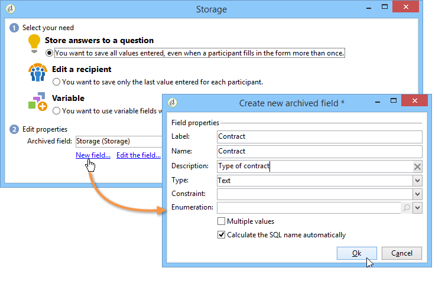
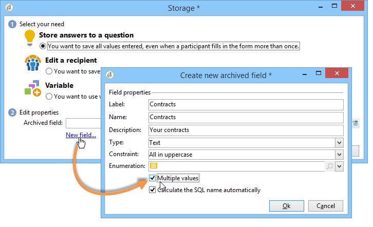
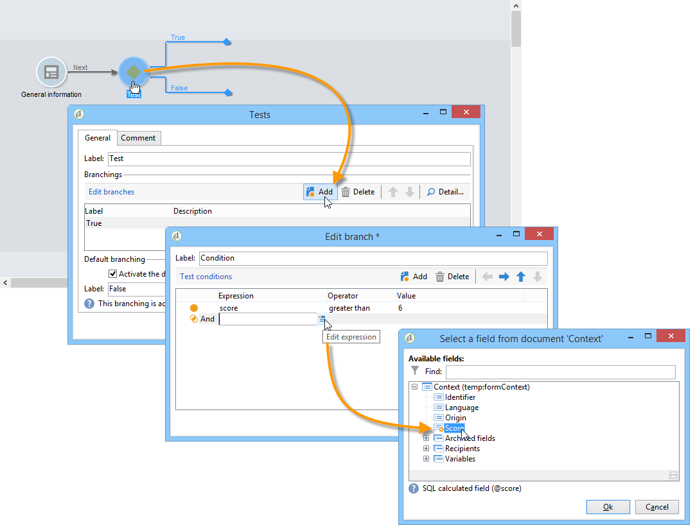
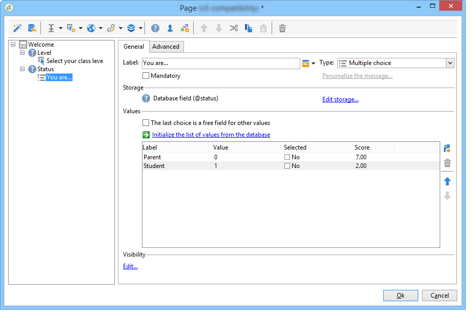

# 管理答案{#managing-answers}


## 儲存收集的答案 {#storing-collected-answers}

除了Adobe Campaign中所有Web表單（資料庫欄位和本機變數）通用的標準儲存模式外，調查還使用封存欄位啟用資料模型的動態擴充功能。

>[!CAUTION]
>
>此選項適用於 **調查** 僅鍵入Web應用程式。 其他類型的網路表單均不提供此功能。

### 儲存在封存的欄位中 {#storing-in-an-archived-field}

借由新增儲存空間以儲存調查中提供的回應，即可輕鬆擴充資料範本。 若要這麼做，請選取 **[!UICONTROL Store answers to a question]** 選項。 按一下 **[!UICONTROL New field...]** 連結並指定其屬性：



輸入欄位的標籤和名稱，並選取欄位類型：文字、布林值、整數或小數、日期等

選取的欄位類型包含使用者輸入回應時對資料的控制。 針對 **文字** 欄位中，您可以新增限制（大小寫、格式），或連結至現有的分項清單以強制選取。

要添加約束，請從下拉清單中選取它。 約束有兩種類型：

1. 字元大小寫

   輸入的資訊可以以下列格式儲存在欄位中：全部大寫、全部小寫或初始大寫。 此限制不要求使用者以選取的格式輸入資料，但儲存時，在欄位中輸入的內容將會轉換。

1. 資料格式

如果此欄位用於清單中，則可使用 **[!UICONTROL Initialize the list of values from the database]** 值清單上方的連結。

例如，您可以建立下拉式清單，讓使用者選取其原生語言。 對應的封存欄位可與 **語言** 包含語言清單的枚舉：


此 **[!UICONTROL Edit link]** 位於欄位右側的圖示可讓您編輯此分項清單的內容：


在 **[!UICONTROL General]** 索引標籤， **[!UICONTROL Initialize the list of values from the database]** 連結可讓您自動輸入所提供標籤的清單。


**範例**:在一個欄位中儲存收件者的合約

若要在一個欄位中儲存不同類型的合約，請建立 **[!UICONTROL Text]** 輸入欄位並選取 **[!UICONTROL Store answers to a question]** 選項。

按一下 **[!UICONTROL New field...]** 連結並輸入欄位屬性。 選取 **[!UICONTROL Multiple values]** 選項，以啟用要儲存的數個值。



為其他合約建立登入欄位，並將資料儲存在相同的已封存欄位中。


當使用者核准調查時，其答案會儲存在 **[!UICONTROL Contracts]** 欄位。

在我們的範例中，針對下列答案：


回應者的設定檔將包含所輸入的四個合約。

您可以在 **[!UICONTROL Answers]** ，方法是顯示相關欄。


您也可以根據答案來篩選收件者，以僅顯示您感興趣的使用者。 若要這麼做，請建立目標工作流程並使用 **[!UICONTROL Survey responses]** 框。


根據要恢復的配置檔案建立查詢。 在以下範例中，查詢可讓您選取至少包含兩個合約的設定檔，包括A類型合約。


對於每個表單，提供的答案可用於欄位或標籤。 對儲存在已封存欄位中的內容使用下列語法：

```
<%= ctx.webAppLogRcpData.name of the archived field %
```

>[!NOTE]
>
>對於其他類型的欄位，語法在 [本節](../../platform/using/about-queries-in-campaign.md).

### 儲存設定 {#storage-settings}

您可以以XML格式封存調查的答案。 這可讓您儲存所收集之答案的原始復本，當分項清單中的資料標準化程度過高時，這項功能會相當實用。 [了解更多](../../surveys/using/publish--track-and-use-collected-data.md#standardizing-data)

>[!CAUTION]
>
>歸檔原始響應會影響所需的儲存空間。 請小心使用此選項。

操作步驟：

* 透過編輯調查屬性 **[!UICONTROL Properties]** 按鈕 **[!UICONTROL Edit]** 標籤。
* 按一下 **[!UICONTROL Advanced parameters]** 連結並檢查 **[!UICONTROL Save a copy of raw answers]** 選項。


您可依預設為所有調查啟用此選項（此選項會在調查發佈時套用）。 若要這麼做，請建立 **[!UICONTROL NmsWebApp_XmlBackup]** 選項和賦值 **[!UICONTROL 1]** ，如下所示：


## 分數管理 {#score-management}

您可以為表單頁面中提供的選項指派分數。 分數只能連結至已結案的問題：核取方塊、下拉式清單中的值、訂閱等。


分數會在確認頁面時(亦即當使用者點按 **[!UICONTROL Next]** 或 **[!UICONTROL Finish]** 按鈕。

>[!NOTE]
>
>您可以使用正值或負值、整數值或非整數值。

分數可用於測試或指令碼。

>[!CAUTION]
>
>分數無法用於相同頁面上欄位的可見性條件。 不過，這些變數可用於後續頁面。

* 若要在測試中使用分數，請使用 **[!UICONTROL Score]** 欄位，如下所示：

   

* 您可以在指令碼中使用分數。

**範例**:計算分數並將其用作顯示下一頁的條件：

* 在調查中，下一頁可讓您根據下拉式清單中選取的值，為使用者指派不同的分數：

   

* 您可以根據選取的選項，將此分數與第二個值結合：

   

* 當使用者點按 **[!UICONTROL Next]** 按鈕，則會將兩個值加總。

   

* 可根據分數來套用條件以顯示頁面。 此設定如下：

   

   
