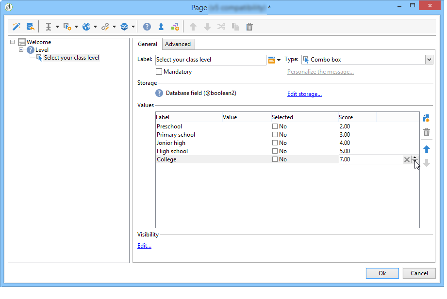

# 管理答案{#managing-answers}


## 儲存收集的答案 {#storing-collected-answers}

除了Adobe Campaign中所有網路表單通用的標準儲存模式（資料庫欄位和本機變數）之外，調查還可使用已封存欄位來動態擴充資料模型。

>[!CAUTION]
>
>此選項僅適用於&#x200B;**調查**&#x200B;型別的網頁應用程式。 其他型別的網路表單不提供此功能。

### 儲存在已封存的欄位中 {#storing-in-an-archived-field}

您可以新增儲存空間來儲存調查中提供的回應，藉此輕鬆擴充資料範本。 若要這麼做，請在建立輸入欄位時選取&#x200B;**[!UICONTROL Store answers to a question]**&#x200B;選項。 按一下&#x200B;**[!UICONTROL New field...]**&#x200B;連結並指定其屬性：


輸入欄位的標籤和名稱，然後選取欄位型別：文字、布林值、整數或小數、日期等。

選取的欄位型別涉及使用者輸入回應時的資料控制。 對於&#x200B;**文字**&#x200B;欄位，您可以新增限制（大小寫、格式）或現有列舉的連結以強制選取。

若要新增限制，請從下拉式清單中選取它。 限制有兩種型別：

1. 字元大小寫

   輸入的資訊可以以下列格式儲存在欄位中：全部大寫、全部小寫或初始大寫。 此限制並不要求使用者以選取的格式輸入資料，但儲存時，在欄位中輸入的內容將會轉換。

1. 資料格式

如果清單中使用此欄位，則可以使用值清單上方的&#x200B;**[!UICONTROL Initialize the list of values from the database]**&#x200B;連結，在值表中自動擷取分項清單的值。

例如，您可以建立下拉式清單，讓使用者選取其原生語言。 對應的封存欄位可以與包含語言清單的&#x200B;**語言**&#x200B;列舉相關聯：


欄位右側的&#x200B;**[!UICONTROL Edit link]**&#x200B;圖示可讓您編輯此分項清單的內容：


在欄位的&#x200B;**[!UICONTROL General]**&#x200B;標籤中，**[!UICONTROL Initialize the list of values from the database]**&#x200B;連結可讓您自動輸入提供的標籤清單。


**範例**：將收件者的合約儲存在一個欄位中

若要將不同型別的合約儲存在一個欄位中，請建立&#x200B;**[!UICONTROL Text]**&#x200B;輸入欄位並選取&#x200B;**[!UICONTROL Store answers to a question]**&#x200B;選項。

按一下&#x200B;**[!UICONTROL New field...]**&#x200B;連結，然後輸入欄位內容。 選取&#x200B;**[!UICONTROL Multiple values]**&#x200B;選項，以儲存數個值。


為其他合約建立輸入欄位，並將資料儲存在相同的存檔欄位中。


當使用者核准調查時，他們的答案將會儲存在&#x200B;**[!UICONTROL Contracts]**&#x200B;欄位中。

在我們的範例中，針對下列答案：


受訪者的設定檔將包含輸入的四份合約。

可藉由顯示相關欄，在調查的&#x200B;**[!UICONTROL Answers]**&#x200B;索引標籤中檢視這些專案。


您也可以根據答案來篩選收件者，以便只顯示您感興趣的使用者。 若要這麼做，請建立目標工作流程並使用&#x200B;**[!UICONTROL Survey responses]**&#x200B;方塊。


根據您要復原的設定檔建立查詢。 在下列範例中，查詢可讓您選取至少有兩個合約的設定檔，包括A型態合約。


針對每個表單，提供的答案可用於欄位或標籤中。 針對已封存欄位中儲存的內容使用下列語法：

```
<%= ctx.webAppLogRcpData.name of the archived field %
```

>[!NOTE]
>
>針對其他型別的欄位，語法在[此區段](../../platform/using/about-queries-in-campaign.md)中有詳細說明。

### 儲存設定 {#storage-settings}

您可以以XML格式封存調查答案。 這可讓您儲存所收集答案的原始復本，當逐項清單中的資料過度標準化時，這將很有用。 [了解更多](../../surveys/using/publish-track-and-use-collected-data.md#standardizing-data)

>[!CAUTION]
>
>封存原始回應會影響所需的儲存空間。 請謹慎使用此選項。

操作步驟：

* 透過&#x200B;**[!UICONTROL Edit]**&#x200B;索引標籤的&#x200B;**[!UICONTROL Properties]**&#x200B;按鈕編輯意見調查屬性。
* 按一下&#x200B;**[!UICONTROL Advanced parameters]**&#x200B;連結並核取&#x200B;**[!UICONTROL Save a copy of raw answers]**&#x200B;選項。


您可以預設為所有調查啟用它（此選項在發佈調查時套用）。 若要這麼做，請建立&#x200B;**[!UICONTROL NmsWebApp_XmlBackup]**&#x200B;選項並為其指派值&#x200B;**[!UICONTROL 1]**，如下所示：


## 分數管理 {#score-management}

您可以將分數指派給表單頁面中提供的選項。 分數只能連結至已關閉的問題：核取方塊、下拉式清單的值、訂閱等。


分數會在確認頁面時（即使用者按一下&#x200B;**[!UICONTROL Next]**&#x200B;或&#x200B;**[!UICONTROL Finish]**&#x200B;按鈕時）累計並儲存在伺服器端。

>[!NOTE]
>
>您可以使用正數或負數、整數或非整數值。

分數可用於測試或指令碼。

>[!CAUTION]
>
>評分無法用於相同頁面上欄位的可見度條件。 不過，它們可用於後續頁面。

* 若要在測試中使用分數，請使用測試計算公式中的&#x200B;**[!UICONTROL Score]**&#x200B;欄位，如下所示：

  

* 您可以在指令碼中使用分數。

**範例**：計算一個分數，並將其作為下一頁顯示的條件：

* 在調查中，下一頁可讓您根據下拉式清單中選取的值，將不同的分數指派給使用者：

  

* 您可以根據選取的選項，將此分數與第二個值結合：

  

* 當使用者按一下&#x200B;**[!UICONTROL Next]**&#x200B;按鈕，兩個值就會相加。

  

* 條件可套用至要根據分數顯示的頁面。 其設定如下：

  

  
