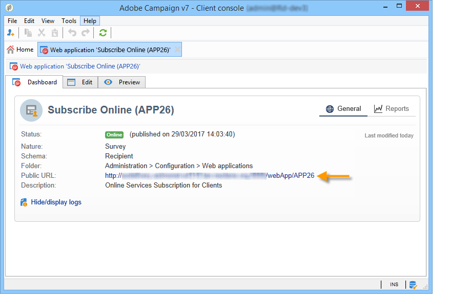

# 發佈、追蹤及使用收集的資料{#publish-track-and-use-collected-data}


建立、設定和發佈表單後，您就可以與對象共用連結並追蹤回應。

>[!NOTE]
>
>Adobe Campaign中調查的生命週期及其發佈和傳送模式與網路表單的類似：這些在 [本節](../../web/using/about-web-forms.md).

## 調查控制面板 {#survey-dashboard}

每個調查都有其專屬的控制面板，可讓您檢視其狀態、說明、公用URL和可用性排程。 它也可讓您檢視可用的報表。 [深入瞭解](#reports-on-surveys)。

調查的公用URL會顯示在控制面板上：



## 回應追蹤 {#response-tracking}

您可以在記錄檔和報表中追蹤對調查的回應。

### 調查記錄 {#survey-logs}

對於傳送的每項調查，您可以在 **[!UICONTROL Logs]** 標籤。 此索引標籤會顯示已完成調查的使用者清單及其來源：


連按兩下某行，以顯示回應者填入的調查表單。 您可以完整瀏覽調查，並完整存取答案。 這些檔案可匯出為外部檔案。 有關詳細資訊，請參閱 [匯出答案](#exporting-answers).

來源會在調查URL中新增下列字元以指出：

```
?origin=xxx
```

在編輯調查時，其URL會包含參數 **[!UICONTROL __uuid]**，表示其處於測試階段且尚未上線。 當您透過此URL存取調查時，在追蹤（報表）中不會考慮已建立的記錄。 原始值會強制為值 **[!UICONTROL Adobe Campaign]**.

如需URL參數的詳細資訊，請參閱 [本頁](../../web/using/defining-web-forms-properties.md#form-url-parameters).

### 調查報表 {#reports-on-surveys}

控制面板標籤可讓您存取調查報表。 按一下報表名稱即可檢視。


調查的結構會顯示在 **[!UICONTROL Documentation]** 報表。

在 **[!UICONTROL Reports]** 調查的索引標籤： **[!UICONTROL General]** 和 **[!UICONTROL Breakdown of responses]**.

* 一般

   此報告包含調查的一般資訊：回應數量隨時間的變化，以及依來源和語言的分佈。

   一般報表範例：

   

* 回應的劃分

   此報表顯示每個問題的回應劃分。 此劃分僅適用於中儲存欄位的回答 **[!UICONTROL Question]** 類型容器。 它僅對選取控制項有效（例如，文字欄位上沒有劃分）。

   

## 匯出答案 {#exporting-answers}

調查的答案可匯出為外部檔案，以供稍後處理。 執行此作業有兩種方式：

1. 匯出報表資料

   若要匯出報表資料，請按一下 **[!UICONTROL Export]** 按鈕，然後選擇導出格式。

   如需匯出報表資料的詳細資訊，請參閱 [本節](../../reporting/using/about-reports-creation-in-campaign.md).

1. 匯出答案

   若要匯出答案，請按一下 **[!UICONTROL Responses]** 標籤，然後按一下滑鼠右鍵。 選取 **[!UICONTROL Export...]**。

   

   然後輸入要導出的資訊和儲存檔案。

   您可以在匯出精靈中設定輸出檔案的內容和格式。

   這可讓您：

   * 向輸出檔案添加列並恢復收件者的資訊（儲存在資料庫中）,
   * 格式化導出的資料，
   * 為檔案中的資訊選擇編碼格式。

   如果您要匯出的調查包含數個 **[!UICONTROL Multi-line text]** 或 **[!UICONTROL HTML text]** 欄位，必須匯出 **[!UICONTROL XML]** 格式。 若要這麼做，請在 **[!UICONTROL Output format]** 欄位，如下所示：

   

   按一下 **[!UICONTROL Start]** 執行匯出。

   >[!NOTE]
   >
   >如需資料匯出及其設定的階段詳細說明，請參閱 [本節](../../platform/using/about-generic-imports-exports.md).

## 使用收集的資料 {#using-the-collected-data}

透過線上調查收集的資訊可在目標工作流程的框架內復原。 若要這麼做，請使用 **[!UICONTROL Survey responses]** 框。

在以下範例中，我們想特別為線上上調查中分數最高、至少有兩個子女的五位收件者，提供網路優惠。 本調查的答案為：


在目標工作流程中， **[!UICONTROL Survey responses]** 將配置如下：


首先選取相關調查，然後在視窗的中央區段中擷取資料。 在此情況下，我們需要至少擷取分數欄，因為此欄將用於分割方塊，以復原五個最高分數。

按一下 **[!UICONTROL Edit query...]** 連結。


啟動目標工作流程。 查詢會復原8個收件者。


以滑鼠右鍵按一下集合方塊的輸出轉變以檢視。


然後在工作流程中放置分割方塊，以復原分數最高的5個收件者。

編輯分割方塊以進行設定：

* 首先，在 **[!UICONTROL General]** ，然後設定子集：

   

* 前往 **[!UICONTROL Sub-sets]** 標籤，然後選取 **[!UICONTROL Limit the selected records]** ，然後按一下 **[!UICONTROL Edit...]** 連結。

   

* 選取 **[!UICONTROL Keep only the first records after sorting]** ，然後選取排序列。 核取 **[!UICONTROL Descending sort]** 選項。

   

* 按一下 **[!UICONTROL Next]** 按鈕，並將記錄數限制為5。

   

* 按一下 **[!UICONTROL Finish]** 然後重新啟動工作流程以核准鎖定目標。

## 標準化資料 {#standardizing-data}

可以在Adobe Campaign中為使用別名收集的資料設定標準化程式。 這可讓您標準化儲存在資料庫中的資料：要執行此操作，請在包含相關資訊的分項清單中定義別名。 [了解更多](../../platform/using/managing-enumerations.md#about-enumerations)
