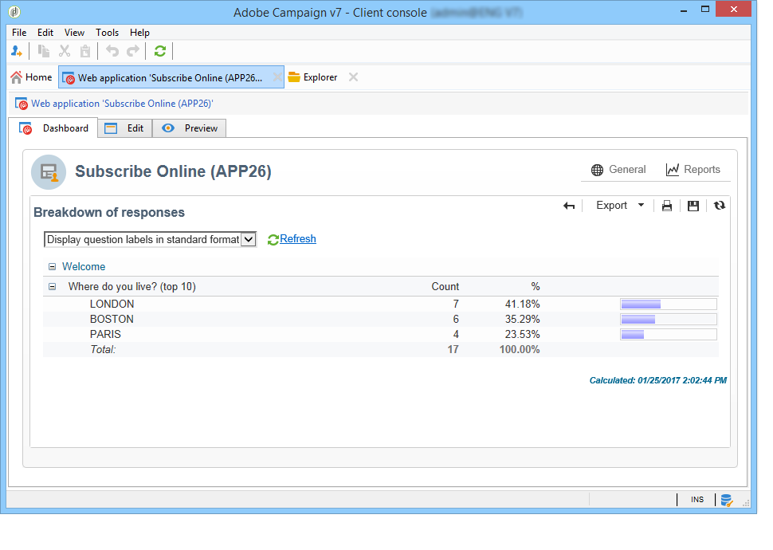

# 發佈、追蹤及使用收集的資料{#publish-track-and-use-collected-data}


建立、配置和發佈表單後，您可以與受眾共用該連結並跟蹤響應。

>[!NOTE]
>
>Adobe Campaign一項調查的生命週期及其發佈和交付模式與Web表單的生命週期相似：詳細資訊 [此部分](../../web/using/about-web-forms.md)。

## 調查儀表板 {#survey-dashboard}

每個調查都有自己的儀表板，您可以通過它查看其狀態、說明、公共URL和可用性計畫。 它還允許您查看可用的報告。 [了解更多資訊](#reports-on-surveys)。

調查的公共URL顯示在儀表板上：


## 響應跟蹤 {#response-tracking}

您可以在日誌和報告中跟蹤對調查的響應。

### 調查日誌 {#survey-logs}

對於交付的每項調查，您可以跟蹤 **[!UICONTROL Logs]** 頁籤。 此頁籤顯示已完成調查的用戶清單及其來源：


按兩下一行以顯示由被調查者填寫的調查表。 您可以全面瀏覽調查並完整訪問答案。 這些檔案可以導出到外部檔案中。 有關此內容的詳細資訊，請參閱 [導出答案](#exporting-answers)。

通過添加以下字元在調查URL中指明原點：

```
?origin=xxx
```

編輯調查時，其URL包含參數 **[!UICONTROL __uuid]**，表示它處於test階段，尚未聯機。 通過此URL訪問調查時，在跟蹤（報告）中不會考慮建立的記錄。 原點被強制設定為值 **[!UICONTROL Adobe Campaign]**。

有關URL參數的詳細資訊，請參閱 [此頁](../../web/using/defining-web-forms-properties.md#form-url-parameters)。

### 調查報告 {#reports-on-surveys}

使用儀表板頁籤可以訪問調查報告。 按一下報告名稱以查看它。


在中可看到調查的結構 **[!UICONTROL Documentation]** 報告。

2004年12月， **[!UICONTROL Reports]** 頁籤： **[!UICONTROL General]** 和 **[!UICONTROL Breakdown of responses]**。

* 常規

   本報告載有調查的一般資料：響應數隨時間的變化以及按來源和語言分佈。

   一般報告示例：

   

* 答復分類

   本報告顯示每個問題的答復的細目。 此細分僅可用於為儲存在 **[!UICONTROL Question]** 類型 它僅對選擇控制項有效（例如，文本欄位沒有細分）。

   

## 導出答案 {#exporting-answers}

可以將調查的答案導出到外部檔案中，以備以後處理。 有兩種方法：

1. 導出報表資料

   要導出報表資料，請按一下 **[!UICONTROL Export]** 按鈕。

   有關導出報告資料的詳細資訊，請參閱 [此部分](../../reporting/using/about-reports-creation-in-campaign.md)。

1. 導出答案

   要導出答案，請按一下 **[!UICONTROL Responses]** 的子菜單。 選取 **[!UICONTROL Export...]**。

   

   然後輸入要導出的資訊和儲存檔案。

   可以在導出嚮導中配置輸出檔案的內容和格式。

   這樣您就可以：

   * 將列添加到輸出檔案並恢復有關收件人的資訊（儲存在資料庫中）,
   * 格式化導出的資料，
   * 選擇檔案中資訊的編碼格式。

   如果要導出的調查包含幾個 **[!UICONTROL Multi-line text]** 或 **[!UICONTROL HTML text]** 欄位，必須將其導出 **[!UICONTROL XML]** 的子菜單。 為此，請在 **[!UICONTROL Output format]** 欄位，如下所示：

   

   按一下 **[!UICONTROL Start]** 以運行導出。

   >[!NOTE]
   >
   >有關資料導出及其配置的各個階段的詳細資訊，請參見 [此部分](../../platform/using/about-generic-imports-exports.md)。

## 使用收集的資料 {#using-the-collected-data}

通過線上調查收集的資訊可以在目標工作流的框架內恢復。 要執行此操作，請使用 **[!UICONTROL Survey responses]** 框。

在以下示例中，我們希望為至少有兩個孩子的5個收件人提供一個Web服務，並在一項線上調查中獲得最高分。 此次調查的答案是：


在目標工作流中， **[!UICONTROL Survey responses]** 將按如下方式配置：


首先選擇相關調查，然後在窗口的中央部分提取資料。 在這種情況下，我們至少需要提取分數列，因為它將用在拆分框中以恢復五個最高分數。

按一下 **[!UICONTROL Edit query...]** 的子菜單。


啟動目標工作流。 查詢將恢復8個收件人。


按一下右鍵收集框的輸出轉換以查看它們。


然後在工作流中放置一個拆分框，以恢復得分最高的5個收件人。

編輯拆分框以配置：

* 開始，在 **[!UICONTROL General]** ，然後配置子集：

   

* 轉到 **[!UICONTROL Sub-sets]** 的子菜單。 **[!UICONTROL Limit the selected records]** ，然後按一下 **[!UICONTROL Edit...]** 的子菜單。

   

* 選擇 **[!UICONTROL Keep only the first records after sorting]** 的子菜單。 核取 **[!UICONTROL Descending sort]** 選項。

   

* 按一下 **[!UICONTROL Next]** 按鈕，將記錄數限制為5。

   

* 按一下 **[!UICONTROL Finish]** 然後重新啟動工作流以批准目標。

## 標準化資料 {#standardizing-data}

有可能在Adobe Campaign為使用別名收集的資料建立標準化流程。 這樣，您就可以標準化儲存在資料庫中的資料：為此，請在明細清單中定義包含相關資訊的別名。 [了解更多](../../platform/using/managing-enumerations.md#about-enumerations)
