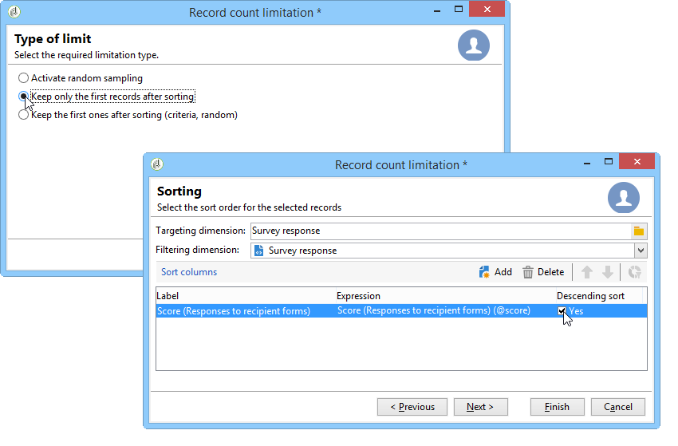

# 發佈、追蹤及使用收集的資料{#publish-track-and-use-collected-data}


建立、設定和發佈表單後，您就可以與對象共用連結，並追蹤回應。

>[!NOTE]
>
>Adobe Campaign中調查的生命週期及其發佈和傳送模式類似於Web表單：這些在[本節](../../web/using/about-web-forms.md)中有詳細說明。

## 調查儀表板 {#survey-dashboard}

每個調查都有自己的控制面板，可讓您檢視其狀態、說明、公用URL和可用性排程。 它也可讓您檢視可用的報表。 [了解更多](#reports-on-surveys)。

調查問卷的公用URL會顯示在控制面板上：


## 回應追蹤 {#response-tracking}

您可以在記錄檔與報表中追蹤意見調查回應。

### 調查記錄 {#survey-logs}

對於每個傳送的問卷，您可以在&#x200B;**[!UICONTROL Logs]**&#x200B;索引標籤中追蹤回應。 此索引標籤顯示已完成調查的使用者清單及其來源：


連按兩下某一行，以顯示回應填入的調查表單。 您可以瀏覽調查問卷的全文，並完整存取答案。 這些檔案可匯出到外部檔案中。 如需詳細資訊，請參閱[匯出答案](#exporting-answers)。

透過新增下列字元，在調查URL中指出來源：

```
?origin=xxx
```

正在編輯意見調查時，其URL包含引數&#x200B;**[!UICONTROL __uuid]**，這表示它處於測試階段，尚未上線。 當您透過此URL存取意見調查時，建立的記錄不會納入追蹤（報表）的考量。 來源被強製為值&#x200B;**[!UICONTROL Adobe Campaign]**。

如需URL引數的詳細資訊，請參閱[此頁面](../../web/using/defining-web-forms-properties.md#form-url-parameters)。

### 調查報表 {#reports-on-surveys}

控制面板標籤可讓您存取調查報表。 按一下報表名稱即可檢視。


意見調查的結構會顯示在&#x200B;**[!UICONTROL Documentation]**&#x200B;報表中。

在調查的&#x200B;**[!UICONTROL Reports]**&#x200B;索引標籤中還有另外兩個關於網路調查的報告： **[!UICONTROL General]**&#x200B;和&#x200B;**[!UICONTROL Breakdown of responses]**。

* 一般

  此報表包含調查的一般資訊：回應的數量如何隨著時間而改變，以及依來源和語言的分佈。

  一般報表的範例：

  

* 回覆的劃分

  此報表顯示每個問題的回覆細目。 此劃分僅適用於&#x200B;**[!UICONTROL Question]**&#x200B;型別容器中儲存欄位的答案。 它僅適用於選取控制項（例如文字欄位沒有劃分）。

  

## 匯出答案 {#exporting-answers}

意見調查的結果可以匯出到外部檔案中，以便稍後處理。 有兩種方法可以達成此目的：

1. 匯出報表資料

   若要匯出報表資料，請按一下&#x200B;**[!UICONTROL Export]**&#x200B;按鈕，然後選擇匯出格式。

   如需匯出報表資料的詳細資訊，請參閱[本區段](../../reporting/using/about-reports-creation-in-campaign.md)。

1. 匯出答案

   若要匯出答案，請按一下問卷的&#x200B;**[!UICONTROL Responses]**&#x200B;標籤，然後按一下滑鼠右鍵。 選取 **[!UICONTROL Export...]**。

   

   然後輸入要匯出的資訊和儲存檔案。

   您可以在匯出輔助程式中設定輸出檔案的內容和格式。

   這可讓您：

   * 將欄新增至輸出檔案，並復原收件者的資訊（儲存在資料庫中），
   * 格式化匯出的資料，
   * 選取檔案中資訊的編碼格式。

   如果您要匯出的問卷包含多個&#x200B;**[!UICONTROL Multi-line text]**&#x200B;或&#x200B;**[!UICONTROL HTML text]**&#x200B;欄位，則必須以&#x200B;**[!UICONTROL XML]**&#x200B;格式匯出。 若要這麼做，請在&#x200B;**[!UICONTROL Output format]**&#x200B;欄位的下拉式清單中選取此格式，如下所示：

   

   按一下&#x200B;**[!UICONTROL Start]**&#x200B;以執行匯出。

   >[!NOTE]
   >
   >[此區段](../../platform/using/about-generic-imports-exports.md)中詳細說明了資料匯出及其設定的階段。

## 使用收集的資料 {#using-the-collected-data}

透過線上調查收集的資訊可在目標定位工作流程的框架內復原。 若要這麼做，請使用&#x200B;**[!UICONTROL Survey responses]**&#x200B;方塊。

在下列範例中，我們想要針對線上上調查中至少有兩個孩子且分數最高的五名收件者，特別提供網站優惠方案。 本問卷的答案為：


在目標定位工作流程中，**[!UICONTROL Survey responses]**&#x200B;將設定如下：


首先，請選取相關的調查，然後在視窗的中央區段中選取要擷取的資料。 在此情況下，我們至少需要擷取分數欄，因為此分數欄將用於分割方塊，以復原5個最高分數。

按一下&#x200B;**[!UICONTROL Edit query...]**&#x200B;連結，指示答案的篩選條件。


開始目標定位工作流程。 查詢找回8個收件者。


在集合方塊的輸出轉變上按一下滑鼠右鍵以檢視。


然後，在工作流程中放置分割方塊，以復原分數最高的5個收件者。

編輯分割方塊以進行設定：

* 在&#x200B;**[!UICONTROL General]**&#x200B;索引標籤中選取適當的結構描述，然後設定子集：

  

* 移至&#x200B;**[!UICONTROL Sub-sets]**&#x200B;標籤並選取&#x200B;**[!UICONTROL Limit the selected records]**&#x200B;選項，然後按一下&#x200B;**[!UICONTROL Edit...]**&#x200B;連結。

  

* 選取&#x200B;**[!UICONTROL Keep only the first records after sorting]**&#x200B;選項並選取排序欄。 核取 **[!UICONTROL Descending sort]** 選項。

  

* 按一下&#x200B;**[!UICONTROL Next]**&#x200B;按鈕，將記錄數限製為5。

  

* 按一下&#x200B;**[!UICONTROL Finish]**，然後重新啟動工作流程以核准鎖定目標。

## 標準化資料 {#standardizing-data}

您可以在Adobe Campaign中為使用別名收集的資料設定標準化流程。 這可讓您標準化資料庫中儲存的資料：若要這麼做，請在包含相關資訊的逐項清單中定義別名。 在&#x200B;**Adobe Campaign v8 （主控台）檔案**&#x200B;中進一步瞭解如何[使用分項清單](https://experienceleague.adobe.com/en/docs/campaign/campaign-v8/config/settings/enumerations){target=_blank}。