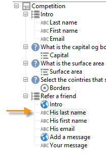

# 使用實例：建立轉介表單{#use-case-creating-a-refer-a-friend-form}


在此範例中，我們想向資料庫中的收件者提供競爭。 網路表單中會有一個輸入答案的區段，另一個則會輸入朋友的電子郵件地址來引用朋友。


識別和競爭塊使用先前描述的過程來建立。

若要設定並建立反向連結區塊，請套用下列步驟：

1. 建立競爭Web表單，其中包含問題，以及輸入朋友的聯繫資訊的欄位，如下所示：

   

   此 **您的訊息** 欄位可讓您輸入被推薦者的訊息。 The referrer must also enter their **Last name**, **First name** and **Email**.

   The information entered in the fields is stored in a specific table known as the visitor table.

   >[!NOTE]
   >
   >只要收件者尚未提供同意，您就無法將其與資料庫中的收件者儲存。 它們將暫時儲存在 **訪客** 表格(**nms:visitor**)，專為病毒式行銷活動而設計。 由於 **清除** 操作。
   >
   >在此範例中，我們想要鎖定收件者，建議他們參與其反向連結建議的競爭。 不過，在此郵件中，我們還希望向他們提供我們其中一項資訊服務的訂購。 如果訂閱，則可將其儲存在資料庫中。

   

   與推薦相關的欄位內容將用於設定檔建立指令碼以及發送給推薦者的消息中。

1. 首先，建立指令碼以將反向連結連結至推薦者。

   它包含下列指示：

   

   ```
   ctx.recipient.visitor.@id = xtk.session.GetNewIds(1)
   ctx.recipient.visitor.@forwardUrl = "APP5"
   ctx.recipient.visitor.@referrerEmail = ctx.recipient.@email
   ctx.recipient.visitor.@referrerFirstName = ctx.recipient.@firstName
   ctx.recipient.visitor.@referrerLastName = ctx.recipient.@lastName
   ```

   在頁面識別區塊中輸入的姓氏、名字和電子郵件地址識別為反向連結的姓氏、名字和電子郵件地址。 這些欄位將重新插入發送給裁判的訊息內文。

   The APP5 value matches the internal name of the Web form: this information lets you find out the referee&#39;s origin, i.e. link the visitor to the Web form based on which they were created.

1. The storage box lets you gather information and store it in the database.

   

1. Then create the delivery template linked to the information service created during step 1. 它將選取於 **[!UICONTROL Choose scenario]** 資訊服務欄位。

   The delivery template used to create the referral offer message contains the following information:

   

   此範本具有下列特性：

   * 選取訪客表格作為目標對應。

      

   * 推薦者的聯絡資訊以及反向連結的資訊都取自訪客表格。 會使用個人化按鈕插入。

      

   * This template contains a link to the competition form and the subscription link for the referee to subscribe to the newsletter.

      訂閱連結會透過個人化區塊插入。 依預設，它可讓您將設定檔訂閱至 **電子報** 服務。 您可以變更此個人化區塊以符合您的需求，例如將收件者訂閱至不同服務。

   * 內部名稱（此處為「反向連結」）將用於訊息傳送指令碼，如下所示。
   >[!NOTE]
   >
   >請參閱 [本頁](../../delivery/using/about-templates.md) 以取得傳遞範本的詳細資訊。

1. 建立傳送訂閱訊息的第二個指令碼。

   

   ```
   // Updtate visitor to have a link to the referrer recipient
   ctx.recipient.visitor.@referrerId = ctx.recipient.@id
   ctx.recipient.visitor.@xtkschema = "nms:visitor"
   ctx.recipient.visitor.@_operation = "update" 
   ctx.recipient.visitor.@_key = "@id" 
   xtk.session.Write(ctx.recipient.visitor)
   
   // Send email to friend
   nms.delivery.QueueNotification("referrer",
   <delivery>
   <targets>
     <deliveryTarget>
       <targetPart type='query' exclusion='false' ignoreDeleteStatus='false'>
         <where>
           <condition expr={'@id IN ('+ ctx.recipient.visitor.@id +')' }/>
         </where>
       </targetPart>
      </deliveryTarget>
     </targets>
    </delivery>)
   ```

1. 發佈競爭表單並傳送邀請給初始目標的收件者。 When one of them invites a friend, a delivery based on the **Referral offer** template is created.

   

   推薦會新增至 **[!UICONTROL Administration > Visitors node]**:

   

   其設定檔包含其反向連結所輸入的資訊。 它會根據在表單指令碼中輸入的設定而儲存。 如果他們決定訂閱電子報，則會將其儲存在收件者表格中。
