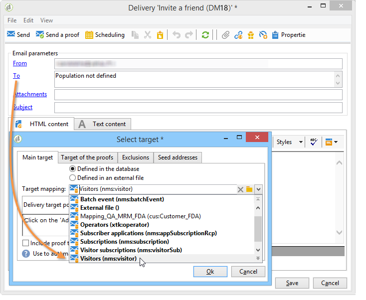

# 使用實例：建立轉介表單{#use-case-creating-a-refer-a-friend-form}

在此範例中，我們想向資料庫中的收件者提供競爭。 網路表單中會有一個輸入答案的區段，另一個則會輸入朋友的電子郵件地址來引用朋友。


識別和競爭塊使用先前描述的過程來建立。

若要設定並建立反向連結區塊，請套用下列步驟：

1. 建立競爭Web表單，其中包含問題，以及輸入朋友的聯繫資訊的欄位，如下所示：

   

   **您的訊息**&#x200B;欄位可讓您輸入推薦者的訊息。 反向連結也必須輸入其&#x200B;**姓氏**、**名字**&#x200B;和&#x200B;**電子郵件**。

   在欄位中輸入的資訊會儲存在稱為訪客表格的特定表格中。

   >[!NOTE]
   >
   >只要收件者尚未提供同意，您就無法將其與資料庫中的收件者儲存。 它們會暫時儲存在專為病毒式行銷促銷活動設計的&#x200B;**visitor**&#x200B;表格(**nms:visitor**)中。 由於&#x200B;**clearing**&#x200B;操作，此表定期清除。
   >
   >在此範例中，我們想要鎖定收件者，建議他們參與其反向連結建議的競爭。 不過，在此郵件中，我們還希望向他們提供我們其中一項資訊服務的訂購。 如果訂閱，則可將其儲存在資料庫中。

   

   與推薦相關的欄位內容將用於設定檔建立指令碼以及發送給推薦者的消息中。

1. 首先，建立指令碼以將反向連結連結至推薦者。

   它包含下列指示：

   

   ```
   ctx.recipient.visitor.@id = xtk.session.GetNewIds(1)
   ctx.recipient.visitor.@forwardUrl = "APP5"
   ctx.recipient.visitor.@referrerEmail = ctx.recipient.@email
   ctx.recipient.visitor.@referrerFirstName = ctx.recipient.@firstName
   ctx.recipient.visitor.@referrerLastName = ctx.recipient.@lastName
   ```

   在頁面識別區塊中輸入的姓氏、名字和電子郵件地址識別為反向連結的姓氏、名字和電子郵件地址。 這些欄位將重新插入發送給裁判的訊息內文。

   APP5值與Web表單的內部名稱相符：此資訊可讓您查明裁判的來源，即將訪客連結至根據其建立的Web表單。

1. 儲存框允許您收集資訊並將其儲存在資料庫中。

   

1. 然後建立連結至步驟1期間建立之資訊服務的傳送範本。 將在資訊服務的&#x200B;**[!UICONTROL Choose scenario]**&#x200B;欄位中選取。

   用於建立反向連結選件訊息的傳送範本包含下列資訊：

   

   此範本具有下列特性：

   * 選取訪客表格作為目標對應。

      

   * 推薦者的聯絡資訊以及反向連結的資訊都取自訪客表格。 會使用個人化按鈕插入。

      

   * 此範本包含競爭表單的連結，以及裁判訂閱電子報的訂閱連結。

      訂閱連結會透過個人化區塊插入。 依預設，它可讓您訂閱設定檔至&#x200B;**電子報**&#x200B;服務。 您可以變更此個人化區塊以符合您的需求，例如將收件者訂閱至不同服務。

   * 內部名稱（此處為「反向連結」）將用於訊息傳送指令碼，如下所示。
   >[!NOTE]
   >
   >如需傳遞範本的詳細資訊，請參閱[本頁面](../../delivery/using/about-templates.md)。

1. 建立傳送訂閱訊息的第二個指令碼。

   

   ```
   // Updtate visitor to have a link to the referrer recipient
   ctx.recipient.visitor.@referrerId = ctx.recipient.@id
   ctx.recipient.visitor.@xtkschema = "nms:visitor"
   ctx.recipient.visitor.@_operation = "update" 
   ctx.recipient.visitor.@_key = "@id" 
   xtk.session.Write(ctx.recipient.visitor)
   
   // Send email to friend
   nms.delivery.QueueNotification("referrer",
   <delivery>
   <targets>
     <deliveryTarget>
       <targetPart type='query' exclusion='false' ignoreDeleteStatus='false'>
         <where>
           <condition expr={'@id IN ('+ ctx.recipient.visitor.@id +')' }/>
         </where>
       </targetPart>
      </deliveryTarget>
     </targets>
    </delivery>)
   ```

1. 發佈競爭表單並傳送邀請給初始目標的收件者。 當其中一個邀請朋友時，會建立以&#x200B;**反向連結選件**&#x200B;範本為基礎的傳送。

   

   推薦被添加到&#x200B;**[!UICONTROL Administration > Visitors node]**&#x200B;中的訪客資料夾：

   

   其設定檔包含其反向連結所輸入的資訊。 它會根據在表單指令碼中輸入的設定而儲存。 如果他們決定訂閱電子報，則會將其儲存在收件者表格中。
