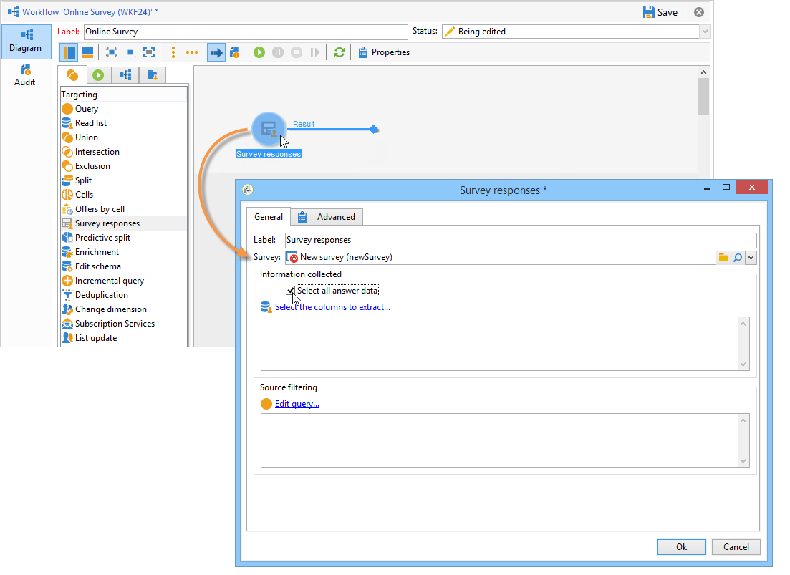

# 使用案例：顯示線上意見調查之答案的報告{#use-case-displaying-report-on-answers-to-an-online-survey}

Adobe Campaign調查的回答可使用專用報表進行收集和分析。

在下列範例中，我們想要收集線上調查的答案，並將它們顯示在樞紐分析表中

應用以下步驟：

1. 建立工作流程以復原意見調查的結果，並將結果儲存在清單中。
1. 使用清單中的資料建立立方體。
1. 使用樞紐分析表建立報表並檢視答案的劃分。

在開始使用此使用案例之前，您需要具有調查及一組您可分析的答案的存取權。

>[!NOTE]
>
>唯有在您取得 **調查管理員** 選項。 請檢查您的授權合約。

## 步驟1 — 建立資料收集和儲存工作流程 {#step-1---creating-the-data-collection-and-storage-workflow}

若要收集問卷的答案，請套用下列步驟：

1. 建立工作流程並放置 **[!UICONTROL Answers to a survey]** 活動。 有關使用此活動的詳細資訊，請參閱 [本節](../../surveys/using/publish--track-and-use-collected-data.md#using-the-collected-data).
1. 編輯活動並選取您要分析其答案的調查。
1. 啟用 **[!UICONTROL Select all the answer data]** 收集所有資訊的選項。

   

1. 選取要擷取的欄（在此案例中為： select：所有已封存欄位）。 這些是包含答案的欄位。

   

1. 設定回應收集方塊後，將 **[!UICONTROL List update]** 輸入活動以儲存資料。

   

   在此活動中，指定要更新的清單並取消勾選 **[!UICONTROL Purge and re-use the list if it exists (otherwise add to the list)]** 選項：答案會新增至現有表格。 此選項可讓您參照立方體中的清單。 每次更新都不會重新產生連結至清單的結構描述，以確保使用此清單的多維資料庫的完整性。

   

1. 啟動工作流程以確認其設定。

   

   指定的清單會建立，並包含調查答案的結構描述。

1. 新增排程器，以自動執行每日答案收集和清單更新。

   此 **[!UICONTROL List update]** 和 **[!UICONTROL Scheduler]** 中會詳細說明活動。

## 步驟2 — 建立立方結構、其測量值及其指標 {#step-2---creating-the-cube--its-measures-and-its-indicators}

然後您可以建立立方結構並設定其計量：它們將用於建立將顯示在報告中的指標。 有關建立和設定多維度資料集的詳細資訊，請參閱 [關於立方體](../../reporting/using/ac-cubes.md).

在此範例中，Cube是以先前建立的工作流程饋送之清單中的資料為基礎。

定義要在報告中顯示的維度和量值。 在這裡，我們要顯示合約日期和回應者的國家。

此 **[!UICONTROL Preview]** 索引標籤可讓您控制報表的呈現。

## 步驟3 — 建立報告並設定表格內的資料配置 {#step-3---creating-the-report-and-configuring-the-data-layout-within-the-table}

然後，您可以根據此立方結構建立報表，並處理資料和資訊。

根據您的需求調整資訊以顯示。

