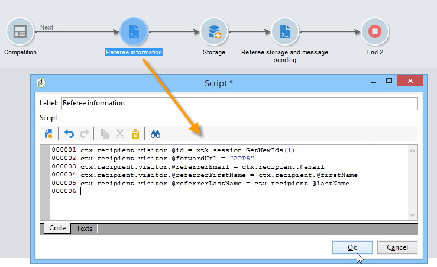
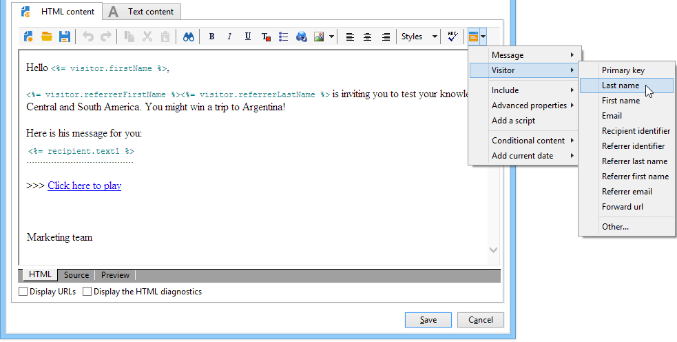

# 使用實例：建立轉介表單{#use-case-creating-a-refer-a-friend-form}


在此範例中，我們要與資料庫中的收件者競爭。 網路表單會有一個區段用於輸入答案，另一個區段用於輸入朋友的電子郵件地址以推薦朋友。


識別與競爭區塊是使用前述程式建立的。

若要設定和建立轉介區塊，請套用下列步驟：

1. 建立競爭網路表單，其中包含問題以及用於輸入朋友聯絡資訊的欄位，如下所示：

   

   **您的訊息**&#x200B;欄位可讓您為裁判輸入訊息。 反向連結還必須輸入其&#x200B;**姓氏**、**名字**&#x200B;和&#x200B;**電子郵件**。

   在欄位中輸入的資訊會儲存在稱為訪客表格的特定表格中。

   >[!NOTE]
   >
   >只要收件者未表示同意，您就無法將兩者與收件者儲存在資料庫中。 它們會暫時儲存在專為病毒式行銷活動設計的&#x200B;**訪客**&#x200B;資料表(**nms：visitor**)中。 由於&#x200B;**清除**&#x200B;作業，此表格會定期清除。
   >
   >在此範例中，我們想要鎖定收件者，以建議他們參與反向連結建議的競爭。 不過，在這封郵件中，我們也要向他們提供我們其中一個資訊服務的訂閱。 如果他們訂閱，可以儲存在資料庫中。

   

   與參考者相關的欄位內容將用於設定檔建立指令碼和傳送給他們的訊息中。

1. 首先，建立指令碼以將反向連結連結至被推薦者。

   它包含下列指示：

   

   ```
   ctx.recipient.visitor.@id = xtk.session.GetNewIds(1)
   ctx.recipient.visitor.@forwardUrl = "APP5"
   ctx.recipient.visitor.@referrerEmail = ctx.recipient.@email
   ctx.recipient.visitor.@referrerFirstName = ctx.recipient.@firstName
   ctx.recipient.visitor.@referrerLastName = ctx.recipient.@lastName
   ```

   在頁面識別區塊中輸入的姓氏、名字和電子郵件地址會識別為反向連結的姓氏、名字和電子郵件地址。 這些欄位將重新插入傳送給裁判的訊息內文。

   APP5值符合Web表單的內部名稱：此資訊可讓您找出被推薦者的來源，也就是將訪客連結至根據其建立的Web表單。

1. 儲存方塊可讓您收集資訊並將其儲存在資料庫中。

   

1. 然後建立傳遞範本，連結至在步驟1中建立的資訊服務。 它將會在資訊服務的&#x200B;**[!UICONTROL Choose scenario]**&#x200B;欄位中選取。

   用來建立轉介優惠訊息的傳遞範本包含下列資訊：

   

   此範本具有以下特性：

   * 選取訪客表格作為目標對應。

     

   * 被推薦者的聯絡資訊以及反向連結上的資訊會從訪客表格中取得。 使用個人化按鈕插入。

     

   * 此範本包含競爭表單的連結，以及供裁判訂閱電子報的訂閱連結。

     訂閱連結會透過個人化區塊插入。 依預設，它可讓您訂閱設定檔至&#x200B;**電子報**&#x200B;服務。 您可以變更此個人化區塊以符合您的需求，例如為收件者訂閱不同的服務。

   * 內部名稱（此處為「referrer」）將用於訊息傳遞指令碼，如下所示。

   >[!NOTE]
   >
   >如需傳遞範本的詳細資訊，請參閱[此頁面](../../delivery/using/about-templates.md)。

1. 建立用於傳遞訂閱訊息的第二個指令碼。

   

   ```
   // Updtate visitor to have a link to the referrer recipient
   ctx.recipient.visitor.@referrerId = ctx.recipient.@id
   ctx.recipient.visitor.@xtkschema = "nms:visitor"
   ctx.recipient.visitor.@_operation = "update" 
   ctx.recipient.visitor.@_key = "@id" 
   xtk.session.Write(ctx.recipient.visitor)
   
   // Send email to friend
   nms.delivery.QueueNotification("referrer",
   <delivery>
   <targets>
     <deliveryTarget>
       <targetPart type='query' exclusion='false' ignoreDeleteStatus='false'>
         <where>
           <condition expr={'@id IN ('+ ctx.recipient.visitor.@id +')' }/>
         </where>
       </targetPart>
      </deliveryTarget>
     </targets>
    </delivery>)
   ```

1. Publish競爭表單，並傳送邀請給初始目標的收件者。 當其中一個邀請朋友時，會建立以&#x200B;**轉介選件**&#x200B;範本為基礎的傳遞。

   

   被推薦者已新增至&#x200B;**[!UICONTROL Administration > Visitors node]**&#x200B;中的訪客資料夾：

   

   其設定檔包含其反向連結輸入的資訊。 它會根據在表單指令碼中輸入的設定進行儲存。 如果他們決定訂閱電子報，則會儲存在收件者表格中。
