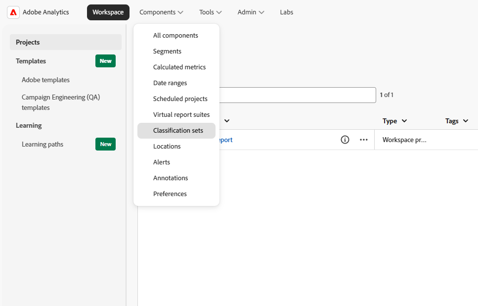
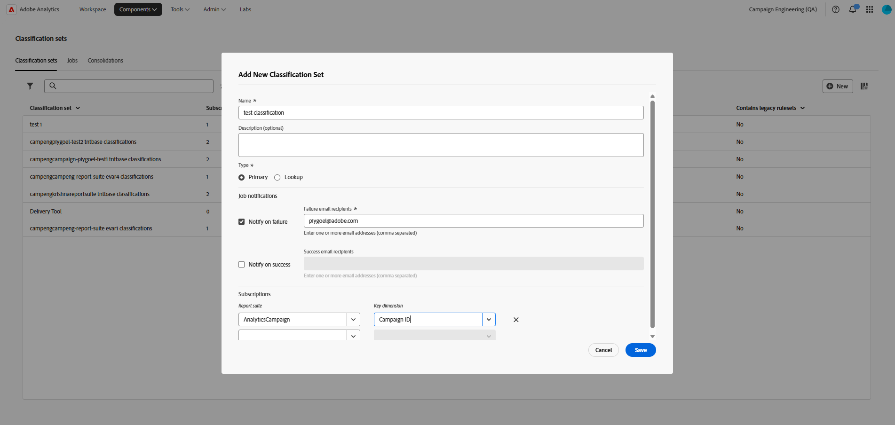

# 移轉至Adobe Analytics 2.0 API {#analytics-2-migration}

Adobe Analytics 1.4 API [即將結束生命週期](https://developer.adobe.com/analytics-apis/docs/1.4/guides/eol){target="_blank"}。 將您的Campaign執行個體連結至Adobe Analytics的[Web Analytics聯結器](../../integrations/using/gs-aa.md)仰賴這些API，因此您需要升級至使用新Analytics 2.0 API的組建，以維持整合正常運作。

>[!CAUTION]
>
>升級時會重新匯入兩個內建的技術工作流程（支援聯結器[!UICONTROL webAnalyticsSendMetrics]和[!UICONTROL webAnalyticsGetWebEvents]） （請參閱[Web Analytics工作流程參考](../../workflow/using/web-analytics.md)，瞭解每個工作流程的用途）。 您在這些工作流程之上自訂的任何內容，都會被重新匯入覆寫。 避免直接修改這些內建工作流程 — 改為在個別的自訂工作流程中建置自訂專案，以免日後升級時覆寫自訂專案。 此升級也會更新內建的Analytics JavaScript檔案：如果您的任何自訂工作流程參考這些檔案，這些檔案將會中斷，且需要加以調整以符合新的程式碼。

## 您有受到影響嗎？ {#are-you-impacted}

如果您的執行個體將[!UICONTROL Web Analytics]外部帳戶用於下列任一專案，就會影響您：

* 將電子郵件行銷活動指標和屬性作為量度傳送至Adobe Analytics。
* 傳送分類資料至Adobe Analytics。
* 再行銷流程（識別行銷活動後的轉換聯絡人）。
* 您計畫首次設定的[!UICONTROL Web Analytics]外部帳戶。

不確定其中哪一個適用於您？ 檢查執行個體上有使用中的上述技術工作流程，並在[!UICONTROL Administration > Platform > External accounts]中檢閱您的[!UICONTROL Web Analytics]外部帳戶設定（請參閱[網站分析外部帳戶](../../installation/using/external-accounts.md#web-analytics-external-account)）。

## 如何移轉 {#how-to-migrate}

如果您在&#x200B;**Adobe代管**&#x200B;執行個體上，Adobe會在升級過程中為您處理SFTP布建、IP允許清單和金鑰設定，您只需在新組建上線後驗證使用案例。

如果您在&#x200B;**內部部署或混合**&#x200B;部署，請完成下列步驟。

1. [將您的Campaign環境](../../production/using/build-upgrade.md)升級至包含Adobe Analytics 2.0變更的組建。 您可以確認從[!UICONTROL Help > About...]執行哪個組建（請參閱[如何檢查您的Campaign版本](../../platform/using/launching-adobe-campaign.md#getting-your-campaign-version)）。
1. 檢閱上述哪些使用案例適用於您的執行個體，因為下一步將視其而定。
1. 如果您使用再行銷流程，[!UICONTROL webAnalyticsFindConverted]工作流程需要專用的SFTP通道才能與Adobe Analytics 2.0交換資料。 請依照以下步驟進行設定；否則，請跳至下一個步驟。
   1. 使用金鑰式驗證來布建執行個體的SFTP伺服器，遵循您套用至任何其他外部SFTP整合的相同[SFTP伺服器最佳實務](../../platform/using/sftp-server-usage.md)。 Adobe提供[範例SFTP安裝指令碼](https://experience.adobe.com/#/downloads/content/software-distribution/en/campaign.html?package=/content/software-distribution/en/details.html/content/dam/campaign/public/setup_sftp.zip){target="_blank"}來協助您開始使用。
   1. 執行隨新組建提供的指令碼，在Adobe Analytics中註冊該伺服器的連線詳細資料：

      ```
      nlserver javascript -instance:<instance_name> -arg:host=<sftp_host_url>#user=<sftp_user> -file <path_to_the_file>/aaremarketingLocation.js
      ```

      範例：

      ```
      nlserver javascript -instance:test_mkt_stage2 -arg:host=test-mkt-stage1.campaign.adobe.com#user=test -file ./nl6/datakit/nms/eng/js/aaremarketingLocation.js
      ```

   1. 在SFTP伺服器上將Adobe Analytics加入允許清單，因為再行銷匯出只會從一組固定的Adobe IP範圍啟動：
      * [查詢目前的Adobe Analytics資料收集IP位址](https://experienceleague.adobe.com/zh-hant/docs/core-services/interface/data-collection/ip-addresses){target="_blank"}，並將其新增至您的SFTP伺服器允許清單。 以FTP為基礎的Analytics匯出（包括資料摘要）只會來自倫敦、奧勒岡和新加坡區域的IPv4位址。
      * [擷取Adobe Analytics公開金鑰](https://experienceleague.adobe.com/zh-hant/docs/experience-cloud-kcs/kbarticles/ka-18141){target="_blank"}並將其新增至SFTP伺服器上的`authorized_keys`檔案，以便Analytics能夠進行驗證。
1. 在Campaign Explorer樹狀結構中的&#x200B;**[!UICONTROL Administration]> [!UICONTROL Platform] >[!UICONTROL Options]**&#x200B;下，在[!UICONTROL xtkOption]中建立或設定選項`longvalue`為`1`，以在您的執行個體上啟用`FEATUREFLAG_USE_ANALYTICS_20_API`功能標幟。 無論上述使用案例適用於您，都需要執行此步驟。
1. 在停用任何舊的連線之前，透過實施適用於您執行個體的每個使用案例來驗證移轉(傳送測試行銷活動、檢查指標是否進入Analytics，以及確認再行銷資料（如果適用）)。

## 設定新的網站分析外部帳戶 {#setting-up-a-new-web-analytics-external-account}

不論您的執行個體為Adobe託管或內部部署/混合，以下專案適用。

如果您是第一次設定[!UICONTROL Web Analytics]外部帳戶，而不是移轉現有的帳戶，請依照[外部帳戶設定步驟](../../installation/using/external-accounts.md#web-analytics-external-account)和[聯結器快速入門手冊](../../integrations/using/gs-aa.md)操作。

由於Analytics 2.0引進了新的分類處理方式，因此您還需要在Adobe Analytics中建立分類設定，外部帳戶才能擷取報表套裝的分類資料。 此為全新步驟：在設定轉換變數和成功事件之後，以及在Campaign中設定外部帳戶之前建立它。

若要建立您的「分類設定」：

1. 從[!DNL Adobe Analytics]頂端功能表列選取&#x200B;**[!UICONTROL Components]** > **[!UICONTROL Classification sets]**，然後按一下&#x200B;**[!UICONTROL New]**。

   

1. 在&#x200B;**[!UICONTROL Add New Classification Set]**&#x200B;對話方塊：

   

   * 輸入分類集的&#x200B;**[!UICONTROL Name]**。
   * 將&#x200B;**[!UICONTROL Type]**&#x200B;設為&#x200B;**[!UICONTROL Primary]**。
   * 在&#x200B;**[!UICONTROL Job notifications]**&#x200B;中，選擇分類設定作業成功或失敗時應通知的人，並提供對應的電子郵件地址。
   * 在&#x200B;**[!UICONTROL Subscriptions]**&#x200B;中，選取您的報表套裝，以及您在上一步中為內部行銷活動名稱建立的轉換變數。

1. 按一下 **[!UICONTROL Save]**。

當您在下一步設定外部帳戶時，Campaign會自動探索此分類集。 如需分類集的詳細資訊，請參閱[Adobe Analytics檔案](https://experienceleague.adobe.com/zh-hant/docs/analytics/components/classifications/sets/create-set){target="_blank"}。

## 需要協助嗎? {#need-help}

如果您在移轉期間遇到問題，請聯絡[Adobe客戶服務](https://helpx.adobe.com/tw/enterprise/admin-guide.html/enterprise/using/support-for-experience-cloud.ug.html){target="_blank"}。
