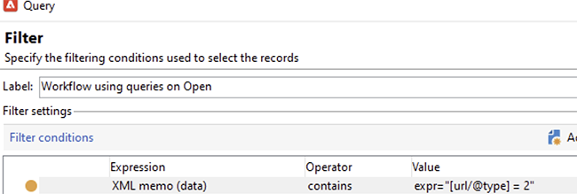
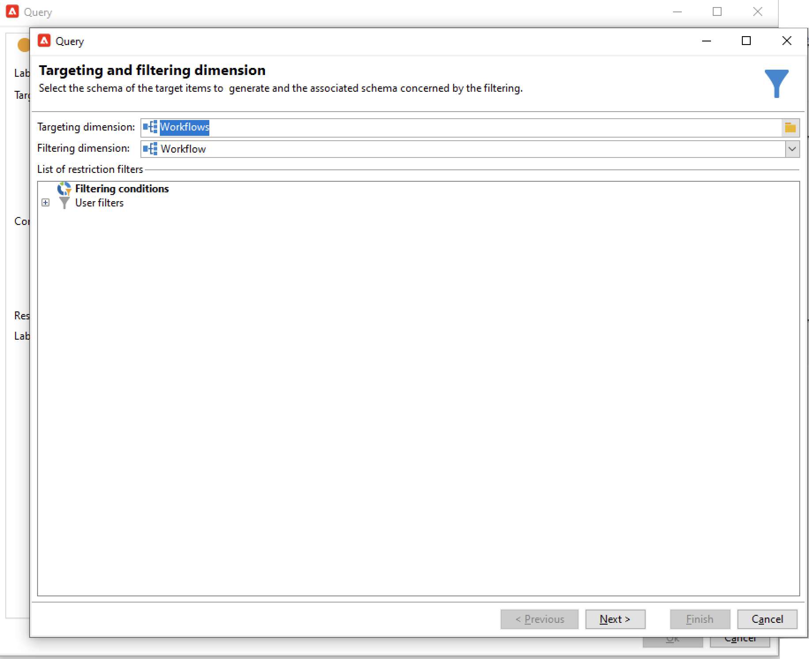
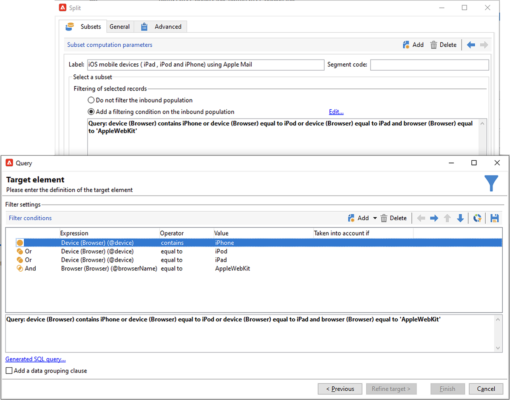

# Apple郵件應用程式中的郵件隱私保護


## 哪些部分有所變更？

2021年，Apple為原生郵件應用程式引入新的隱私權保護功能。 此應用程式現在包含Apple的郵件隱私權保護功能。 基本上，寄件者無法再使用追蹤畫素來收集有關已選擇開啟Apple郵件隱私權保護功能的收件者的資訊。

## 我的行銷活動受到哪些影響？

Adobe Campaign提供使用追蹤畫素來追蹤電子郵件開啟次數的功能。 此功能不僅可用於定位和促銷活動，也可用於量度。 例如，您可以使用電子郵件開啟率來評估促銷活動的成效和使用者的參與度。 簡而言之，您的行銷活動可能會影響細分、目標定位和量度。

## 我該採取什麼動作？

Apple的新功能是未來產業在電子郵件隱私保護方面的面貌。 我們強烈建議您遵循Adobe的建議。

### 評估對您的Campaign觸發程式的影響

評估這些變更如何影響您目前的促銷活動觸發程式。 識別將電子郵件開啟作為分段、目標定位或重新目標定位條件的工作流程。 閱讀[提示與秘訣](#find-email-open-tracking)。

### 保留您的資料

保留您的資料，並整合您目前的裝置知識。 您可以讓關鍵績效指標(KPI)以使用者代理程式為基礎。 例如，您可以根據使用iOS和Apple郵件應用程式之人員的設定檔建立KPI。 閱讀[提示與秘訣](#preserve-tracking-data)。

### 在保留期間過後封存您的追蹤記錄

在Adobe Campaign的保留期間過後封存您的追蹤記錄：

1. 檢查行銷活動執行個體中保留期的持續時間。
1. 仔細檢查您使用中的目標對應。 除了現成可用的設定檔表格(`nmsRecipient`)之外，決定是否使用自訂設定檔表格。
1. 從Adobe Campaign匯出您的追蹤記錄。 納入包含使用者代理程式和作業系統相關資料的記錄檔。

### 評估目前未結費率的趨勢

決定您的對象中哪些比例在iOS裝置上使用Apple的郵件應用程式。
使用此評估，您可以找出潛在的異常差距及其原因。 您可以判斷間隙是否是因為行銷活動效能問題或Apple的隱私權保護功能所造成。 閱讀[提示與秘訣](#measure-ios-footprint)。

### 重新評估您的行銷活動策略和績效量度

首先，我們強烈建議您主動重新評估行銷活動策略與行銷活動效能量度。 您可以將焦點重新放在更可靠的量度上，例如點進次數、產品檢視和購買。

建議您探索目前可用的資料，並評估開放率與其他量度之間的關聯性。 如果這些量度始終相關，您就可以提高信賴度來改善觸發程式。

## 提示與秘訣

### 測量整個iOS的足跡 {#measure-ios-footprint}

若要從Adobe Campaign資料收集深入分析，您可以使用現成可用的報表：

* **[!UICONTROL Operating Systems]**&#x200B;報告

  若要識別每個作業系統和每個版本的訪客比例，請使用此報表。 [閱讀全文](../../reporting/using/global-reports.md#operating-systems)。

  您可以檢視每個作業系統相對於訪客總數的訪客劃分。

  

  對於每個作業系統，您可以檢視每個作業系統版本的訪客劃分。

  

* **[!UICONTROL Breakdown of opens]**&#x200B;報告

  若要識別每個作業系統的電子郵件開啟比例，請使用此報表。 [閱讀全文](../../reporting/using/global-reports.md#breakdown-of-opens)。

  

### 決定如何使用電子郵件開啟追蹤 {#find-email-open-tracking}

您可以識別工作流程，其中電子郵件開啟作為分段、鎖定目標和重新定位的標準。

若要這麼做，您可以使用追蹤連結URL (**[!UICONTROL url/@type]**)的&#x200B;**[!UICONTROL type]**&#x200B;屬性。 針對電子郵件開啟，此屬性設定為&#x200B;**[!UICONTROL Open]**。 此屬性可從查詢編輯器、工作流程中的&#x200B;**[!UICONTROL Query]**&#x200B;活動以及預先定義的篩選器取得。 您可以使用此屬性當作行銷活動的目標定位條件。


在此範例中，行銷人員想要傳送獎勵優惠給在過去七天內開啟特定傳送電子郵件並在過去一個月中購買的收件者。 在工作流程查詢中，您可以透過各種方式使用電子郵件開啟：

* 您可以在查詢中使用電子郵件開啟作為目標定位條件。

  您可以指定特定傳遞的追蹤記錄的URL型別必須設定為&#x200B;**[!UICONTROL Open]**&#x200B;做為篩選條件。

  

* 您可以使用預先定義的篩選器。 [了解更多](../../workflow/using/creating-a-filter.md)。

  

  您可以在工作流程的查詢活動中使用此預先定義的篩選器。

  

  >[!NOTE]
  >
  >在工作流程中，您無法檢視預先定義篩選器的目標定位條件。

若要擷取使用電子郵件開啟作為目標定位條件的工作流程清單，您必須查詢`xtk:workflow`結構描述。 工作流程的內容以XML格式儲存在&#x200B;**[!UICONTROL XML memo (data)]**&#x200B;欄位中。


您可以指定工作流程必須包含此內容：

`expr="[url/@type] = 2"`

此目標定位條件表示追蹤的URL型別必須設為&#x200B;**[!UICONTROL Open]**。



#### 實作範例和範例套件

您可以善用此實施範例，識別將電子郵件開啟作為目標定位條件的工作流程，並傳送通知給您選擇的行銷活動運運算元。 您可以將此實作用於下列用途：

* 您可以在目標工作流程中，衡量從電子郵件開啟切換至其他KPI的潛在影響。 如果您不使用電子郵件開啟，則不需要進一步的動作。
* 當您重新評估實作時，您可以使用此範例來避免略過工作流程。

此範例說明單一技術工作流程中的自訂實作。


>[!IMPORTANT]
>
>此套件僅以範例提供，Adobe不支援此套件作為產品功能。
>
>您可能需要將範常式式碼調整成適合您的Campaign實施。
>
>一般使用者應自行負責安裝及使用此範例套件。
>
>我們強烈建議您在非生產環境中測試及驗證此套件。

下載[範例套件](assets/PKG_Search_workflows_using_Opens_in_queries_V1.xml)並安裝。 [了解更多](../../platform/using/working-with-data-packages.md#importing-packages)。

安裝套件後，您可以從包含執行個體中現成技術工作流程的資料夾存取工作流程：

`/Administration/Production/Technical workflows/nmsTechnicalWorkflow`

從使用者介面中選擇&#x200B;**[!UICONTROL Administration]** > **[!UICONTROL Production]** > **[!UICONTROL Technical workflows]**。


工作流程包含下列主要步驟：

1. 列出將電子郵件開啟作為目標定位條件的工作流程。
1. 列出預先定義的篩選器，其中電子郵件開啟會作為目標定位標準。
1. 列出使用這些預先定義篩選器的工作流程。
1. 將兩個工作流程清單合併為一個清單。
1. 傳送電子郵件通知給指定的操作員。

工作流程包含下列詳細步驟：

1. 初始活動是`xtk:workflow`結構描述中的查詢活動。 此活動用於根據例項查詢明確的工作流程查詢，包括作為定位條件的電子郵件開啟。

   

   

   

   結果會傳回工作流程清單。

   

   因為此資訊會被重複使用，所以工作表格的名稱會儲存在全域工作流程例項變數中。

   

1. 第二個查詢用於尋找包含電子郵件開啟的預定義篩選器。

   

   

   

   結果會傳回預先定義的篩選器清單。

   

1. 此預先定義的篩選器清單是用來尋找使用這些篩選器的工作流程。
1. 兩個工作流程清單會合併為一個清單。

   為此目的使用JavaScript程式碼。

   

   ```javascript
   const queryPredFilter = xtk.queryDef.create(
     <queryDef schema={vars.targetSchema} operation="select">
        <select>
          <node alias="@id" expr="@id" />
          <node alias="@name" expr="@name"  />
        </select>
        <where/>
     </queryDef>
       ).ExecuteQuery()
   
   var qDef =
     <queryDef schema="xtk:workflow" operation="select">
       <select>
         <node expr="@id"/>
         <node expr="@internalName"/>
         <node expr="@label"/>
       </select>
       <where>
         <condition boolOperator="OR" expr={"data like '%expr=[url/@type] = 2%'" }/>
       </where>
     </queryDef>
   
   for each (var filter in queryPredFilter) {       
   
      //logInfo (filter.@name);
      var condition;
      condition =<condition boolOperator="OR" expr={"data like '%" + filter.@name + "%'" }/>
      qDef.where.appendChild(condition);   
   
   }
   
   var queryWorkflowList = xtk.queryDef.create(qDef);
   var workflowList = queryWorkflowList.ExecuteQuery();
   
   var sWorkflowList = "";
   var iCount = 0
   for each (var workflow in workflowList) {       
   
      //logInfo ("Workflow ID: " + workflow.@id + " in " + instance.vars.mainTargetSchema);
   
      iWorkflowId = workflow.@id;
      iWorkflowName = workflow.@internaName;
      iWorkflowLabel = workflow.@label;
   
       xtk.session.Write(
             <{instance.vars.mainTargetSchema.split(':')[1]}
               _operation="insertOrUpdate"       
               _key="@id"
               xtkschema={instance.vars.mainTargetSchema}
               id={iWorkflowId}
               internaName={iWorkflowName}
               label={iWorkflowLabel}
             />
       )
   }
   ```

1. 重複的工作流程會從合併清單中移除。

   

1. 執行測試以檢查清單是否不是空的。

   

   如果清單不是空的，則會將其插入電子郵件通知的HTML表中。

   

   ```js
   const queryWorkflow = xtk.queryDef.create(
       <queryDef schema={vars.targetSchema} operation="select">
           <select>
               <node alias="@id" expr="@id" />
               <node alias="@internalName" expr="@internalName"  />
               <node alias="@label" expr="@label"  />
           </select>
           <where/>
       </queryDef>
   ).ExecuteQuery()
   
   var sWorkflowList = '<table border="0" >';
   
   sWorkflowList = sWorkflowList + "<tr><th>Worklow Id</th><th>Name</th><th>Label</th></tr>";
   
   for each (var workflow in queryWorkflow) {       
   
      sWorkflowList = sWorkflowList + "<tr>" +
                       "<td>" + workflow.@id + "</td>" +
                       "<td>" + workflow.@internalName + "</td>" +
                       "<td>" + workflow.@label + "</td>" +
                       "</tr>";
   
   }
   
   sWorkflowList = sWorkflowList + "</table>";
   
   instance.vars.workflowList = sWorkflowList;
   ```

1. HTML表格會新增至通知範本。

   ```js
   <%= instance.vars.workflowLIst%>
   ```

   

   電子郵件通知包含工作流程清單，其中包含電子郵件開啟作為查詢中的定位條件。

   

### 保留您目前的追蹤資料 {#preserve-tracking-data}

#### 哪些資料會受到影響？

設定檔資料更富含來自動作（例如電子郵件開啟和點進）的追蹤資料。 在有此資訊時，追蹤功能也會透過使用者代理程式提供有關使用者裝置的重要資訊。

簡而言之，Adobe Campaign追蹤資料提供下列資訊：

* 與開啟或點進特定電子郵件訊息之人員相關聯的設定檔
* 開啟日期
* 使用的裝置，例如iPhone或Mac
* 作業系統和版本，例如iOS 15、macOS 12或Windows 10
* 應用程式（例如郵件應用程式或網頁瀏覽器）和版本（例如Outlook 2019）

#### 為什麼要保留追蹤資料？

基於下列多項原因，我們強烈建議您保留此資料：

* Adobe Campaign會保留此資料一段有限的時間。 保留期間會因執行個體的設定而異。

  檢查執行個體的設定。 [閱讀全文](../../platform/using/privacy-management.md#data-retention)。

* 除了Apple最近的變更以外，您還可以使用追蹤資料來新增巨大價值，以吸引受眾參與。
* Apple可能會對其原生郵件應用程式和郵件隱私權保護功能進行進一步的變更。

基於上述原因，我們強烈建議您儘快匯出這些資料。 否則，您對部分對象的追蹤資料可能會受到負面影響。

#### 如何保留追蹤資料？

若要保留追蹤資料，您必須將其從Adobe Campaign匯出至資訊系統。 [閱讀全文](../../platform/using/get-started-data-import-export.md)。

>[!IMPORTANT]
>
>下列範例著重於現成可用的結構描述`nms:Recipient`，這是預設的設定檔結構描述。 如果您使用附加到自訂設定檔的其他自訂目標對應，我們建議您將此匯出策略擴充到所有自訂記錄表。 [閱讀全文](../../configuration/using/target-mapping.md)。

##### 原則

依預設，`nms:Recipient`結構描述會連結至您必須匯出的三個結構描述：

| 結構描述 | 內容 |
| --- | --- |
| nms：trackingLogRcp | 追蹤資料，對使用者、時間和相關訊息而言 |
| nms：trackingUrl | 連結的詳細資訊，包括性質，例如開啟的電子郵件或點進 |
| nms：userAgent | 裝置的相關資訊 |

這些表格會在資料模型中連結。


使用這些關係來建立單一匯出查詢。


您可以使用連結結構描述中的有用資訊豐富此資料：

| 結構描述 | 內容 |
| --- | --- |
| nms：Recipient | 與設定檔相關的詳細資料 |
| nms：傳送 | 使用者回應之訊息的相關資訊 |

您可以將結果匯出至Adobe Campaign支援的外部儲存解決方案：

* SFTP
* S3
* Azure Blob

##### 實施

此範例說明如何從Adobe Campaign匯出追蹤資料。

1. 建立以查詢開頭的工作流程。

   初始查詢是用來擷取過去三個月的追蹤記錄。
您可以使用增量查詢來僅擷取尚未匯出的記錄。

   從&#x200B;**[!UICONTROL Additional data]**&#x200B;節點新增所有必要資訊。

   

1. 新增&#x200B;**[!UICONTROL Data extraction (file)]**&#x200B;活動。 將查詢的所有資料對應到擷取檔案格式。

   

   選擇檔案格式，例如TXT或CSV。

   

1. 新增第三個也是最後一個將檔案上傳至支援的儲存解決方案的活動。


##### 進階實施：依iOS裝置劃分

您可以使用工作流程來判斷收件者是否使用Apple的郵件應用程式。 您可以依裝置分割追蹤記錄。 例如，您可以使用查詢篩選器來依iOS裝置劃分記錄：

| 應用程式 | 作業系統或裝置  | 查詢篩選器 |
| --- | --- | --- |
| Apple Mail | iOS 15 | `operating System (Browser) contains 'iOS 15' and browser (Browser) contains 'ApplewebKit'` |
| Apple Mail | iOS 14或iOS 13 | `browser contains 'AppleWebKit' and operating System of browser contains 'iOS 14' or operating System of browser contains 'iOS 13'` |
| Apple Mail | iOS行動裝置： iPad、iPod和iPhone | `device (Browser) contains iPhone or device (Browser) equal to iPod or device (Browser) equal to iPad and browser (Browser) equal to 'AppleWebKit'` |
| Apple Mail | iPhone 、 iPad或iPod | `browser (Browser) equal to 'AppleWebKit' and device (Browser) equal to iPhone or device (Browser) equal to iPod or device (Browser) equal to iPad` |
| Apple Mail | Mac | `browser (Browser) equal to 'AppleWebKit' and operating System (Browser) contains 'Mac'` |
| Safari | macOS | `browser (Browser) equal to 'Safari' and device (Browser) equal to PC and operating System (Browser) contains 'Mac'` |
| Safari | 行動裝置 | `browser (Browser) equal to 'Safari' and device (Browser) equal to iPad or device (Browser) equal to iPod or device (Browser) equal to iPhone` |



您可以將這些規則用於各種用途：

* 將資料匯出並封存至外部儲存解決方案
* 計算要附加至設定檔的KPI
* 建立隱藏清單
* 報告

這些範例說明如何使用工作流程來依iOS裝置劃分記錄：

* 第一個工作流程範例包含下列活動：

   1. 初始&#x200B;**[!UICONTROL Query]**&#x200B;活動用於選取過去三個月所有開啟的電子郵件。
   1. **[!UICONTROL Split]**&#x200B;活動是用來依電子郵件應用程式、瀏覽器、作業系統和裝置來分割選取專案。

   1. 每個&#x200B;**[!UICONTROL Split]**&#x200B;活動之後都有一個&#x200B;**[!UICONTROL Deduplication]**&#x200B;活動。 **[!UICONTROL Deduplication]**&#x200B;活動用於移除重複的電子郵件地址。

      **[!UICONTROL Deduplication]**&#x200B;活動位於&#x200B;**[!UICONTROL Split]**&#x200B;活動之後，以避免遺失使用各種裝置的收件者資訊。

   1. 每個&#x200B;**[!UICONTROL Deduplication]**&#x200B;活動後面都有&#x200B;**[!UICONTROL End]**&#x200B;活動。

  如果您僅將收件者儲存在現成可用的收件者表格中以進行目標定位，則此型別的工作流程會很有用。

  

* 第二個工作流程範例包含下列活動：

   1. 初始&#x200B;**[!UICONTROL Query]**&#x200B;活動用於選取過去三個月所有開啟的電子郵件。
   1. **[!UICONTROL Deduplication]**&#x200B;活動用於移除重複的電子郵件地址。
   1. 已使用&#x200B;**[!UICONTROL Fork]**&#x200B;活動：

      * 在一個轉變中，**[!UICONTROL Change dimension]**&#x200B;活動用於尋找追蹤記錄所參照的收件者。
      * 在另一個轉變中，**[!UICONTROL Split]**&#x200B;活動是用來依電子郵件應用程式、瀏覽器、作業系統和裝置分割選取專案。

   1. **[!UICONTROL Split]**&#x200B;活動之後的每個轉變都有&#x200B;**[!UICONTROL End]**&#x200B;活動。

  如果您將收件者儲存在現成可用的收件者表格以外的表格中，此型別的工作流程會很有用。

  
