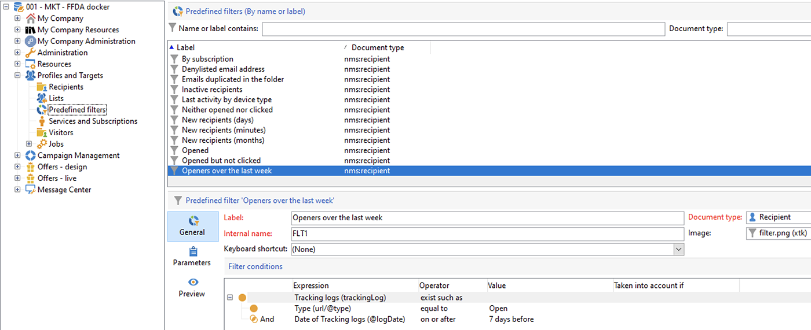
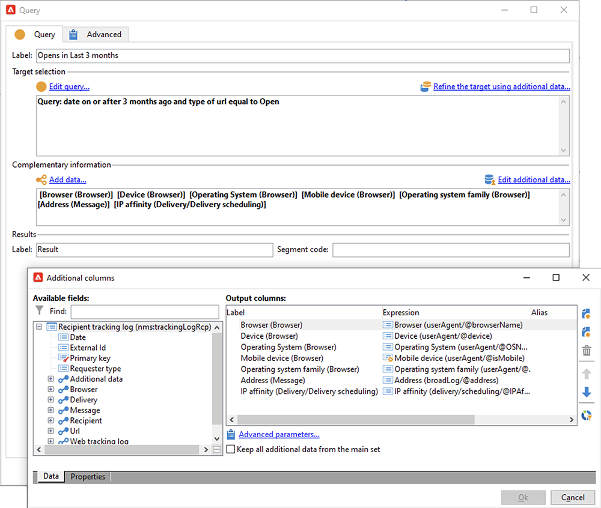

# Apple郵件應用中的郵件隱私保護


## 有什麼改變？

2021年，Apple為其原生Mail應用程式引入了新的隱私保護功能。 此應用程式現在包含Apple的郵件隱私保護功能。 基本上，發送者無法再使用追蹤像素來收集關於已選擇開啟Apple「郵件隱私保護」功能的收件者的資訊。 [了解詳情](https://experienceleague.adobe.com/docs/deliverability-learn/deliverability-best-practice-guide/additional-resources/technotes/apple-mail-privacy-faq.html){target=&quot;_blank&quot;}。

## 我的促銷活動會受到哪些影響？

Adobe Campaign提供使用追蹤像素來追蹤電子郵件開啟次數的功能。 此功能不僅可用於定位和促銷活動，也可用於量度。 例如，您可以使用電子郵件開放率來評估促銷活動的成效和使用者參與度。 簡而言之，您的促銷活動可能會影響區段、鎖定目標和量度。 [了解詳情](https://experienceleague.adobe.com/docs/deliverability-learn/deliverability-best-practice-guide/additional-resources/technotes/apple-mail-privacy-faq.html#in-addition-to-measuring-opens%2C-what-else-is-impacted%3F){target=&quot;_blank&quot;}。

## 我該採取什麼行動？

蘋果的新功能是電子郵件隱私保護領域未來事物的形態。 強烈建議您遵循Adobe的建議。

### 評估對促銷活動觸發程式的影響

評估這些變更如何影響您目前的促銷活動觸發程式。 識別將電子郵件開啟作為細分、鎖定目標或重新鎖定目標的標準的工作流程。 閱讀[提示與秘訣](#find-email-open-tracking)。

### 保留您的資料

保留您的資料並整合您目前在裝置上的知識。 您可以根據使用者代理程式的關鍵績效指標(KPI)。 例如，您可以根據使用iOS和Apple Mail應用程式之人員的設定檔來建立KPI。 閱讀[提示與秘訣](#preserve-tracking-data)。

### 在保留期之後封存您的追蹤記錄

在Adobe Campaign的保留期以外封存您的追蹤記錄：

1. 檢查促銷活動例項中的保留期間。
1. 再次檢查活動目標映射。 除了現成可用的設定檔表格(`nmsRecipient`)外，還可判斷您是否使用自訂設定檔表格。
1. 從Adobe Campaign匯出追蹤記錄。 包含包含使用者代理和作業系統相關資料的記錄檔。

### 評估開放率的當前趨勢

決定受眾中在iOS裝置上使用Apple郵件應用程式的比例。
使用此評估，可以識別潛在的異常間隙及其原因。 您可以判斷間隙是由於促銷活動效能問題還是Apple的隱私權保護功能所致。 閱讀[提示與秘訣](#measure-ios-footprint)。

### 重新評估您的促銷活動策略和績效量度

最重要的是，我們強烈建議您主動重新評估您的促銷活動策略和促銷活動績效量度。 您可以重新關注更可靠的量度，例如點進次數、產品檢視和購買。

建議您探索目前可用的資料，並評估開放率與其他量度之間的關聯性。 如果這些量度持續產生關聯，您便可以充分信賴並改善觸發器。

## 提示與秘訣

### 測量整體iOS佔用空間 {#measure-ios-footprint}

若要收集Adobe Campaign資料的深入分析，您可以使用現成可用的報表：

* **[!UICONTROL Operating Systems]** 報告

   若要識別每個作業系統和每個版本的訪客比例，請使用此報表。 [顯示全文](../../reporting/using/global-reports.md#operating-systems)。

   您可以檢視每個作業系統的訪客劃分，與訪客總數相關。

   

   對於每個作業系統，您可以檢視每個作業系統版本的訪客劃分。

   

* **[!UICONTROL Breakdown of opens]** 報告

   若要識別每個作業系統的電子郵件開啟比例，請使用此報表。 [顯示全文](../../reporting/using/global-reports.md#breakdown-of-opens)。

   

### 決定如何使用電子郵件開啟追蹤 {#find-email-open-tracking}

您可以識別將電子郵件開啟作為細分、鎖定目標及重新鎖定目標的標準的工作流程。

若要這麼做，您可以使用追蹤連結URL的&#x200B;**[!UICONTROL type]**&#x200B;屬性(**[!UICONTROL url/@type]**)。 對於開啟的電子郵件，此屬性會設為&#x200B;**[!UICONTROL Open]**。 此屬性可從查詢編輯器、工作流程中的&#x200B;**[!UICONTROL Query]**&#x200B;活動和預先定義的篩選器中使用。 您可以將此屬性用作行銷活動的定位標準。


在此範例中，行銷人員想要傳送獎勵優惠給在過去七天內開啟特定傳送電子郵件並在過去一個月內購買的收件者。 在工作流程查詢中，您可以透過各種方式使用電子郵件開啟：

* 您可以將電子郵件開啟作為查詢中的定位標準。

   您可以將特定傳送之追蹤記錄檔的URL類型設為&#x200B;**[!UICONTROL Open]**，作為篩選條件。

   

* 您可以使用預先定義的篩選。 [深入瞭解](../../workflow/using/creating-a-filter.md)。

   

   您可以在工作流程的查詢活動中使用此預先定義的篩選。

   

   >[!NOTE]
   >
   >在工作流程中，您無法檢視預先定義篩選器的鎖定目標條件。

若要擷取其中使用電子郵件開啟作為定位標準的工作流程清單，您必須查詢`xtk:workflow`架構。 工作流的內容以XML格式儲存在&#x200B;**[!UICONTROL XML memo (data)]**&#x200B;欄位中。


您可以指定工作流程必須包含此內容：

`expr="[url/@type] = 2"`

此定位准則表示追蹤的URL類型必須設為&#x200B;**[!UICONTROL Open]**。


#### 實作範例和範例套件

您可以使用此實作範例來識別將電子郵件開啟作為目標准則的工作流程，並傳送通知給您選擇的促銷活動運算子。 您可將此實作用於下列用途：

* 您可以在目標工作流程中測量從電子郵件開啟切換至其他KPI的潛在影響。 如果您未使用電子郵件開啟，則不需要進一步動作。
* 當您重新評估實作時，可以使用此範例來避免略過工作流程。

此範例顯示單一技術工作流程中的自訂實作。


>[!IMPORTANT]
>
>此套件僅以範例提供，且Adobe不支援以產品功能的形式提供。
>
>您可能需要調整范常式式碼以配合您的行銷活動實施。
>
>一般使用者是安裝和使用此範例套件的唯一責任人。
>
>強烈建議您在非生產環境中測試及驗證此套件。

下載[範例套件](assets/PKG_Search_workflows_using_Opens_in_queries_V1.xml)並加以安裝。 [深入瞭解](../../platform/using/working-with-data-packages.md#importing-packages)。

安裝套件後，您可以從包含執行個體中現成技術工作流程的資料夾存取工作流程：

`/Administration/Production/Technical workflows/nmsTechnicalWorkflow`

從用戶介面中，選擇&#x200B;**[!UICONTROL Administration]** > **[!UICONTROL Production]** > **[!UICONTROL Technical workflows]**。


工作流程包含下列主要步驟：

1. 列出將電子郵件開啟作為目標准則的工作流程。
1. 列出將電子郵件開啟作為定位准則的預先定義篩選器。
1. 列出使用這些預先定義篩選器的工作流程。
1. 將兩個工作流程清單合併為一個清單。
1. 傳送電子郵件通知給指定的運算子。

工作流程包含下列詳細步驟：

1. 初始活動是`xtk:workflow`架構中的查詢活動。 此活動可用來在根據例項中尋找包含電子郵件的明確工作流程查詢，以作為定位標準。

   

   

   

   結果會傳回工作流程清單。

   

   由於此資訊被重複使用，因此工作表的名稱將儲存在全局工作流實例變數中。

   

1. 第二個查詢用於尋找包含電子郵件開啟的預先定義篩選器。

   

   

   

   系統會隨之傳回預先定義的篩選器清單。

   

1. 此預先定義篩選器清單可用來尋找使用這些篩選器的工作流程。
1. 工作流程兩份清單合併為一份清單。

   為此，需使用JavaScript程式碼。

   

   ```javascript
   const queryPredFilter = xtk.queryDef.create(
     <queryDef schema={vars.targetSchema} operation="select">
        <select>
          <node alias="@id" expr="@id" />
          <node alias="@name" expr="@name"  />
        </select>
        <where/>
     </queryDef>
       ).ExecuteQuery()
   
   var qDef =
     <queryDef schema="xtk:workflow" operation="select">
       <select>
         <node expr="@id"/>
         <node expr="@internalName"/>
         <node expr="@label"/>
       </select>
       <where>
         <condition boolOperator="OR" expr={"data like '%expr=[url/@type] = 2%'" }/>
       </where>
     </queryDef>
   
   for each (var filter in queryPredFilter) {       
   
      //logInfo (filter.@name);
      var condition;
      condition =<condition boolOperator="OR" expr={"data like '%" + filter.@name + "%'" }/>
      qDef.where.appendChild(condition);   
   
   }
   
   var queryWorkflowList = xtk.queryDef.create(qDef);
   var workflowList = queryWorkflowList.ExecuteQuery();
   
   var sWorkflowList = "";
   var iCount = 0
   for each (var workflow in workflowList) {       
   
      //logInfo ("Workflow ID: " + workflow.@id + " in " + instance.vars.mainTargetSchema);
   
      iWorkflowId = workflow.@id;
      iWorkflowName = workflow.@internaName;
      iWorkflowLabel = workflow.@label;
   
       xtk.session.Write(
             <{instance.vars.mainTargetSchema.split(':')[1]}
               _operation="insertOrUpdate"       
               _key="@id"
               xtkschema={instance.vars.mainTargetSchema}
               id={iWorkflowId}
               internaName={iWorkflowName}
               label={iWorkflowLabel}
             />
       )
   }
   ```

1. 複製的工作流程會從合併的清單中移除。

   

1. 會執行測試以檢查清單是否非空白。

   

   如果清單不為空，則會將其插入HTML表格中，以接收電子郵件通知。

   

   ```js
   const queryWorkflow = xtk.queryDef.create(
       <queryDef schema={vars.targetSchema} operation="select">
           <select>
               <node alias="@id" expr="@id" />
               <node alias="@internalName" expr="@internalName"  />
               <node alias="@label" expr="@label"  />
           </select>
           <where/>
       </queryDef>
   ).ExecuteQuery()
   
   var sWorkflowList = '<table border="0" >';
   
   sWorkflowList = sWorkflowList + "<tr><th>Worklow Id</th><th>Name</th><th>Label</th></tr>";
   
   for each (var workflow in queryWorkflow) {       
   
      sWorkflowList = sWorkflowList + "<tr>" +
                       "<td>" + workflow.@id + "</td>" +
                       "<td>" + workflow.@internalName + "</td>" +
                       "<td>" + workflow.@label + "</td>" +
                       "</tr>";
   
   }
   
   sWorkflowList = sWorkflowList + "</table>";
   
   instance.vars.workflowList = sWorkflowList;
   ```

1. HTML表格會新增至通知範本。

   ```js
   <%= instance.vars.workflowLIst%>
   ```

   

   電子郵件通知包含包含工作流程的清單，這些工作流程包含以電子郵件開啟作為查詢中的定位標準。

   

### 保留您目前的追蹤資料 {#preserve-tracking-data}

#### 哪些資料會受到影響？

設定檔資料富含來自動作（例如電子郵件開啟和點進）的追蹤資料。 追蹤功能也會在有此資訊時透過使用者代理，提供使用者裝置的重要資訊。

簡而言之，Adobe Campaign追蹤資料提供以下資訊：

* 與開啟或點進特定電子郵件訊息之人員相關聯的設定檔
* 開啟日期
* 使用的裝置，例如iPhone或Mac
* 作業系統和版本，例如iOS 15、macOS 12或Windows 10
* 應用程式（如郵件應用程式或Web瀏覽器）和版本（如Outlook 2019）

#### 為何應保留追蹤資料？

基於多種原因，強烈建議您保留此資料：

* 此資料由Adobe Campaign保留有限期間。 保留期會依執行個體的設定而有所不同。

   檢查執行個體的設定。 [顯示全文](../../platform/using/privacy-management.md#data-retention)。

* 除了Apple最近的變更外，您還可以使用追蹤資料來創造巨大的價值來促進受眾的參與度。
* Apple可能會對其原生Mail應用程式和「郵件隱私保護」功能進行進一步的變更。

基於上述原因，我們強烈建議您盡快匯出這些資料。 否則，您部分對象的追蹤資料可能會受到負面影響。

#### 如何保留追蹤資料？

若要保留追蹤資料，您必須將其從Adobe Campaign匯出至資訊系統。 [顯示全文](../../platform/using/get-started-data-import-export.md)。

>[!IMPORTANT]
>
>以下範例將著重於現成可用的`nms:Recipient`架構，此為預設設定檔架構。 如果您使用附加至自訂設定檔的其他自訂目標對應，建議您將此匯出策略擴充至所有自訂記錄檔表格。 [顯示全文](../../configuration/using/target-mapping.md)。

##### 原則

預設情況下， `nms:Recipient`架構連結到必須導出的三個架構：

| 結構 | 內容 |
| --- | --- |
| nms:trackingLogRcp | 追蹤資料（例如，使用者、時間和相關訊息） |
| nms:trackingUrl | 連結的詳細資訊，包括性質，例如電子郵件開啟或點進 |
| nms:userAgent | 有關設備的資訊 |

表在資料模型中連結。


使用這些關係建立單個導出查詢。



您可以透過連結結構的有用資訊來擴充此資料：

| 結構 | 內容 |
| --- | --- |
| nms：收件者 | 與設定檔相關的詳細資訊 |
| nms：傳遞 | 使用者回應的訊息的相關資訊 |

您可以將結果匯出至Adobe Campaign支援的外部儲存解決方案：

* SFTP
* S3
* Azure Blob

##### 實作

此範例說明如何從Adobe Campaign匯出追蹤資料。

1. 建立以查詢開頭的工作流程。

   初始查詢可用來擷取最近三個月的追蹤記錄。
您可以使用增量查詢僅提取尚未導出的記錄。

   從&#x200B;**[!UICONTROL Additional data]**&#x200B;節點添加所有必需資訊。

   

1. 新增&#x200B;**[!UICONTROL Data extraction (file)]**&#x200B;活動。 將查詢中的所有資料對應至解壓縮檔案格式。

   

   選擇檔案格式，例如TXT或CSV。

   

1. 將檔案上傳至支援的儲存解決方案時，新增第三個和最後一個活動。


##### 進階實作：依iOS裝置劃分

您可以使用工作流程來判斷收件者是否使用Apple的Mail應用程式。 您可以依裝置分割追蹤記錄。 例如，您可以使用查詢篩選器來依iOS裝置來劃分記錄：

| 應用程式 | 作業系統或設備  | 查詢篩選器 |
| --- | --- | --- |
| Apple Mail | iOS 15 | `operating System (Browser) contains 'iOS 15' and browser (Browser) contains 'ApplewebKit'` |
| Apple Mail | iOS 14或iOS 13 | `browser contains 'AppleWebKit' and operating System of browser contains 'iOS 14' or operating System of browser contains 'iOS 13'` |
| Apple Mail | iOS行動裝置：iPad、iPod和iPhone | `device (Browser) contains iPhone or device (Browser) equal to iPod or device (Browser) equal to iPad and browser (Browser) equal to 'AppleWebKit'` |
| Apple Mail | iPhone、iPad或iPod | `browser (Browser) equal to 'AppleWebKit' and device (Browser) equal to iPhone or device (Browser) equal to iPod or device (Browser) equal to iPad` |
| Apple Mail | Mac | `browser (Browser) equal to 'AppleWebKit' and operating System (Browser) contains 'Mac'` |
| Safari | macOS | `browser (Browser) equal to 'Safari' and device (Browser) equal to PC and operating System (Browser) contains 'Mac'` |
| Safari | 行動裝置 | `browser (Browser) equal to 'Safari' and device (Browser) equal to iPad or device (Browser) equal to iPod or device (Browser) equal to iPhone` |


您可以將這些規則用於各種用途：

* 將資料導出並存檔到外部儲存解決方案
* 計算要附加至設定檔的KPI
* 建立隱藏清單
* 報告

以下範例說明如何使用工作流程來依iOS裝置劃分記錄：

* 第一個範例工作流程包含下列活動：

   1. 初始&#x200B;**[!UICONTROL Query]**&#x200B;活動用於選取最近三個月開啟的所有電子郵件。
   1. **[!UICONTROL Split]**&#x200B;活動用於依電子郵件應用程式、瀏覽器、作業系統和裝置來分割選取項目。

   1. **[!UICONTROL Deduplication]**&#x200B;活動會遵循每個&#x200B;**[!UICONTROL Split]**&#x200B;活動。 **[!UICONTROL Deduplication]**&#x200B;活動可用來移除重複的電子郵件地址。

      **[!UICONTROL Deduplication]**&#x200B;活動位於&#x200B;**[!UICONTROL Split]**&#x200B;活動之後，以避免遺失使用各種裝置的收件者的相關資訊。

   1. 每個&#x200B;**[!UICONTROL Deduplication]**&#x200B;活動後面都有&#x200B;**[!UICONTROL End]**&#x200B;活動。

   如果您只將收件者儲存在現成可用的收件者表格中，以便鎖定目標，此類型的工作流程將十分實用。

   

* 第二個範例工作流程包含下列活動：

   1. 初始&#x200B;**[!UICONTROL Query]**&#x200B;活動用於選取最近三個月開啟的所有電子郵件。
   1. **[!UICONTROL Deduplication]**&#x200B;活動可用來移除重複的電子郵件地址。
   1. 使用&#x200B;**[!UICONTROL Fork]**&#x200B;活動：

      * 在一個轉變中， **[!UICONTROL Change dimension]**&#x200B;活動用於尋找追蹤記錄所參照的收件者。
      * 在另一個轉變中， **[!UICONTROL Split]**&#x200B;活動用於依電子郵件應用程式、瀏覽器、作業系統和裝置分割選取項目。
   1. **[!UICONTROL End]**&#x200B;活動會遵循&#x200B;**[!UICONTROL Split]**&#x200B;活動之後的每個轉變。

   如果您將收件者儲存在現成可用的收件者表格以外的表格中，此類型的工作流程將十分實用。

   

## 實用連結

[Apple Mail隱私保護常見問題集](https://experienceleague.adobe.com/docs/deliverability-learn/deliverability-best-practice-guide/additional-resources/technotes/apple-mail-privacy-faq.html){target=&quot;_blank&quot;}
