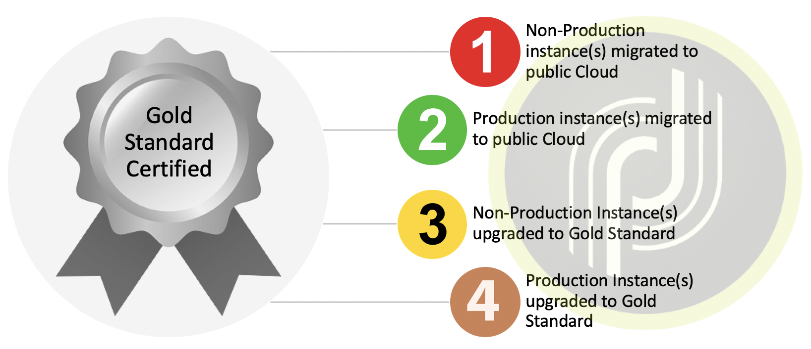

# 概覽{#dc-ovv}

## 內容

作為尊貴的Adobe Campaign Classic客戶，我們致力提供您最佳體驗和價值。 多年來，我們已認識到在雲中托管客戶的價值和可靠性。  作為[Gold Standard計畫](../../rn/using/gold-standard.md)的一部分，我們將所有客戶轉移至Adobe Managed Services（AWS上的Public Cloud），以提供更好、更可靠的服務。

該計畫有三個主要目標：

* 通過將基礎設施移至安全且現代的環境(AWS)來解決已識別的安全漏洞。
* 消除可能繁瑣的擴展過程，提供對[增強MTA](../../delivery/using//sending-with-enhanced-mta.md)的訪問，並改善所有維護服務級別。
* 為未來的Adobe Campaign Classic做好準備，包括更自動化、定期的升級，不需要那麼多的資源，也不需要太多的時間。

### 字彙

* **建置升級**  — 當Adobe Campaign Classic軟體更新至最新的安全組建編號，但仍維持相同的主要/次要組建層級。例如：Campaign v7 20.2.3版本編號9182至Campaign v7 21.2.5版本編號9188。 [深入瞭解](../../platform/using/faq-build-upgrade.md)。
* **MID/RT**  — 在Experience Cloud上托管的訊息執行伺服器（批次促銷活動為MID，即時單一訊息為RT）
* **Gold Standard升級**  — 此計畫提供改進的安全性、改進的支援、增強的維護和穩定性。它也可讓日後的升級更輕鬆，並可存取Campaign中的新功能。  [深入瞭解](../../rn/using/gs-overview.md)。
* **AWS**  - Amazon Web Services(Amazon Public Cloud)
* **SFTP**  — 安全檔案傳輸通訊協定。[深入瞭解](../../platform/using/sftp-server-usage.md)。

>[!NOTE]
>Campaign Classicv7移轉至Public Cloud只會影響使用&#x200B;**Adobe Managed Services**&#x200B;的客戶。

## 好處

**安全性**

* 最新安全性修正
* 閒置資料加密
* 改善驗證(IMS)

**基礎設施**

* 靈活的硬體可擴充性
* 更快速的恢復
* 提高可靠性和穩定性
* 協調的作業程式

**效能**

* 改善電子郵件容量
* 更大的資料庫
* Presod Campaign版本 — Gold Standard

**為Adobe Campaign Classic客戶帶來強大、可靠的解決方案**

1. 更好的生產流程，導致更高的可靠性、更快的問題反應、更快的重大事故恢復。
1. 更高的電子郵件傳送容量。 在新資料中心托管的執行個體將能夠受益於電子郵件傳送的專用基礎架構。 這可能會導致電子郵件傳送速度提高，或允許使用較少的傳送IP。
1. 更好的硬體可擴充性。 增加硬體資源的速度可以快得多。 從技術上講，這次的震級是1小時，而不是數天。

**Gold Standard可讓日後的升級更輕鬆**

1. 您的組織等待升級的時間越長，升級變得越複雜，且面臨漏洞的可能性也會增加（尤其是從舊版移轉時）。
1. 有了Gold Standard升級，您的執行個體將會更新，並準備好以更少的手動干預和資源接收更多自動化和定期更新。

## 關於移轉

受影響帳戶的移轉至Adobe Managed Services(Public Cloud)將於2020/2021年完成。 Adobe將引導您的組織完成此歷程。

為了開始此工作，需要進行此移轉的帳戶會收到來自Adobe的電子郵件通訊，提供時間表和檔案存取權。 這會是您排程移轉帳戶的通知。

移轉可以透過[開啟新的客戶服務支援票證](https://experienceleague.adobe.com/?support-solution=Campaign#support)來啟動。 使用主題行「遷移至AWS」。

### 此移轉是否為強制性？

此移轉至雲端作業是您Adobe Campaign執行個體[Gold Standard認證&#x200B;](../../rn/using/gs-overview.md)**的第一步。**&#x200B;如果您托管在非公用雲(AWS)的資料中心，則此遷移是強制性的。

Adobe Managed Services雲端托管於Amazon Web Services(AWS)，這是一個現代、安全且最佳化的環境。 [了解更多AWS](https://aws.amazon.com/application-hosting/benefits/)。

Adobe計畫解除舊版資料中心的運行，必須將運行在舊版資料中心的Adobe Campaign實例傳輸到新的參考資料中心AWS。

這是前進的關鍵路徑，因為您的當前位置可能會暴露在&#x200B;**安全和效能漏洞**&#x200B;中。

此外，此移轉現在是您未來任何Adobe Campaign版本編號升級&#x200B;**的**&#x200B;先決條件。 舊版資料中心不再提供組建升級功能。

Adobe致力於保護您的資料，並協助您邁向Adobe Campaign未來的正軌。 我們需要你們的合作，使它成為共同的成功！

**我們已組織了一** 個專責的客戶服務代表、客戶成功經理、產品經理、工程師、TechOps專家和產品顧問團隊，以協助並確保體驗順暢無礙。我們致力確保您具有相關專案和聯絡資訊。

我們投入巨大精力開發技術，使此遷移快速、無縫且安全。

### 限制

* 遷移過程將伴隨不可避免的平台停機。 此計畫的目的是引導最大限度地減少此停機時間。
* 資料整合的IP變更。
* 新傳送IP的傳遞能力提升。 不過，該計畫是讓這項業務透明化，這與上線期間最初的升級不同。

進一步了解Campaign移轉至[Public Cloud常見問題集](dc-migration-faq.md)。

## Gold Standard認證歷程

我們將協助您執行每個里程碑之間的驗證步驟。

## 遷移至Public Cloud的路徑

Adobe會處理大部分動作。 我們需要您進行驗證和簽核。

## 移轉准則

### 全球方法

**資料庫**

資料庫將從舊式資料中心轉儲，並在Public Cloud(AWS)中恢復。 在新資料中心重新啟動後，應用程式將從關閉前的確切狀態恢復。 除了某些已排程的工作會延遲外，使用者不會看到任何差異。

**電子郵件傳送IP**

移轉完成後，Campaign執行個體的傳送IP將會完全不同。 為了確保順利轉換，Adobe將通過從舊IP向新IP進行預先切換流量，來實現新發送IP的升級。

**資料整合IP**

用戶端的資料整合可能會因資料整合的IP變更而受到影響。 視Campaign作為伺服器或用戶端而定，變更可能會影響兩個方向。
典型案例：

* SFTP，可能是雙向
* HTTP，可能是雙向
* SMPP（與SMS提供者的連線）、以用戶端形式使用Campaign、變更來源IP

一般而言，這表示用戶端應檢查其防火牆上可能設定的IP限制，並據此進行調整。*

**Campaign伺服器**

現有Campaign伺服器（實際上是容器）將以「提升並轉移」方法移至Public Cloud(AWS)。 也就是說，不需要安裝新伺服器，但整個伺服器將傳輸到新資料中心。 操作只需要低級技術重新配置即可完成。

**伺服器名稱**

在用於行銷通訊的子網域下方：會保持不變。 不過，視實施而定，用戶端可能需要執行下列動作：

* 若是子網域委派（一般情況）,Adobe會處理所有變更，並確保順暢轉換
* 若是CNAME設定（例外），將會要求用戶端實作變更。 需要與Adobe協調。

若為使用者存取和資料整合，neolane.net下的名稱將維持不變。

這表示如果伺服器名稱未由硬式編碼IP取代，變更對使用者和資料整合實作而言將是透明的。

### 準備

**電子郵件傳送IP**

首先，Adobe傳遞能力將評估平台的傳遞能力狀態，並建議交換機至新IP的計畫。

Adobe將在新資料中心上配置相同數量的IP。

一旦布建新IP，新IP的數量就會開始增加。

**應用程式清**
理資料中心之間的資料傳輸處於停機的關鍵路徑。

資料的儲存方式有兩種：

1. 最重要的是，資料庫
1. 應用程式伺服器上的檔案（資料匯入和匯出）

縮小資料庫的大小對於加快資料傳輸至關重要。

建議：

* 縮短歷史資料（傳送記錄、追蹤記錄等）的保留期
* 刪除其他表格（傳送、收件者、自訂表格）上無用的記錄

### 執行

**暫停執行**

建議您放慢速度，最好在舊式資料中心關閉應用程式之前暫停所有執行：傳遞和工作流程。 這將簡化Public Cloud(AWS)上的重啟，因為流程將有時間「優雅」暫停並保存任何正在進行的執行狀態。

**移轉期間**

移轉期間，只有一項服務可繼續運作：電子郵件連結重新導向。 換言之，收件者在電子郵件中按一下後，將可以到達登錄頁面。 但系統不會記錄這些點按，因此移轉前不久開始的傳送點按率將低於正常。

**重新啟動**

遷移到新環境後，應用程式將逐步重新啟動：

* 首次存取主控台，讓使用者無需主動執行任何動作即可檢查狀態
* 然後，工作流程和傳送

### 移轉後

**刪除舊式資料中心上的實例**

應用程式遷移完成後，將無計畫在舊式資料中心再次運行任何進程。 我們希望，除了臨時備份外，舊式資料中心上的所有資料都可以被擦除，直到定時備份過程在Public Cloud(AWS)上運行。

**DNS委派**

通常，從Campaign傳送電子郵件（錯誤地址中@符號右側的部分）的網域已委派給Adobe。 可以更改委派並實施到AWS DNS伺服器。

## 支援和其他有效連結{#support}

* [移轉至Adobe Managed Services(Public Cloud)常見問題集](dc-migration-faq.md)
* [Gold Standard升級](../../rn/using/gs-overview.md)
* [建置升級常見問題集](../../platform/using/faq-build-upgrade.md)

