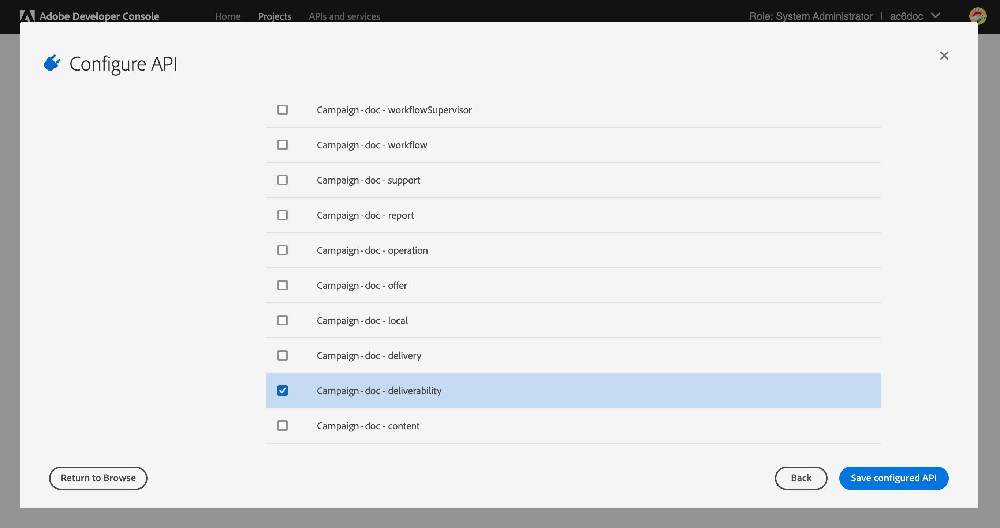

# 市場活動交付性伺服器 {#acc-deliverability}

在啟動v7 21.1版的Campaign Classic時，Adobe Campaign公司建議了一款新的可交付性伺服器，它帶來了高可用性並解決了安全合規性問題。 Campaign Classic現在將可傳送性規則、廣播和禁止地址從新可傳送性伺服器同步，並同步到新可傳送性伺服器。

作為Campaign Classic客戶，您必須實施新的交付性伺服器 **2022年8月31日前**。

>[!NOTE]
>
>有關這些更改的任何問題，請參閱 [常見問題](#faq)或聯繫人 [Adobe客戶關懷](https://helpx.adobe.com/tw/enterprise/admin-guide.html/enterprise/using/support-for-experience-cloud.ug.html)。

## 什麼變了？{#acc-deliverability-changes}

Adobe是由於安全合規性的原因而淘汰舊資料中心。 Adobe Campaign Classic客戶需要遷移到新的交付服務，該服務托管在Amazon網路服務(AWS)上。

此新伺服器保證高可用性(99.9)&#x200B;，並提供安全且經過身份驗證的端點，使市場活動伺服器能夠獲取所需資料：新的可傳送性伺服器不是針對每個請求連接到資料庫，而是在可能的情況下快取資料以服務於請求。 該機制改善了響應時間&#x200B;。

## 您有受到影響嗎？{#acc-deliverability-impacts}

如果環境是在低於 [市場活動v7.2.1](../../rn/using/latest-release.md#release-7-2-2)，您會受到影響。 您需要升級到Campaign v7.2.1（或更多）。

瞭解如何檢查您的版本 [此部分](../../platform/using/launching-adobe-campaign.md#getting-your-campaign-version)。

## 如何更新？{#acc-deliverability-update}

作為 **托管客戶**,Adobe將與您一起將實例升級到較新版本，並在Adobe Developer控制台中建立項目。

作為 **本地/混合客戶**，您需要升級到其中一個較新版本，以便從新的可交付性伺服器中獲益。 升級所有實例後，您將能夠 [實施新的整合](#implementation-steps) Adobe可交付性伺服器，並確保無縫過渡。

## 實施步驟 {#implementation-steps}

作為新的可交付性伺服器整合的一部分，Campaging需要通過基於Identity Management服務(IMS)的Adobe與Shared Services通信。 首選方法是使用基於Adobe Developer的網關令牌(也稱為技術帳戶令牌或AdobeIO JWT)。


>[!WARNING]
>
>這些步驟只應通過混合和內部實現來執行。

### 必要條件{#prerequisites}

在啟動實施之前，請檢查實例配置。

1. 開啟市場活動客戶端控制台並以管理員身份登錄到Adobe Campaign。
1. 瀏覽到 **管理>平台>選項**。
1. 檢查 `DmRendering_cuid` 的子菜單。

   * 如果選項已填充，則可以啟動實施。
   * 如果未填充值，則聯繫 [Adobe客戶關懷](https://helpx.adobe.com/enterprise/admin-guide.html/enterprise/using/support-for-experience-cloud.ug.html) 拿到你的CUID

      必須在所有市場活動實例(MKT、MID、RT、EXEC)上使用相同的值填充此選項。

### 步驟1:建立/更新您的Adobe Developer項目 {#adobe-io-project}

1. 訪問 [Adobe Developer控制台](https://developer.adobe.com/console/home) 並使用您組織的開發人員訪問權限登錄。

   >[!NOTE]
   >
   > 確保您已登錄到正確的組織門戶。

1. 選取 **[!UICONTROL Create new project]**。
   


   >[!CAUTION]
   >
   >如果您已在為其他整合使用AdobeIO JWT身份驗證功能，則必須通過添加來更新項目 **市場活動API** 那個項目。
1. 選擇 **[!UICONTROL Add API]**。
   
1. 在 **[!UICONTROL Add an API]** 窗口，選擇 **[!UICONTROL Adobe Campaign]**。
   
<!--1. Choose **[!UICONTROL Service Account (JWT)]** as the authentication type.-->
1. 如果客戶端ID為空，請選擇 **[!UICONTROL Generate a key pair]** 建立公鑰和私鑰對。
   

   然後自動下載密鑰，預設到期日期為365天。 過期後，您需要建立新密鑰對並更新配置檔案中的整合。 使用選項2，您可以選擇手動建立和上載 **[!UICONTROL Public key]** 期限更長。
   

   >[!CAUTION]
   >
   >您應保存 `config.zip` 下載提示時，您將無法再次下載。

1. 按一下&#x200B;**[!UICONTROL Next]**。
1. 選擇任何現有 **[!UICONTROL Product profile]** 或根據需要建立新的。 無需對此權限 **[!UICONTROL Product profile]**。 有關 **[!UICONTROL Product Profiles]**，請參閱 [此頁](https://helpx.adobe.com/enterprise/using/manage-developers.html)。
   

   然後，按一下 **[!UICONTROL Save configured API]**。

1. 從項目中，選擇 **[!UICONTROL Adobe Campaign]** 並複製下列資訊 **[!UICONTROL Service Account (JWT)]**

   

   * **[!UICONTROL Client ID]**
   * **[!UICONTROL Client Secret]**
   * **[!UICONTROL Technical account ID]**
   * **[!UICONTROL Organization ID]**

>[!CAUTION]
>
>Adobe Developer證書將在12個月後到期。 您每年需要生成新密鑰對。

### 步驟2:在Adobe Campaign添加項目憑據 {#add-credentials-campaign}

私鑰應以base64 UTF-8格式編碼。

若要這麼做：

1. 使用上述步驟中生成的私鑰。
1. 使用以下命令對私鑰進行編碼： `base64 ./private.key > private.key.base64`。 這將將base64內容保存到新檔案 `private.key.base64`。

   >[!NOTE]
   >
   >複製/貼上私鑰時，有時可以自動添加額外的行。 記住在對私鑰進行編碼之前將其刪除。

1. 從檔案複製內容 `private.key.base64`。
1. 通過SSH登錄到安裝Adobe Campaign實例的每個容器，並通過以下命令在Adobe Campaign添加項目憑據 `neolane` 。 這將插入 **[!UICONTROL Technical Account]** 實例配置檔案中的憑據。

   ```
   nlserver config -instance:<instance name> -setimsjwtauth:Organization_Id/Client_Id/Technical_Account_ID/<Client_Secret>/<Base64_encoded_Private_Key>
   ```

1. 必須停止並重新啟動伺服器，才能將修改考慮在內。 您還可以運行 `config -reload` 的子菜單。

### 第3步：啟用新的可傳送性伺服器

現在可以啟用新的可傳送性伺服器。 要執行此操作，請執行以下操作：

1. 開啟客戶端控制台，以管理員身份登錄到Adobe Campaign。
1. 瀏覽到 **管理>平台>選項**。
1. 訪問 `NewDeliverabilityServer_FeatureFlag` 選項並將值設定為 `1`。 此配置應在您的所有市場活動實例(MKT、MID、RT、EXEC)上執行。

### 第4步：驗證配置

要檢查整合是否成功，請執行以下步驟：


1. 開啟客戶端控制台並登錄到Adobe Campaign。
1. 瀏覽到 **管理>生產>技術工作流**。
1. 重新啟動 **更新可交付性** (deliverabilityUpdate)工作流。 應對您的所有促銷活動實例(MKT、MID、RT、EXEC)執行此操作。
1. 檢查日誌：工作流應執行而不出現錯誤。


## 常見問題集 {#faq}

### 如果我不升級我的環境會發生什麼？

任何在8月31日之前未升級的市場活動實例將無法再與市場活動交付性伺服器連接。 因此， **更新可交付性** (deliverabilityUpdate)工作流將失敗。 此工作流管理MX規則和彈出規則的每日更新。

如果您不升級環境，電子郵件設定將停止同步（MX管理規則、入站電子郵件規則、域管理規則和退出資格規則）。 這可能會影響您的交付能力。 如果對這些規則進行了重大更改，則必須從此點手動應用這些規則。

僅對於MKT實例 [全局隱藏清單](../../campaign-opt/using/filtering-rules.md#default-deliverability-exclusion-rules) 會受到影響。

### 我現在無法升級。 指導是什麼？

如果無法在8月31日之前升級實例，則必須臨時禁用 **更新可交付性** (deliverabilityUpdate)工作流，直到升級完成，以便它不會嘗試與舊的deliverability伺服器同步。


如需更多指導，請與 [Adobe客戶關懷](https://helpx.adobe.com/enterprise/admin-guide.html/enterprise/using/support-for-experience-cloud.ug.html)。
