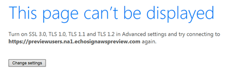

# 終止支援 TLS 1.0 和 1.1{#eol-tls-support}

Adobe不再支援不符合傳輸層安全性(TLS) 1.2通訊協定的使用者系統和使用者端系統。 如果您繼續使用舊版TLS，您可能會失去所有Adobe產品和服務的存取權。

## 為什麼我會看到此頁面？

如果您看到下列訊息： **無法顯示此頁面**，表示您嘗試存取的Adobe應用程式、網頁或服務需要與網頁瀏覽器、作業系統或應用程式建立更安全的網路連線。 必須使用&#x200B;**TLS 1.2**，使用者系統與Adobe應用程式和Web服務之間才能進行安全的網路通訊和資料交換。

Adobe已停止支援較低版本的TLS （包括TLS 1.0和1.1）。 如需TLS 1.2通訊協定的技術詳細資訊，請參閱[常見問題](#faq)。

## 如何繼續服務？

現代的網頁瀏覽器支援TLS 1.2。 升級瀏覽器可讓您存取這些應用程式和服務。

您可以下載並安裝下列其中一個熱門瀏覽器：

* [Google Chrome](https://www.google.com/chrome/)
* [Apple Safari](https://www.apple.com/safari/)
* [Firefox](https://www.mozilla.org/en-US/firefox/new/)
* [Microsoft Edge](https://www.microsoft.com/en-us/edge)

如果您使用其他瀏覽器，請確定其支援TLS 1.2。

您的作業系統和應用程式架構也必須支援TLS 1.2。 如果升級瀏覽器無法解決問題，請確定您的電腦符合[ Campaign相容性矩陣](../../rn/using/compatibility-matrix.md)所列的系統需求。

## 常見問題{#faq}

* **什麼是傳輸層安全性(TLS)？**

  [傳輸層安全性](https://en.wikipedia.org/wiki/Transport_Layer_Security) (TLS)是一種安全性通訊協定，可在兩個通訊應用程式之間提供隱私權和資料完整性。 它廣泛部署於需要透過網路安全交換資料的網頁瀏覽器和其他應用程式。

  根據通訊協定規格，TLS包括兩個層次：TLS記錄通訊協定和TLS交握通訊協定。 記錄通訊協定提供連線安全性。 交握通訊協定可讓伺服器和使用者端相互驗證，並在資料交換之前交涉加密演演算法和密碼編譯金鑰。

* **會有什麼影響？**

  Adobe的安全性法規遵循標準要求自2018年5月起淘汰舊版通訊協定，並強制使用TLS 1.2作為最新版本。 如果您的系統不符合TLS 1.2規範，則限制存取某些Adobe應用程式和服務。

* **TLS如何影響您？**

  您只能透過安全網路連線與某些Adobe應用程式和服務互動。 TLS有助於確保瀏覽器與這些應用程式和Web服務之間的連線安全可靠。

  隨著新瀏覽器和作業系統的發行，安全性標準也相應升級，以確保更嚴密的隱私權和資料完整性。 然而，這些瀏覽器或作業系統的舊版本不會更新以包含最新標準。

  隨著可接受的安全性層級提升，這些較舊且較不安全的瀏覽器版本和應用程式就會被留下。

  若要能夠連線到安全的網站，請更新您的作業系統和瀏覽器版本。

* **TLS是否容易受到駭客攻擊？**

  已有檔案說明使用舊版加密方法針對TLS 1.0的攻擊，且舊版比TLS 1.2更容易受到攻擊。 如需詳細資訊，請參閱針對TLS/SSL的攻擊。

* **為何Adobe停用對TLS 1.0和1.1的支援？**

  Adobe的安全性法規遵循標準要求停用對舊版通訊協定的支援。 其中一個標準可確保符合支付卡產業(PCI)的規定。 PCI適配伺服器是一組安全性標準，要求接受、處理、儲存或傳輸信用卡資訊的組織必須維持安全的環境。

  自2018年5月起，PCI法規遵循會強制使用TLS 1.1或更新版本。

* **為什麼Adobe強制使用TLS 1.2，而不是允許TLS 1.1或TLS 1.0？**

  大部分對Adobe應用程式和Web服務的請求都是源自符合TLS 1.2的使用者系統，而TLS 1.1系統的流量很低。

  Adobe已移轉至TLS 1.2，以便更安全地存取其應用程式和Web服務。

* **我可以使用舊版TLS的最後日期是多久？**

  Adobe鼓勵使用者快速放棄舊版，以避免暴露於安全性弱點。 如需詳細資訊，請聯絡Adobe客戶服務或您的客戶成功經理。

* **如果我使用的瀏覽器未設定為TLS 1.2，會出現什麼錯誤訊息？**

  這取決於您使用的瀏覽器。 [Campaign相容性矩陣](../../rn/using/compatibility-matrix.md)中提及的所有瀏覽器皆已設定為使用TLS 1.2。 如果您使用的瀏覽器或版本未出現在清單中，請更新瀏覽器。

  Adobe不會控制SSL通訊層產生的錯誤訊息。 瀏覽器會在連線至Adobe應用程式和服務之前產生這些訊息。 以下是Windows 7上的Internet Explorer 11可能發生的錯誤範例：

  

  Internet Explorer 11預設會啟用TLS 1.2，但若關閉，您可以將其開啟。 在這種情況下，請從進階設定對話方塊開啟TLS 1.2，而不使用其他選項。 也可能會發生其他錯誤，例如：

   * 無法連線到服務
   * 服務無法提供
   * 連線錯誤
