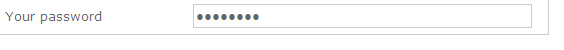

# 新增欄位至網路表單{#adding-fields-to-a-web-form}

在Web表單中，欄位允許用戶輸入資訊並選擇選項。 Web表單可以提供輸入欄位、選擇欄位、靜態和高級內容（captchas、訂閱等）。

使用嚮導添加欄位時，會根據選定的欄位或儲存變數自動檢測欄位類型。 可以使用 **[!UICONTROL Type]** 下拉框 **[!UICONTROL General]** 頁籤。

使用工具欄中的按鈕時，選擇要添加的欄位類型。

以下類型的欄位可用：

* 文本/數字輸入。 請參閱 [添加輸入欄位](#adding-input-fields)。
* 下拉清單選擇。 請參閱 [添加下拉清單](#adding-drop-down-lists)。
* 通過複選框進行多選。 請參閱 [添加複選框](#adding-checkboxes)。
* 通過單選按鈕進行獨佔選擇。 請參閱 [添加單選按鈕](#adding-radio-buttons)。
* 在選項網格中投票。 請參閱 [添加網格](#adding-grids)。
* 數字和日期。 請參閱 [添加日期和數字](#adding-dates-and-numbers)。
* 訂閱/取消訂閱資訊服務。 請參閱 [訂閱複選框](#subscription-checkboxes)。
* 驗證碼驗證。 請參閱 [插入驗證碼](#inserting-a-captcha)。
* 下載按鈕。 [正在上載檔案](#uploading-a-file)。
* 隱藏常數。 請參閱 [插入隱藏常數](#inserting-a-hidden-constant)。

請指定響應儲存模式：更新資料庫中的欄位（僅儲存最後保存的值）或儲存在變數中（未儲存回答）。 有關此內容的詳細資訊，請參閱 [響應儲存欄位](web-forms-answers.md#response-storage-fields)。

>[!NOTE]
>
>預設情況下，該欄位將插入當前樹的底部。 使用工具欄中的箭頭將其上移或下移。

## 欄位建立嚮導 {#field-creation-wizard}

對於表單的每個頁面，您可以通過工具欄中的第一個按鈕添加欄位。 要執行此操作，請轉到 **[!UICONTROL Add using the wizard]** 的子菜單。

選擇要建立的欄位類型：您可以選擇在資料庫中添加一個欄位、變數或導入在另一個窗體中建立並在容器中收集的一組欄位。

按一下 **[!UICONTROL Next]** 並選擇儲存欄位或變數，或要導入的容器。

按一下 **[!UICONTROL Finish]** 的子菜單。

## 添加輸入欄位 {#adding-input-fields}

要添加輸入欄位，請按一下 **[!UICONTROL Input control]** 按鈕，選擇要添加的欄位類型。

### 輸入欄位的類型 {#types-of-input-fields}

可將五種不同類型的文本欄位插入表單頁：

* **文本**:允許用戶在一行中輸入文本。

   

* **數字**:允許用戶在一行中輸入數字。 有關此的詳細資訊，請參閱 [添加數字](#adding-numbers)。

   當頁面被批准時，會檢查欄位內容以確保輸入的值與欄位相容。 有關此內容的詳細資訊，請參閱 [定義控制項設定](form-rendering.md#defining-control-settings)。

* **密碼**:允許用戶在單行上輸入文本。 在文本輸入過程中，字元被句點替換：

   

   >[!CAUTION]
   >
   >密碼未加密儲存在資料庫中。

* **多行文本**:允許用戶在幾行上輸入文本。

   

   >[!CAUTION]
   >
   >多行文本欄位是可包含回車符的特定欄位。 其儲存空間必須與映射到XML元素而不是XML屬性的欄位相關聯。

* **豐富的多行文本**:允許用戶輸入將以HTML格式儲存的佈局的文本。

   

   您可以選擇提供給用戶的編輯器類型。 為此，請使用 **[!UICONTROL HTML editor]** 的 **[!UICONTROL Advanced]** 頁籤。

   

   顯示的表徵圖數量因編輯器類型而異。 對於 **[!UICONTROL Advanced]** 編輯器，呈現方式如下：

   

### 配置輸入欄位 {#configure-input-fields}

所有輸入欄位都基於相同的模式進行配置，使用以下選項：

的 **[!UICONTROL General]** 頁籤中，您可以輸入欄位的名稱，並根據需要為其提供預設值。

可以通過 **[!UICONTROL Edit storage...]** 的子菜單。 值可以儲存在資料庫的現有欄位中；或者可以選擇不在資料庫中保存資訊（使用本地變數）。

>[!NOTE]
>
>儲存模式在 [響應儲存欄位](web-forms-answers.md#response-storage-fields)

的 **[!UICONTROL Advanced]** 頁籤，用於定義欄位的顯示參數（標籤的位置、對齊方式等）。 請參閱 [定義Web表單佈局](defining-web-forms-layout.md)。

## 添加下拉清單 {#adding-drop-down-lists}

您可以將下拉清單插入調查頁。 這允許用戶從下拉菜單中提供的值中選擇一個值。

要將下拉框添加到表單頁，請按一下 **[!UICONTROL Selection controls > Drop-down list]** 按鈕。

選擇應答儲存模式並確認您的選擇。

定義清單下部的標籤和值 **[!UICONTROL General]** 頁籤。 如果資訊儲存在資料庫的一個現有欄位中，並且該欄位是枚舉欄位，則可以通過按一下 **[!UICONTROL Initialize the list of values from the database]** ，如下所示：

>[!NOTE]
>
>使用值清單右側的箭頭更改其序列。

如果資料儲存在連結表中，則可以選擇保存清單中建議的值的欄位。 例如，如果選擇國家/地區表，請按一下 **[!UICONTROL Initialize the list of values from the database...]** 並選擇所需欄位。

接下來，按一下 **[!UICONTROL Load]** 連結以檢索值：

>[!CAUTION]
>
>每當更新清單以刷新提供值時，重複此操作。

## 添加複選框 {#adding-checkboxes}

要讓用戶選擇選項，您需要使用複選框。

要向表單添加複選框，請按一下 **[!UICONTROL Selection controls > Checkbox...]** 表徵圖。

選擇應答儲存模式並確認您的選擇。

在 **[!UICONTROL Label]** 的 **[!UICONTROL General]** 頁籤。

複選框允許您根據是否選中該框為儲存欄位（或值）分配值。 的 **[!UICONTROL Values]** 框(位於 **[!UICONTROL Value]** 欄位)和未選中時要分配的值(在 **[!UICONTROL Empty value]** )。 這些值取決於資料儲存格式。

如果儲存欄位（或變數）是布爾值，則在未選中該框時將自動推導要分配的值。 在這種情況下，只有 **[!UICONTROL Value if checked]** 欄位，如下所示：

## 示例：如果選中了框，則為欄位分配值 {#example--assign-a-value-to-a-field-if-a-box-is-checked}

我們希望在表單中插入一個複選框以發送維護請求，如下所示：

該資訊將上載到資料庫並上載到現有欄位(在本例中， **[!UICONTROL Comment]** ):

如果選中「Maintenance required（需要維護）」框， **[!UICONTROL Comment]** 列將包含「需要維護」。 如果未選中該框，則列將顯示「不需要維護」。 要獲取此結果，請將以下配置應用於表單頁面上的複選框：

## 添加單選按鈕 {#adding-radio-buttons}

單選按鈕允許您為用戶提供一系列可供選擇的獨佔選項。 這是同一欄位的不同值。

您可以單獨（單一按鈕）或通過多選項清單建立單選按鈕，但是由於單選按鈕的要點是選擇一個或另一個選項，因此我們始終會建立至少一對單選按鈕，而不僅僅是一個按鈕。

>[!CAUTION]
>
>要強制選擇，需要建立多選項清單。

### 添加單個按鈕 {#add-single-buttons}

要將單選按鈕添加到表單頁面，請轉至 **[!UICONTROL Selection controls > Radio button]** 的子菜單。

單選按鈕的配置方式與複選框類似(請參閱 [添加複選框](#adding-checkboxes))。 但是，如果未選中該選項，則不分配值。 為了使多個按鈕相互依存，即選擇一個按鈕自動取消選擇其他按鈕，它們必須儲存在同一欄位中。 如果它們未儲存在資料庫中，則必須將同一本地變數用於臨時儲存。 請參閱 [響應儲存欄位](web-forms-answers.md#response-storage-fields)。

### 添加按鈕清單 {#add-a-list-of-buttons}

要通過清單添加單選按鈕，請轉到 **[!UICONTROL Selection controls>Multiple choice]** 的子菜單。

添加標籤數量與單選按鈕數量相同。 此功能的優點是，您可以從現有欄位（如果是明細欄位）導入值，並使用戶能夠選擇一個選項。 但是，按鈕的佈局不太靈活。

>[!NOTE]
>
>不能在Web應用程式中啟用多選項。
>但是，可以插入 **[!UICONTROL Multiple choice]** 將欄位輸入到Web應用程式，但這將不允許用戶選擇多個值。

## 添加網格 {#adding-grids}

網格用於設計Web應用程式中的投票頁。 這樣，您就可以提供回答調查或評估類型Web表單的單選按鈕清單，如下所示：

要在表單中使用此類型的元素，請建立一個簡單網格並為要評估的每個元素添加一行。

網格的每一行中單選按鈕的數量與簡單網格中定義的值的數量相匹配。

每個網格線只能選擇一個選項。

>[!NOTE]
>
>在本例中，網格的標籤被隱藏。 要執行此操作，請轉到 **[!UICONTROL Advanced]** 頁籤 **[!UICONTROL Label position]** 顯示定義為 **[!UICONTROL Hidden]** 。 請參閱 [定義標籤的位置](defining-web-forms-layout.md#defining-the-position-of-labels)。

## 添加日期和數字 {#adding-dates-and-numbers}

表單域的內容可以被格式化以匹配儲存在資料庫中的資料或滿足特定要求。 您可以為數字和日期的輸入建立合適的欄位。

### 添加日期 {#adding-dates}

要允許用戶在表單頁中輸入日期，請添加輸入欄位並選擇類型 **[!UICONTROL Date...]**。

輸入欄位的標籤並配置資料儲存模式。

窗口的下半部分允許您為此欄位中儲存的值選擇日期和時間格式。

您也可以選擇不顯示日期（或時間）。

可通過日曆或下拉框選擇日期。 您也可以直接在欄位中輸入它們，但它們需要與上面螢幕中指定的格式相匹配。

>[!NOTE]
>
>預設情況下，表單中使用的日期通過日曆輸入。 對於多語言表單，請檢查日曆是否可用於所有使用的語言。 請參閱 [翻譯Web表單](translating-a-web-form.md)。

但是，在某些情況下（例如，對於輸入出生日期），使用下拉清單可能更容易。

要執行此操作，請按一下 **[!UICONTROL Advanced]** 的子菜單。 **[!UICONTROL Drop-down lists]**。

然後，可以設定清單中提供的值的限制。

### 添加數字 {#adding-numbers}

您可以為數字的輸入建立合適的欄位。

在數字欄位中，用戶只能輸入數字。 批准頁面後，將自動應用條目控制。

根據資料庫中儲存資料的欄位，可以應用特殊格式或某些限制。 也可以指定最大值和最小值。 此類型的欄位配置如下：

預設值是發佈表單時在欄位中顯示的值。 用戶可以更正。

您可以通過以下方式將前置詞和/或尾碼添加到數字欄位 **[!UICONTROL Advanced]** 頁籤，如下所示：

在窗體中，呈現方式如下：

## 訂閱複選框 {#subscription-checkboxes}

您可以添加控制項，以允許用戶訂閱或取消訂閱一個或多個資訊服務（新聞稿、警告、即時通知等）。 要訂閱，用戶檢查相應的服務。

要建立訂閱複選框，請按一下 **[!UICONTROL Advanced controls>Subscription]**。

指示複選框的標籤，然後使用 **[!UICONTROL Service]** 下拉框。

>[!NOTE]
>
>資訊服務詳見 [此頁](../../delivery/using/managing-subscriptions.md)。

用戶通過檢查相關選項來預訂服務。

>[!CAUTION]
>
>如果用戶已訂閱了資訊服務，並且在批准表單時未選中連結到此服務的框，則將取消訂閱它們。

## 插入驗證碼 {#inserting-a-captcha}

目的 **卡普查** test是防止欺詐性使用Web表單。

>[!CAUTION]
>
>如果您的表單包含幾頁，驗證碼必須始終放在最後一頁上，即儲存框之前，以防止任何規避安全措施。

要將驗證碼插入表單，請按一下工具欄上的第一個按鈕，然後選擇 **[!UICONTROL Advanced controls>Captcha]**。

輸入欄位的標籤。 此標籤將顯示在驗證碼顯示區域的前面。 您可以在 **[!UICONTROL Advanced]** 頁籤。

>[!NOTE]
>
>對於 **[!UICONTROL captcha]** 類型控制項，不需要指示儲存欄位或變數。

驗證碼插入頁面，輸入欄位置於可視欄位下。 這兩個元素是不可分的，並且被視為用於頁面佈局的單個項目（它們佔用單個單元格）。

確認頁面後，如果驗證碼內容未正確輸入，則輸入欄位將以紅色顯示。

您可以建立要顯示的錯誤消息。 為此，請使用 **[!UICONTROL Personalize the message]** 連結 **[!UICONTROL General]** 頁籤。

>[!NOTE]
>
>卡契卡總是8個字元長。 不能修改此值。

## 正在上載檔案 {#uploading-a-file}

您可以向頁面添加上載欄位。 例如，此功能對於Intranet檔案共用非常有用。

要將上載欄位插入表單頁，請選擇 **[!UICONTROL Advanced controls > File...]** 的子菜單。

預設情況下，上載的檔案儲存在可通過 **[!UICONTROL Resources > Online > Public resources]** 的子菜單。 可以使用指令碼更改此行為。 此指令碼可以使用中定義的函式 [市場活動JSAPI文檔](https://experienceleague.adobe.com/developer/campaign-api/api/index.html?lang=zh-Hant)包括那些涉及檔案操作的。

可以將指向這些檔案的連結儲存在本地變數或資料庫欄位中。 例如，可以擴展收件人方案，以添加到基於檔案的資源的連結。

>[!CAUTION]
>
>* 必須為具有安全訪問（使用憑據）的表單保留此類型的檔案。
>* Adobe Campaign不控制上載的資源的大小或類型：因此，我們強烈建議僅對安全類型的Intranet站點使用上載欄位。
>* 如果多個伺服器連結到該實例（負載平衡體系結構），則需要確保對Web表單的調用到達同一伺服器。
>* 這些實施需要Adobe Campaign咨詢團隊的幫助。
>

## 插入隱藏常數 {#inserting-a-hidden-constant}

當用戶驗證表單的其中一個頁面時，可以將特定值設定為其配置檔案的欄位或變數。

此欄位對用戶不可見，但可用於豐富用戶配置檔案中的資料。

為此，請將 **常數** 指定值和儲存位置。

在以下示例中， **來源** 每當用戶批准此頁時，都會自動填寫收件人配置檔案的欄位。 該常數不顯示在頁面上。

