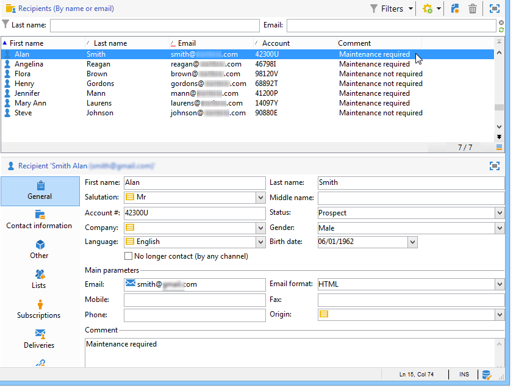
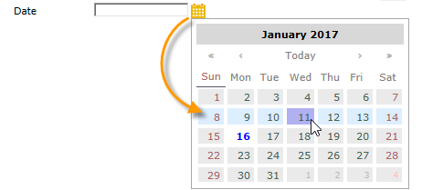
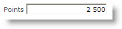

# 新增欄位至網路表單{#adding-fields-to-a-web-form}

在Web表單中，欄位使用戶能夠輸入資訊並選擇選項。 網路表單可提供輸入欄位、選取欄位、靜態和進階內容（擷取、訂閱等）。

使用嚮導添加欄位時，根據所選欄位或儲存變數自動檢測欄位類型。 您可以使用 **[!UICONTROL Type]** 下拉式方塊中 **[!UICONTROL General]** 標籤。

使用工具列中的按鈕時，選取您要新增的欄位類型。

可用的欄位類型如下：

* 文字/數字輸入。 請參閱 [新增輸入欄位](#adding-input-fields).
* 下拉式清單選取項目。 請參閱 [新增下拉式清單](#adding-drop-down-lists).
* 通過複選框進行多個選擇。 請參閱 [添加複選框](#adding-checkboxes).
* 通過單選按鈕進行獨佔選擇。 請參閱 [添加單選按鈕](#adding-radio-buttons).
* 在選項格線中投票。 請參閱 [添加網格](#adding-grids).
* 數字和日期。 請參閱 [新增日期和數字](#adding-dates-and-numbers).
* 訂閱/取消訂閱資訊服務。 請參閱 [訂閱複選框](#subscription-checkboxes).
* 驗證碼。 請參閱 [插入驗證碼](#inserting-a-captcha).
* 下載按鈕。 [上傳檔案](#uploading-a-file).
* 隱藏常數。 請參閱 [插入隱藏常數](#inserting-a-hidden-constant).

請指定響應儲存模式：更新資料庫中的欄位（僅儲存最後儲存的值）或儲存在變數中（不儲存答案）。 有關詳細資訊，請參閱 [回應儲存欄位](web-forms-answers.md#response-storage-fields).

>[!NOTE]
>
>預設情況下，欄位將插入當前樹的底部。 使用工具列中的箭頭將其上移或下移。

## 欄位建立精靈 {#field-creation-wizard}

對於表單的每個頁面，您可以透過工具列中的第一個按鈕新增欄位。 若要這麼做，請前往 **[!UICONTROL Add using the wizard]** 功能表。

選取要建立的欄位類型：您可以選擇在資料庫中新增欄位、變數，或匯入在其他表單中建立並在容器中收集的一組欄位。

按一下 **[!UICONTROL Next]** ，然後選取儲存欄位或變數，或您要匯入的容器。

按一下 **[!UICONTROL Finish]** 將選定欄位插入頁面中。

## 新增輸入欄位 {#adding-input-fields}

若要新增輸入欄位，請按一下 **[!UICONTROL Input control]** 按鈕，然後選擇要添加的欄位類型。

### 輸入欄位的類型 {#types-of-input-fields}

可將五種不同類型的文本欄位插入表單頁面中：

* **文字**:可讓使用者在一行上輸入文字。

   

* **數字**:可讓使用者在一行中輸入數字。 有關詳細資訊，請參閱 [添加數字](#adding-numbers).

   核准頁面時，會檢查欄位內容，以確保輸入的值與欄位相容。 有關詳細資訊，請參閱 [定義控制設定](form-rendering.md#defining-control-settings).

* **密碼**:可讓使用者在單行上輸入文字。 文字輸入期間，字元會由句號取代：

   

   >[!CAUTION]
   >
   >密碼在資料庫中未加密儲存。

* **多行文本**:可讓使用者在數行上輸入文字。

   

   >[!CAUTION]
   >
   >多行文本欄位是可包含歸位符的特定欄位。 其儲存空間必須與XML元素上映射的欄位相關聯，而不是XML屬性。

* **擴充多行文字**:可讓使用者輸入版面的文字，版面會以HTML格式儲存。

   

   您可以選取提供給使用者的編輯器類型。 若要這麼做，請使用 **[!UICONTROL HTML editor]** 欄位 **[!UICONTROL Advanced]** 標籤。

   

   顯示的圖示數量會依編輯器類型而異。 對於 **[!UICONTROL Advanced]** 編輯器，呈現方式如下：

   

### 設定輸入欄位 {#configure-input-fields}

所有輸入欄位都是根據相同模式，使用下列選項：

此 **[!UICONTROL General]** 索引標籤可讓您輸入欄位名稱，並視需要為其歸因預設值。

應答儲存模式可通過 **[!UICONTROL Edit storage...]** 連結。 值可以儲存在資料庫的現有欄位中；或者，您可以選擇不將資訊保存在資料庫中（使用本地變數）。

>[!NOTE]
>
>儲存模式在 [回應儲存欄位](web-forms-answers.md#response-storage-fields)

此 **[!UICONTROL Advanced]** 索引標籤可讓您定義欄位的顯示參數（標籤位置、對齊方式等）。 請參閱 [定義網路表單版面](defining-web-forms-layout.md).

## 新增下拉式清單 {#adding-drop-down-lists}

您可以將下拉式清單插入調查頁面。 這可讓使用者從下拉式功能表中的選件上選取值。

若要將下拉式方塊新增至表單頁面，請按一下 **[!UICONTROL Selection controls > Drop-down list]** 按鈕。

選取答案儲存模式並確認您的選擇。

在 **[!UICONTROL General]** 標籤。 如果資訊儲存在資料庫的現有欄位中，而且是枚舉欄位，則可以按一下以自動填寫值 **[!UICONTROL Initialize the list of values from the database]** ，如下所示：

>[!NOTE]
>
>使用值清單右側的箭頭來變更其順序。

如果資料儲存在連結的表格中，您可以選取要儲存清單中建議值的欄位。 例如，若您選取國家/地區表格，請按一下 **[!UICONTROL Initialize the list of values from the database...]** 並選取所需欄位。

下一步，按一下 **[!UICONTROL Load]** 連結以擷取值：

>[!CAUTION]
>
>每當更新清單時，重複此操作，以重新整理選件上的值。

## 添加複選框 {#adding-checkboxes}

若要讓使用者選取選項，您需要使用核取方塊。

若要將核取方塊新增至表單，請按一下 **[!UICONTROL Selection controls > Checkbox...]** 圖示。

選取答案儲存模式並確認您的選擇。

在 **[!UICONTROL Label]** 欄位 **[!UICONTROL General]** 標籤。

核取方塊可讓您根據是否已勾選方塊，將值指派給儲存欄位（或值）。 此 **[!UICONTROL Values]** 區段可讓您在核取方塊時輸入要指派的值(位於 **[!UICONTROL Value]** 欄位)，以及若未核取要指派的值(位於 **[!UICONTROL Empty value]** 欄位)。 這些值取決於資料儲存格式。

如果儲存欄位（或變數）是布林值，則如果未核取方塊，則會自動推斷要指派的值。 在此情況下，僅 **[!UICONTROL Value if checked]** 欄位提供，如下所示：

## 範例：如果核取方塊，請將值指派給欄位 {#example--assign-a-value-to-a-field-if-a-box-is-checked}

我們想要在表單中插入核取方塊以傳送維護請求，如下所示：

資訊將上傳至資料庫和現有欄位(在此例中， **[!UICONTROL Comment]** 欄位):

如果勾選「需要維護」方塊，則 **[!UICONTROL Comment]** 欄將包含「需要維護」。 如果未核取方塊，欄將會顯示「不需要維護」。 若要取得此結果，請將下列設定套用至表單頁面上的核取方塊：

## 添加單選按鈕 {#adding-radio-buttons}

選項按鈕可讓您為使用者提供一系列可供選擇的專屬選項。 同一欄位的值不同。

您可以個別建立選項按鈕（單一按鈕）或透過多選項清單，但由於選項按鈕的點是要選取一個或另一個選項，因此我們始終會建立至少一對選項按鈕，而不只是一個按鈕。

>[!CAUTION]
>
>若要強制選取，您必須建立多個選取清單。

### 新增單一按鈕 {#add-single-buttons}

若要將選項按鈕新增至表單頁面，請前往 **[!UICONTROL Selection controls > Radio button]** 菜單，然後選擇儲存模式。

選項按鈕的配置方式與複選框類似(請參閱 [添加複選框](#adding-checkboxes))。 但是，如果未選取選項，則不會指派任何值。 為了讓數個按鈕保持相依性，即，選取一個按鈕會自動取消選取其他按鈕，這些按鈕必須儲存在相同欄位中。 如果這些變數未儲存在資料庫中，則必須使用相同的本地變數進行臨時儲存。 請參閱 [回應儲存欄位](web-forms-answers.md#response-storage-fields).

### 新增按鈕清單 {#add-a-list-of-buttons}

若要透過清單新增選項按鈕，請前往 **[!UICONTROL Selection controls>Multiple choice]** 的子菜單。

添加標籤數量最多的單選按鈕。 此功能的優點是，您可以從現有欄位匯入值（若是分項欄位），並讓使用者選擇一個選項。 不過，按鈕的佈局不那麼靈活。

>[!NOTE]
>
>不能在Web應用程式中啟用多選。
>但是，可以插入 **[!UICONTROL Multiple choice]** 在Web應用程式中輸入欄位，但這不會讓使用者選取數個值。

## 添加網格 {#adding-grids}

網格用於設計Web應用程式中的投票頁。 這可讓您提供答卷調查或評估類型Web表單的選項按鈕清單，如下所示：

若要在表單中使用此類型的元素，請建立簡單格線，並為要評估的每個元素新增一行。

網格的每一行中的單選按鈕數與簡單網格中定義的值數相匹配。

每個網格線只能選擇一個選項。

>[!NOTE]
>
>在本例中，網格的標籤被隱藏。 若要這麼做，請前往 **[!UICONTROL Advanced]** 標籤 **[!UICONTROL Label position]** 顯示定義為 **[!UICONTROL Hidden]** . 請參閱 [定義標籤的位置](defining-web-forms-layout.md#defining-the-position-of-labels).

## 新增日期和數字 {#adding-dates-and-numbers}

表單欄位的內容可以格式化以匹配儲存在資料庫中的資料或滿足特定要求。 您可以建立適合輸入數字和日期的欄位。

### 新增日期 {#adding-dates}

若要允許使用者在表單頁面中輸入日期，請新增輸入欄位並選取類型 **[!UICONTROL Date...]**.

輸入欄位的標籤並設定資料儲存模式。

視窗的下方部分可讓您選取此欄位中儲存之值的日期和時間格式。

您也可以選擇不顯示日期（或時間）。

可透過日曆或下拉式方塊選取日期。 您也可以直接在欄位中輸入，但必須符合上方畫面中指定的格式。

>[!NOTE]
>
>依預設，表單中使用的日期會透過日曆輸入。 對於多語言表單，請檢查日曆是否可用於所有使用的語言。 請參閱 [轉譯網路表單](translating-a-web-form.md).

但在某些情況下（例如輸入出生日期），下拉式清單的使用可能會較為容易。

若要這麼做，請按一下 **[!UICONTROL Advanced]** 頁簽，使用 **[!UICONTROL Drop-down lists]**.

然後，您可以對清單中提供的值設定限制。

### 添加數字 {#adding-numbers}

您可以建立適合輸入數字的欄位。

在數值欄位中，使用者只能輸入數字。 核准頁面時，會自動套用登入控制項。

根據資料庫中儲存資料的欄位，可以應用特殊格式或某些限制。 您也可以指定最大值和最小值。 此類型的欄位設定如下：

預設值是表單發佈時欄位中顯示的值。 使用者可加以修正。

您可以透過 **[!UICONTROL Advanced]** 標籤，如下所示：

在形式中，呈現方式如下：

## 訂閱複選框 {#subscription-checkboxes}

您可以新增控制項，讓使用者訂閱或取消訂閱一或多項資訊服務（電子報、警告、即時通知等）。 若要訂閱，使用者會檢查對應的服務。

若要建立訂閱核取方塊，請按一下 **[!UICONTROL Advanced controls>Subscription]**.

指定核取方塊的標籤，並選取使用 **[!UICONTROL Service]** 下拉框。

>[!NOTE]
>
>資訊服務於 [本頁](../../delivery/using/managing-subscriptions.md).

使用者核取相關選項以訂閱服務。

>[!CAUTION]
>
>如果使用者已訂閱資訊服務，且在核准表單時未勾選連結至此服務的方塊，則會取消訂閱。

## 插入驗證碼 {#inserting-a-captcha}

此 **驗證碼** 測試是為了防止欺詐性使用您的網路表單。

>[!CAUTION]
>
>如果您的表單包含數頁，驗證碼必須一律放在最後一頁，緊接在儲存盒前，以防安全措施受到任何規避。

若要將驗證碼插入表單中，請按一下工具列上的第一個按鈕，然後選取 **[!UICONTROL Advanced controls>Captcha]**.

輸入欄位的標籤。 此標籤會顯示在驗證碼顯示區域前。 您可以在 **[!UICONTROL Advanced]** 標籤。

>[!NOTE]
>
>針對 **[!UICONTROL captcha]** 類型控制項，則不需要指定儲存欄位或變數。

驗證碼會插入頁面中，並在視覺效果下方放置輸入欄位。 這兩個元素分不開，且在進行頁面配置時，會視為單一項目（它們佔據單一儲存格）。

確認頁面後，如果驗證碼的內容未正確輸入，輸入欄位會以紅色顯示。

您可以建立要顯示的錯誤訊息。 若要這麼做，請使用 **[!UICONTROL Personalize the message]** 連結 **[!UICONTROL General]** 標籤。

>[!NOTE]
>
>Captchas長度一律為8個字元。 您無法修改此值。

## 上傳檔案 {#uploading-a-file}

您可以新增上傳欄位至頁面。 例如，此功能對於Intranet檔案共用非常有用。

若要將上傳欄位插入表單頁面，請選取 **[!UICONTROL Advanced controls > File...]** 的子菜單。

依預設，上傳的檔案會儲存在可透過 **[!UICONTROL Resources > Online > Public resources]** 功能表。 您可以使用指令碼來變更此行為。 此指令碼可使用 [Campaign JSAPI檔案](https://experienceleague.adobe.com/developer/campaign-api/api/index.html?lang=zh-Hant)，包括涉及檔案操作的項目。

您可以將這些檔案的連結儲存在本機變數或資料庫欄位中。 例如，您可以擴充收件者結構，以新增連結至檔案型資源。

>[!CAUTION]
>
>* 必須為具有安全存取權的表單（使用憑證）保留此類型的檔案。
>* Adobe Campaign不會控制上傳的資源大小或類型：因此，我們強烈建議僅將上傳欄位用於安全類型的內部網站。
>* 如果有數台伺服器連結至執行個體（負載平衡架構），您必須確定對Web表單的呼叫到達同一台伺服器。
>* 這些實作需要Adobe Campaign諮詢團隊的協助。
>

## 插入隱藏常數 {#inserting-a-hidden-constant}

當使用者驗證表單的其中一頁時，您可以將特定值設為其設定檔的欄位或變數。

此欄位不會顯示給使用者，但可用來擴充使用者設定檔中的資料。

若要這麼做，請將 **常數** ，並指定值和儲存位置。

在下列範例中， **來源** 每當使用者核准此頁面時，收件者設定檔的欄位都會自動填入。 常數不會顯示在頁面上。

