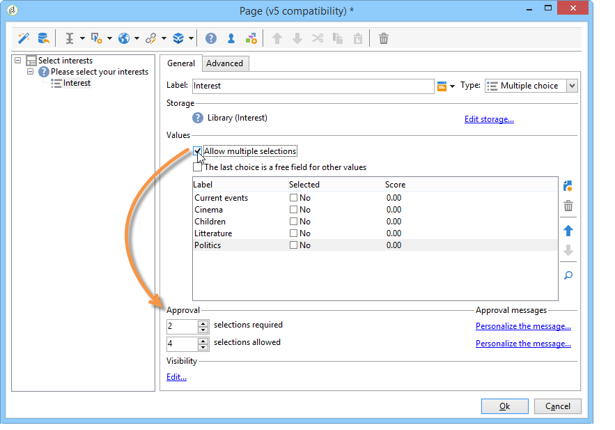

# 設計意見調查{#building-a-survey}

## 建立新調查{#creating-a-new-survey}

本章詳細說明使用Adobe Campaign設計&#x200B;**Survey**&#x200B;類型表單，以及可用的選項和設定。 Adobe Campaign可讓您讓使用者能使用此調查，並在資料庫中收集和封存答案。

Web表單可通過樹的&#x200B;**[!UICONTROL Resources > Online > Web applications]**&#x200B;節點訪問。 若要建立調查，請按一下應用程式清單上方的&#x200B;**[!UICONTROL New]**&#x200B;按鈕，或以滑鼠右鍵按一下清單並選擇&#x200B;**[!UICONTROL New]**。

選取調查範本（預設為&#x200B;**[!UICONTROL newSurvey]**）。

表單的頁面是使用特殊編輯器建立，可讓您定義和設定（文字）輸入欄位、選取欄位（清單、核取方塊等） 和靜態元素（影像、HTML內容等）。 可在「容器」中收集，並根據需求排列（請參閱[新增問題](#adding-questions)）。

>[!NOTE]
>
>有關如何定義內容和建立Web表單螢幕佈局的詳細資訊，請參閱[此部分](../../web/using/about-web-forms.md)。

## 新增欄位{#adding-fields}

表單中的欄位可讓使用者輸入資訊並選取選項。 對於表單中的每個頁面，都是使用&#x200B;**[!UICONTROL Add using the wizard]**&#x200B;功能表透過工具列中的第一個按鈕建立。

>[!NOTE]
>
>您也可以按一下滑鼠右鍵並插入輸入區域。 預設情況下，區域將插入到選定樹的末端。 使用工具列中的箭頭來移動它。

### 欄位類型{#types-of-fields}

將欄位新增至調查時，您需要選取其類型。 可以使用以下選項：

1. **[!UICONTROL Answer a question]**:此選項可讓您宣告新欄位（稱為「已封存欄位」）以儲存答案。在這種情況下，即使參與者多次填入表單，也會保存所收集的所有值。 此儲存模式僅適用於&#x200B;**調查**。 請參閱[儲存收集的答案](../../web/using/managing-answers.md#storing-collected-answers)。
1. **[!UICONTROL Edit a recipient]**:此選項可讓您選取資料庫中的欄位。在這種情況下，用戶答案將儲存在此欄位中。 對於每個參與者，僅保留最後保存的值，並將其添加到配置檔案資料中。
1. **[!UICONTROL Add a variable]**:此選項可讓您建立設定，以便資訊不會儲存在資料庫中。局部變數可在上游宣告。 您也可以在建立欄位時直接新增欄位。
1. **[!UICONTROL Import an existing question]**:此選項可讓您匯入其他調查中建立的現有問題。

   >[!NOTE]
   >
   >在[儲存收集的答案](../../web/using/managing-answers.md#storing-collected-answers)中詳細說明了儲存模式和欄位導入。

要新增的欄位的性質（下拉式清單、文字欄位、核取方塊等） 會適應所選儲存模式。 您可以使用&#x200B;**[!UICONTROL General]**&#x200B;標籤的&#x200B;**[!UICONTROL Type]**&#x200B;欄位來變更，但請務必與資料類型保持一致。

[此小節](../../web/using/about-web-forms.md)中詳細說明了各種可用欄位類型。

## 調查特定元素{#survey-specific-elements}

線上調查使用Web應用程式功能。 連結至調查欄位的特定功能於下文詳細說明。

### 多選{#multiple-choice}

對於&#x200B;**[!UICONTROL Multiple choice]**&#x200B;類型控制項，可以定義最小和最大選擇數。 例如，此選項可讓您從可用選項強制選取至少&#x200B;**2**&#x200B;值，以及最多&#x200B;**4**&#x200B;值：

如果選取的數量太大或太小，則會顯示適當的訊息。

>[!NOTE]
>
>在此情況下，使用複選框來選擇選項。 只能使用一個選項時，會使用選項按鈕。

對應的設定如下：

此外，此輸入欄位的儲存位置必須為&#x200B;**[!UICONTROL Multiple values]**&#x200B;類型&#x200B;**歸檔欄位**:

>[!CAUTION]
>
>* 此功能僅適用於&#x200B;**Survey**&#x200B;類型表單。
>* 此選項與隨機問題顯示不相容。 有關詳細資訊，請參閱[新增問題](#adding-questions)。

### 新增問題{#adding-questions}

容器有兩種類型：標準和問題。 標準容器可用來設定頁面配置和頁面中的條件式顯示。 在[本節](../../web/using/about-web-forms.md)中詳細介紹了這些規則。

使用&#x200B;**問題**&#x200B;容器將問題新增至頁面，並在階層中插入下方的可能答案。 可在報表中分析使用者對此類容器中問題的回應。

>[!CAUTION]
>
>請勿在階層中其他&#x200B;**Question**&#x200B;容器下方插入&#x200B;**Question**&#x200B;容器。

在標籤欄位中輸入問題的標籤。 在此情況下，將應用表單樣式表中的樣式。 選取&#x200B;**[!UICONTROL Enter the title in HTML format]**&#x200B;選項以個人化它。 這可讓您存取HTML編輯器。

>[!NOTE]
>
>有關使用HTML編輯器的詳細資訊，請參閱[此區段](../../web/using/about-web-forms.md)。

例如：

在上述範例中，呈現的方式如下：

>[!NOTE]
>
>每個問題都有一個&#x200B;**問題**&#x200B;類型容器。

您可以啟用Adobe Campaign隨機繪製問題。 接著，您就可以在設定視窗底部的欄位中，指定要在頁面中顯示的問題數。

呈現會如下所示：

重新整理頁面時，顯示的問題不同。

>[!CAUTION]
>
>隨機顯示問題（在頁面上勾選的&#x200B;**[!UICONTROL Display randomly]**&#x200B;選項）時，請小心不要使用多個選擇問題，其中必須有一或多個選擇。
