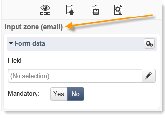

# 內容編輯最佳實務{#content-editing-best-practices}


為確保編輯器最佳化操作，我們建議遵循以下准則：

* 早於 **匯入HTML頁面範本** 在Adobe Campaign中，請確定範本已開啟並在各種瀏覽器中正確顯示。
* 如果HTML頁面包含 **JavaScript指令碼**，他們需要執行 **無錯誤** 在編輯器外。
* 建立範本時，建議新增 **&#39;type&#39;** 歸因至 `<input>` 標籤之間。 編輯器將處理此資訊，並幫助使用者在設定Web應用程式時將資料庫的欄位連結到表單的欄位。

  範本中的 HTML 程式碼範例：

  ```
  <input id="email" type="email" name="email"/>
  ```

  此 **&#39;type&#39;** 屬性會以下列形式顯示在介面中：

  

  「型別」屬性的正式清單可供使用 [在此網站中](https://www.w3schools.com/tags/att_input_type.asp).

* 使用DCE模擬結束頁面的步驟：

  

* 確定只有一個 `<body> </body>` 在頁面中。
* 上傳CSS或JS檔案時，不會上傳.zip檔案中包含的影像。 因此，不會更新CSS對這些影像的參考。

## 內容編輯器支援的格式 {#content-editor-supported-formats}

數位內容編輯器支援HTML格式：您可以切換至 **來源** 模式。

數位內容編輯器的匯入功能與下列支援的格式搭配使用時，其運作方式如下：

* CSS： .zip檔案中存在的影像不會匯入。 CSS對這些影像的參考不會更新。
* JS： .zip檔案中存在的影像不會匯入。 JS對這些影像的參考不會更新。
* Iframe：未匯入連結的頁面。
* 登陸頁面與網頁應用程式：如果 **表單** 標籤遺失，會出現警告。 A `<form> </form>` 必須一律存在於訊息本文中。

數位內容編輯器也可搭配下列支援的程式碼頁面運作：

* iso-8859-1
* iso-8859-2
* utf-7
* utf-8 （使用BOM時建議使用）
* iso-8859-15
* us-ascii
* shift jis
* iso-2022-jp
* big-5
* euc-kr
* utf-16

>[!NOTE]
>
>HTML內碼表必須在中繼標籤(HTML4或HTML5)或BOM中定義。 如果沒有可用的程式碼頁，請以latin1開啟檔案。

## HTML內容狀態 {#html-content-statuses}

編輯器的上方區段會顯示與內容狀態相關的訊息。 訊息的色彩代碼如下：

* **灰色訊息**：資訊訊息，編輯器中無需執行任何動作。
* **藍色訊息**：與正在編輯的內容相關的資訊訊息。
* **黃色訊息**：需要代表使用者採取動作的警告或錯誤訊息。

### 編輯Web應用程式時的訊息清單 {#list-of-messages-when-editing-a-web-application}

* HTML內容運作正常。
* Web應用程式尚未發佈，無法線上存取。
* Web應用程式已上線，請重新發佈以套用任何變更。
* 頁面內容無法運作。 其中必須包含HTML表單(`<form>`)
* 沒有要設定的輸入區域或按鈕。
* 若要啟用轉換至下一頁，您必須將「下一頁」動作連結至目前頁面上的按鈕或連結。

### 編輯傳遞時的訊息清單 {#list-of-messages-when-editing-a-delivery}

* 傳遞內容運作正常
* 沒有欄位或個人化區塊可設定。
* 傳遞內容已準備就緒，請重新執行分析以套用任何變更。
* 傳遞已準備就緒可供傳送。
