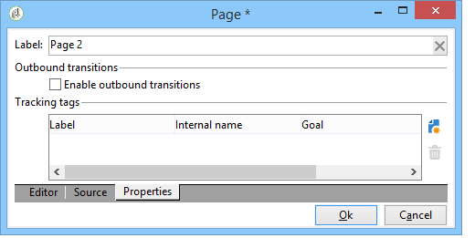
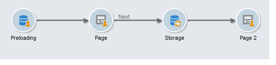
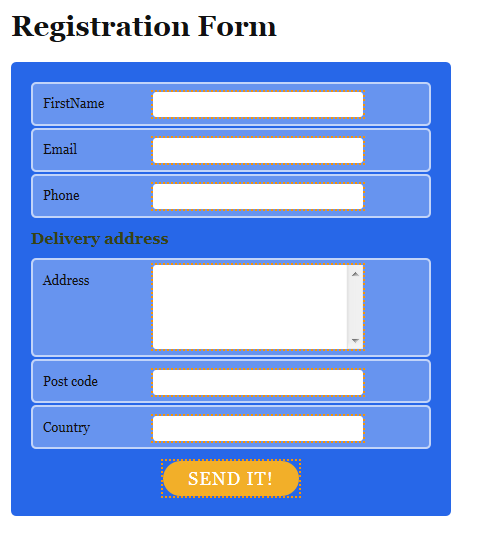
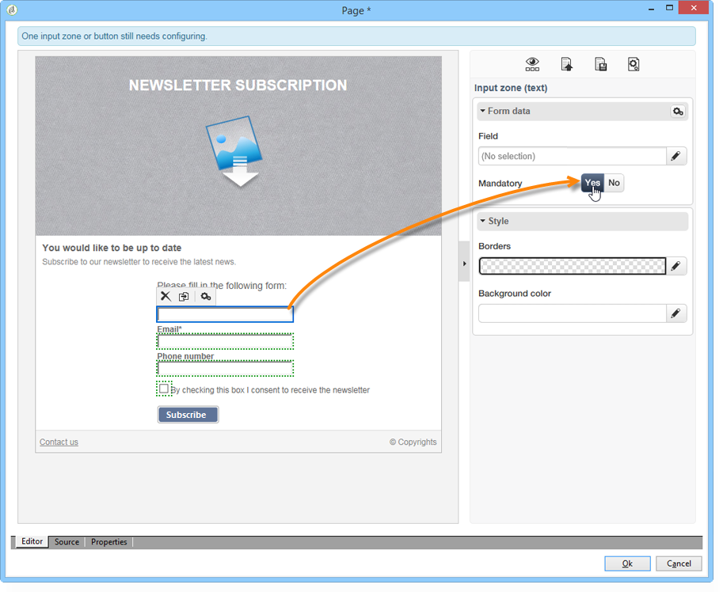

# 建立登錄頁面{#creating-a-landing-page}

## 關於建立{#about-landing-pages-creation}登錄頁面

此使用案例顯示如何使用數位編輯器從Adobe Campaign主控台建立登錄頁面。

開始在Adobe Campaign中設定登錄頁面之前，請確定您有&#x200B;**一或多個範本**&#x200B;來代表HTML頁面。

此使用案例的主要目的，是使用DCE中的函式，讓「著陸頁面」表單欄位與Adobe Campaign中的內部欄位對應。

## 建立登錄頁面{#creating-the-landing-page}

若要建立新的著陸頁面類型Web應用程式，請使用下列步驟：

1. 前往&#x200B;**[!UICONTROL Campaigns]**&#x200B;標籤，按一下&#x200B;**[!UICONTROL Web application]**&#x200B;連結，然後按一下&#x200B;**[!UICONTROL Create]**&#x200B;按鈕。
1. 選擇&#x200B;**[!UICONTROL New landing page]**&#x200B;模板並輸入標籤，然後按一下&#x200B;**[!UICONTROL Save]**。

   

1. 按一下&#x200B;**[!UICONTROL Edit]**&#x200B;標籤。
1. 刪除&#x200B;**End**&#x200B;活動。
1. 在&#x200B;**[!UICONTROL Storage]**&#x200B;活動之後新增&#x200B;**[!UICONTROL Page]**&#x200B;活動。
1. 編輯&#x200B;**頁面2**&#x200B;活動，然後在&#x200B;**[!UICONTROL Properties]**&#x200B;標籤中取消勾選&#x200B;**[!UICONTROL Activate outbound transitions]**&#x200B;選項。

   

1. 儲存變更。

接著，您會取得下列順序：

>[!NOTE]
>
>有關建立Web應用程式的詳細資訊，請參閱[此部分](../../web/using/creating-a-new-web-application.md)。

## 步驟1 — 選擇和載入模板{#step-1---selecting-and-loading-templates}

在本節中，我們將探討如何為Web應用程式的每個頁面&#x200B;**匯入HTML內容**。

範本必須包含：

* an **HTML**&#x200B;檔案（必填）
* 一個或多個&#x200B;**CSS**&#x200B;檔案（可選）
* 一個或多個&#x200B;**images**（可選）

若要在第一頁上載入範本，請套用下列步驟：

1. 開啟Web應用程式的第一個&#x200B;**[!UICONTROL Page]**&#x200B;活動。
1. 選取&#x200B;**[!UICONTROL From a file]**&#x200B;以擷取內容範本。

   

1. 選取要使用的HTML檔案。
1. 按一下&#x200B;**開啟**&#x200B;以開始匯入。

   載入期間，會顯示共用檔案的清單。 匯入系統會檢查連結至所選HTML的所有檔案（CSS、影像等）是否存在。

   匯入完成後，按一下&#x200B;**[!UICONTROL Close]**&#x200B;按鈕。

   

   >[!CAUTION]
   >
   >您必須等到收到下列訊息後才關閉：**[!UICONTROL The external resources have been successfully published]** 。

1. 按一下&#x200B;**[!UICONTROL Properties]**&#x200B;標籤。
1. 為每個頁面輸入&#x200B;**標籤**(例如：第1頁=收集，第2頁=謝謝)。

   

對Web應用程式中插入的每個頁面應用這些步驟。

>[!CAUTION]
>
>**DCE會為載入的HTML頁面執行JavaScript程式碼。** HTML範本中可能出現在Adobe Campaign介面中的JavaScript錯誤。這些錯誤與編輯器無關。 若要檢查匯入的檔案中是否沒有錯誤，建議您先在瀏覽器(Internet Explorer/Firefox/Chrome)中測試這些檔案，再將檔案匯入DCE。

## 步驟2 — 配置內容{#step-2---configuring-the-content}

在本節中，我們將調整匯入的內容，並將資料庫的欄位連結至網頁的形式。 先前建立的Web應用程式為：

### 修改內容{#modifying-content}

讓我們從更改頁面的顏色開始。 操作步驟：

1. 開啟&#x200B;**[!UICONTROL Collection]**&#x200B;頁面。
1. 按一下背景。
1. 按一下右側的&#x200B;**背景顏色**。
1. 選取新的背景顏色。
1. 按一下&#x200B;**OK**&#x200B;以確認更改。

   

1. 套用這些相同的程式以變更按鈕的顏色

   

### 連結表單欄位{#linking-form-fields}

我們將將頁面中的欄位連結至資料庫中的欄位，以儲存提供的資訊。

1. 選取表單欄位。
1. 編輯編輯器右側的&#x200B;**[!UICONTROL Field]**&#x200B;區段。
1. 選擇要連結到所選欄位的資料庫欄位。

   

1. 對頁面上的每個欄位重複此程式。

您可以將欄位設為必填欄位：例如，按一下&#x200B;**[!UICONTROL Email]**&#x200B;欄位，然後啟用&#x200B;**強制**&#x200B;選項。

### 建立指向下一頁的連結{#creating-a-link-to-the-next-page}

此步驟為必要步驟，因為它將允許Web應用程式確定後續步驟的順序：將收集的資料儲存在資料庫中，然後顯示下一頁（**感謝**&#x200B;頁面）。

1. 選擇&#x200B;**[!UICONTROL Collection]**&#x200B;頁的&#x200B;**[!UICONTROL Send it!]**&#x200B;按鈕。
1. 按一下&#x200B;**[!UICONTROL Action]**&#x200B;下拉式功能表。
1. 選取&#x200B;**[!UICONTROL Next page]**&#x200B;動作。

   

### 插入個人化欄位 {#inserting-a-personalization-field}

此步驟可讓您個人化「感謝」頁面。 操作步驟：

1. 開啟&#x200B;**[!UICONTROL Thank you]**&#x200B;頁面。
1. 將游標置於要插入收件人名字的文本區域中。
1. 在工具欄的&#x200B;**[!UICONTROL Insert]**&#x200B;菜單中選擇&#x200B;**[!UICONTROL Personalization field]**。
1. 選取名字。

   

個人化欄位在編輯器中有黃色背景。

## 步驟3 — 發佈內容{#step-3---publishing-content}

內容從Web應用程式控制面板發佈。 按一下&#x200B;**[!UICONTROL Publish]**&#x200B;按鈕以執行它。

發佈期間會顯示記錄檔。 發佈系統會分析在Web應用程式中找到的所有內容

>[!NOTE]
>
>在發佈記錄中，警告和錯誤會依活動排序。

表單現已可用：其URL可在應用程式控制面板中存取，並可傳送給收件者。
