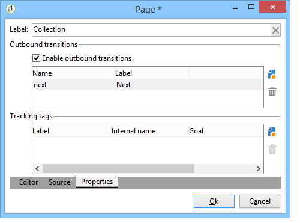

# 設定登陸頁面{#creating-a-landing-page}

## 關於建立登錄頁面 {#about-landing-pages-creation}

此使用案例顯示如何使用數位編輯器從Adobe Campaign主控台建立登錄頁面。

開始在Adobe Campaign中設定登錄頁面之前，請確定您已 **一個或多個模板** 來表示HTML頁面。

此使用案例的主要目的，是使用DCE中的函式，讓「著陸頁面」表單欄位與Adobe Campaign中的內部欄位對應。

## 建立登錄頁面 {#creating-the-landing-page}

若要建立新的著陸頁面類型Web應用程式，請使用下列步驟：

1. 前往 **[!UICONTROL Campaigns]** ，然後按一下 **[!UICONTROL Web application]** 連結，然後按一下 **[!UICONTROL Create]** 按鈕。
1. 選取 **[!UICONTROL New landing page]** 範本並輸入標籤，然後按一下 **[!UICONTROL Save]**.

   

1. 按一下 **[!UICONTROL Edit]** 標籤。
1. 刪除 **結束** 活動。
1. 新增 **[!UICONTROL Page]** 活動之後 **[!UICONTROL Storage]** 活動。
1. 編輯 **第2頁** 活動，然後取消勾選 **[!UICONTROL Activate outbound transitions]** 選項 **[!UICONTROL Properties]** 標籤。

   

1. 儲存變更.

接著，您會取得下列順序：

>[!NOTE]
>
>有關建立Web應用程式的詳細資訊，請參閱 [本節](creating-a-new-web-application.md).

## 步驟1 — 選取和載入範本 {#step-1---selecting-and-loading-templates}

在本節中，我們將探討如何 **匯入HTML內容** Web應用程式的每個頁面。

範本必須包含：

* an **HTML** 檔案（必填）
* 一個或多個 **CSS** 檔案（可選）
* 一個或多個 **影像** （可選）

若要在第一頁上載入範本，請套用下列步驟：

1. 開啟第一個 **[!UICONTROL Page]** Web應用程式的活動。
1. 選擇 **[!UICONTROL From a file]** 來擷取內容範本。

   

1. 選取要使用的HTML檔案。
1. 按一下 **開啟** 以開始匯入。

   載入期間，會顯示共用檔案的清單。 匯入系統會檢查連結至所選HTML的所有檔案（CSS、影像等）是否存在。

   按一下 **[!UICONTROL Close]** 按鈕。

   

   >[!CAUTION]
   >
   >您必須等到收到下列訊息後才關閉： **[!UICONTROL The external resources have been successfully published]** .

1. 按一下 **[!UICONTROL Properties]** 標籤。
1. 輸入 **標籤** (例如：第1頁=收集，第2頁=謝謝)。

   

對Web應用程式中插入的每個頁面應用這些步驟。

>[!CAUTION]
>
>**DCE會為載入的HTML頁面執行JavaScript程式碼。** HTML範本中的JavaScript錯誤，這些錯誤可能會出現在Adobe Campaign介面中。 這些錯誤與編輯器無關。 要檢查導入的檔案中是否沒有錯誤，建議您先在Web瀏覽器中測試這些錯誤，然後再將檔案導入DCE。

## 步驟2 — 設定內容 {#step-2---configuring-the-content}

在本節中，我們將調整匯入的內容，並將資料庫的欄位連結至網頁的形式。 先前建立的Web應用程式為：

### 修改內容 {#modifying-content}

讓我們從更改頁面的顏色開始。 操作步驟：

1. 開啟 **[!UICONTROL Collection]** 頁面。
1. 按一下背景。
1. 按一下 **背景顏色** 在右側。
1. 選取新的背景顏色。
1. 按一下 **確定** 以確認變更。

   

1. 套用這些相同的程式以變更按鈕的顏色

   

### 連結表單欄位 {#linking-form-fields}

我們將將頁面中的欄位連結至資料庫中的欄位，以儲存提供的資訊。

1. 選取表單欄位。
1. 編輯 **[!UICONTROL Field]** 區段。
1. 選擇要連結到所選欄位的資料庫欄位。

   

1. 對頁面上的每個欄位重複此程式。

您可以將欄位設為必填欄位：例如，按一下 **[!UICONTROL Email]** 欄位，然後啟用 **必填** 選項。

### 建立下一頁的連結 {#creating-a-link-to-the-next-page}

此步驟為必要步驟，因為它將允許Web應用程式確定後續步驟的順序：將收集的資料儲存在資料庫中，然後顯示下一頁(**謝謝** 頁面)。

1. 選取 **[!UICONTROL Send it!]** 按鈕 **[!UICONTROL Collection]** 頁面。
1. 按一下 **[!UICONTROL Action]** 下拉式功能表。
1. 選取 **[!UICONTROL Next page]** 動作。

   

### 插入個人化欄位 {#inserting-a-personalization-field}

此步驟可讓您個人化「感謝」頁面。 操作步驟：

1. 開啟 **[!UICONTROL Thank you]** 頁面。
1. 將游標置於要插入收件人名字的文本區域中。
1. 選擇 **[!UICONTROL Personalization field]** 在 **[!UICONTROL Insert]** 的下限。
1. 選取名字。

   

個人化欄位在編輯器中有黃色背景。

## 步驟3 — 發佈內容 {#step-3---publishing-content}

內容從Web應用程式控制面板發佈。 按一下 **[!UICONTROL Publish]** 按鈕來運行它。

發佈期間會顯示記錄檔。 發佈系統會分析在Web應用程式中找到的所有內容

>[!NOTE]
>
>在發佈記錄中，警告和錯誤會依活動排序。

表單現已可用：其URL可在應用程式控制面板中存取，並可傳送給收件者。
