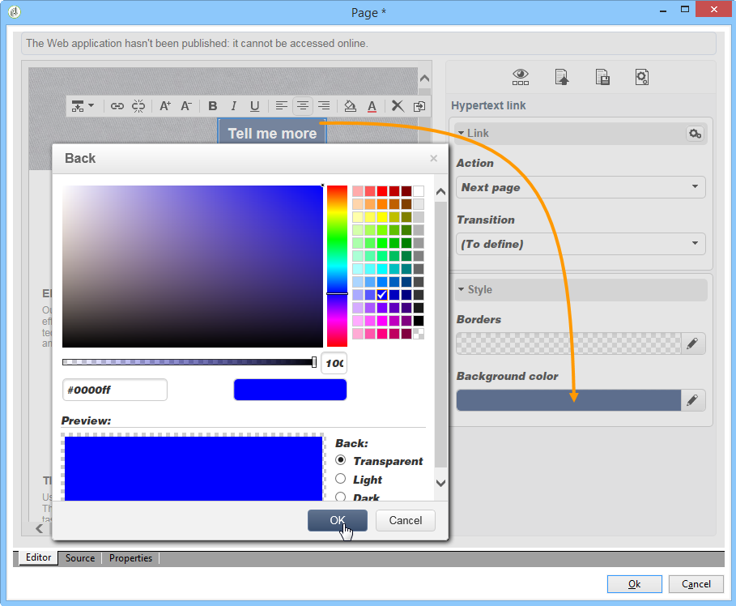

# 設定登陸頁面{#creating-a-landing-page}

## 關於登錄頁建立 {#about-landing-pages-creation}

此用例顯示了使用數字編輯器從Adobe Campaign控制台建立登錄頁。

在開始配置Adobe Campaign的登錄頁之前，請確保 **一個或多個模板** 表示HTML頁。

此使用案例的主要目的是使登錄頁表單欄位與Adobe Campaign的內部欄位對應，並使用DCE中的功能。

## 建立登錄頁 {#creating-the-landing-page}

要建立新的登錄頁類型Web應用程式，請執行以下步驟：

1. 轉到 **[!UICONTROL Campaigns]** ，然後按一下 **[!UICONTROL Web application]** 連結，然後按一下 **[!UICONTROL Create]** 按鈕
1. 選擇 **[!UICONTROL New landing page]** 輸入標籤，然後按一下 **[!UICONTROL Save]**。

   

1. 按一下 **[!UICONTROL Edit]** 頁籤。
1. 刪除 **結束** 的子菜單。
1. 添加 **[!UICONTROL Page]** 活動 **[!UICONTROL Storage]** 的子菜單。
1. 編輯 **第2頁** 活動，然後取消選中 **[!UICONTROL Activate outbound transitions]** 的上界 **[!UICONTROL Properties]** 頁籤。

   

1. 保存更改。

然後，您將獲得以下排序：

>[!NOTE]
>
>有關建立Web應用程式的詳細資訊，請參閱 [此部分](creating-a-new-web-application.md)。

## 步驟1 — 選擇和載入模板 {#step-1---selecting-and-loading-templates}

在本節中，我們將研究如何 **導入HTML內容** 頁。

模板必須包含：

* 一個 **HTML** 檔案（必填）
* 一個或多個 **CSS** 檔案（可選）
* 一個或多個 **影像** （可選）

要在第一頁上載入模板，請應用以下步驟：

1. 開啟第一個 **[!UICONTROL Page]** Web應用程式的活動。
1. 選擇 **[!UICONTROL From a file]** 獲取內容模板。

   

1. 選擇要使用的HTML檔案。
1. 按一下 **開啟** 的子菜單。

   載入期間，將顯示共用檔案清單。 導入系統檢查連結到所選HTML的所有檔案（CSS、影像等）是否都在。

   按一下 **[!UICONTROL Close]** 按鈕。

   

   >[!CAUTION]
   >
   >您必須等到收到以下消息後才關閉： **[!UICONTROL The external resources have been successfully published]** 。

1. 按一下 **[!UICONTROL Properties]** 頁籤。
1. 輸入 **標籤** (例如：第1頁=收集，第2頁=謝謝)。

   

將這些步驟應用於Web應用程式中插入的每個頁面。

>[!CAUTION]
>
>**DCE為已載入的HTML頁執行JavaScript代碼。** HTML模板中的JavaScript錯誤，可能出現在Adobe Campaign介面中。 這些錯誤與編輯器無關。 要檢查導入的檔案中是否沒有錯誤，建議在將檔案導入DCE之前，先在Web瀏覽器中test它們。

## 步驟2 — 配置內容 {#step-2---configuring-the-content}

在本節中，我們將調整導入的內容並將資料庫的欄位連結到網頁的形式。 以前建立的Web應用程式是：

### 修改內容 {#modifying-content}

讓我們從更改頁面的顏色開始。 操作步驟：

1. 開啟 **[!UICONTROL Collection]** 的子菜單。
1. 按一下背景。
1. 按一下 **背景顏色** 在右邊。
1. 選擇新背景顏色。
1. 按一下 **確定** 確認更改。

   

1. 應用這些相同的進程以更改按鈕的顏色

   

### 連結表單域 {#linking-form-fields}

我們將將頁中的欄位連結到資料庫中的欄位，以保存提供的資訊。

1. 選擇表單域。
1. 編輯 **[!UICONTROL Field]** 對話框。
1. 選擇要連結到選定欄位的資料庫欄位。

   

1. 對頁面上的每個欄位重複此過程。

您可以將欄位設定為必填欄位：例如，按一下 **[!UICONTROL Email]** ，然後啟用 **強制** 的雙曲餘切值。

### 建立指向下一頁的連結 {#creating-a-link-to-the-next-page}

此步驟是必需的，因為它將允許Web應用程式確定後續步驟的順序：將收集的資料保存到資料庫中，然後顯示下一頁(**謝謝** )的正平方根。

1. 選擇 **[!UICONTROL Send it!]** 按鈕 **[!UICONTROL Collection]** 的子菜單。
1. 按一下 **[!UICONTROL Action]** 的下界。
1. 選擇 **[!UICONTROL Next page]** 操作。

   

### 插入個人化欄位 {#inserting-a-personalization-field}

此步驟允許您個性化「謝謝」頁。 操作步驟：

1. 開啟 **[!UICONTROL Thank you]** 的子菜單。
1. 將游標置於要插入收件人名字的文本區域。
1. 選擇 **[!UICONTROL Personalization field]** 的 **[!UICONTROL Insert]** 的子菜單。
1. 選擇名。

   

個性化欄位在編輯器中具有黃色背景。

## 步驟3 — 發佈內容 {#step-3---publishing-content}

內容從Web應用程式儀表板發佈。 按一下 **[!UICONTROL Publish]** 按鈕來運行它。

在發佈期間，將顯示日誌。 發佈系統分析Web應用程式中找到的所有內容

>[!NOTE]
>
>在發佈日誌中，警告和錯誤按活動排序。

現在可以使用該表單：其URL可在應用程式儀表板中訪問，並可以發送給收件人。
