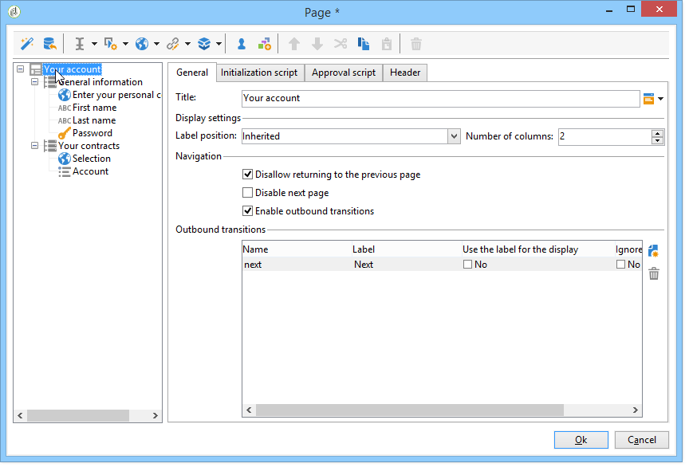
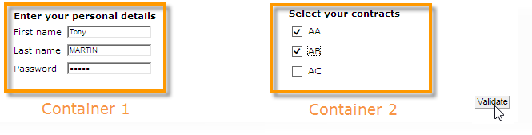
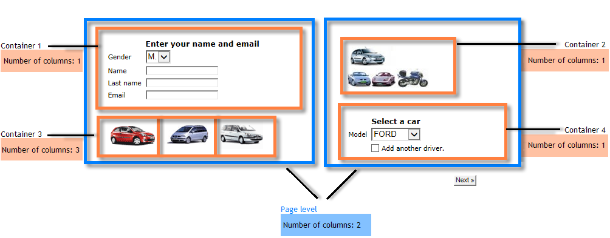

# 定義網路表單版面{#defining-web-forms-layout}

## 建立容器 {#creating-containers}

容器可讓您結合頁面的欄位並設定其配置；來組織頁面中的元素。

對於表單的每個頁面，容器是透過工具列的&#x200B;**[!UICONTROL Containers]**&#x200B;按鈕建立。

使用容器將頁面的元素分組，而不在最終呈現中新增標籤。 元素會分組到容器子樹中。 標準容器可讓您管理版面。

例如：

標籤的位置會套用至階層中容器下方的元素。 如有必要，每個元素的負載都可能過多。 新增或移除欄以變更配置。 請參閱[定位頁面上的欄位](#positioning-the-fields-on-the-page)。

在上述範例中，呈現的方式如下：

## 定位頁面上的欄位 {#positioning-the-fields-on-the-page}

Web表單的版面配置是依頁面在每個容器中定義，並且可視需要超載。

頁面會劃分為欄：每個頁面都包含特定的欄數。 頁面的每個欄位佔據&#x200B;**n**&#x200B;儲存格。 容器也佔據一定數量的欄，而容器所包含的欄位則佔據一定數量的儲存格。

依預設，頁面會建置在單一欄上，而每個元素會佔據一個儲存格。 這表示欄位會彼此顯示，每個欄位會佔據整行，如下所示：

在下列範例中，已保留預設設定。 頁面佔據一欄，其中包含四個容器。

每個容器各佔一欄，每個元素各佔一個儲存格：

呈現如下：

您可以調整顯示參數以取得下列轉譯：

在上述轉譯範例中，每個輸入欄位、標題和影像在容器的欄中佔據一個儲存格。

您可以修改每個容器中的格式。 在此範例中，您可以將容器4的內容分佈至兩欄，然後分佈元素。

標題和清單各佔一個儲存格（因此是容器的整行），核取方塊延伸至兩個儲存格。 根據欄位類型，在&#x200B;**[!UICONTROL General]**&#x200B;標籤或&#x200B;**[!UICONTROL Advanced]**&#x200B;標籤中定義了輸入欄位的單元格數：

## 定義標籤的位置 {#defining-the-position-of-labels}

您可以定義表單中欄位和標籤的對齊方式。

依預設，欄位和頁面其他內容的顯示參數繼承自表單的一般設定、頁面的設定，或父容器的設定（如果存在）。

整個表單的全局顯示參數在表單屬性框中指定。 **[!UICONTROL Rendering]**&#x200B;標籤可讓您選取標籤的位置。

透過&#x200B;**[!UICONTROL Advanced]**&#x200B;標籤，此位置可能會針對每個頁面、每個容器和每個欄位而超載。

支援下列對齊：

* 繼承：對齊方式繼承自父元素（預設值），即父容器（如果有），或頁面的其他內容。
* 左/右：標籤位於欄位的右側或左側，
* 上/下：標籤位於欄位上或下方，
* 隱藏：標籤未顯示。
