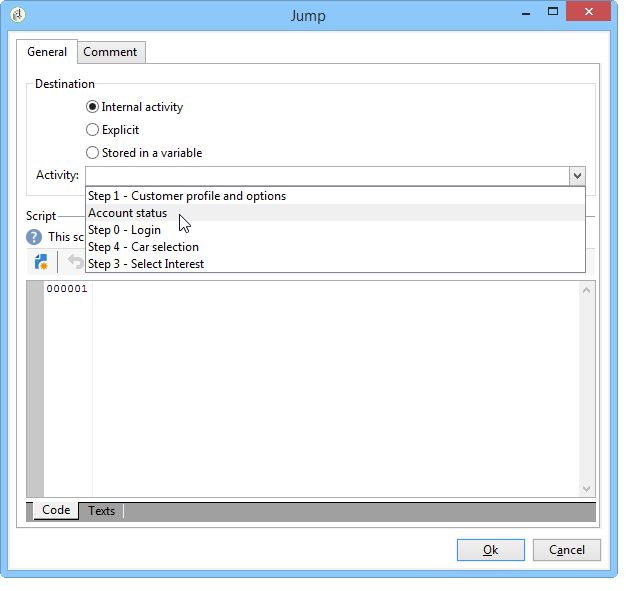
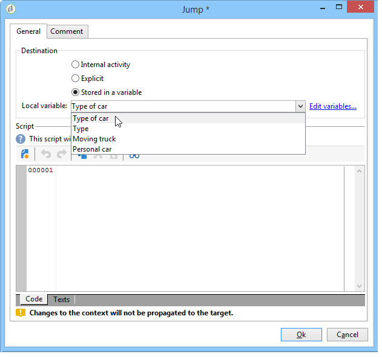
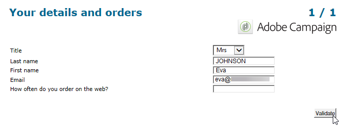

# 定義網路表單頁面排序{#defining-web-forms-page-sequencing}


表單可包含一或多個頁面。 它是透過圖表建置，可讓您排序頁面、測試、指令碼執行、頁面跳轉和記錄步驟。 全域圖表設計模式與Campaign工作流程的模式相同。

## 關於上一頁和下一頁 {#about-previous-page-and-next-page}

您可以對每個頁面刪除 **[!UICONTROL Next]** 或 **[!UICONTROL Previous]** 按鈕。 要執行此操作，請選取相關頁面並選取選項 **[!UICONTROL Disable next page]** 或 **[!UICONTROL Disallow returning to the previous page]** .


您可以用連結取代這些按鈕。 請參閱 [插入HTML內容](static-elements-in-a-web-form.md#inserting-html-content).

## 插入跳轉 {#inserting-a-jump}

此 **[!UICONTROL Jump]** 當使用者點按時，物件可讓使用者存取其他頁面或其他表單 **[!UICONTROL Next]**.

目的地可以是：

* 表單的另一頁。 要執行此操作，請選取 **[!UICONTROL Internal activity]** 然後指定所需的頁面，如下所示：

   

* 另一種形式。 若要這麼做，請選取 **[!UICONTROL Explicit]** 選項並指定目標表單。

   

* 目的地可儲存在變數中。 在此情況下，請從下拉式清單中選取它，如下所示：

   

* 此 **[!UICONTROL Comment]** 索引標籤可讓您輸入運算子按一下圖表中的物件時可見的資訊。

   

## 範例：根據URL的參數存取其他表單 {#example--accessing-another-form-according-to-a-parameter-of-the-url}

在以下範例中，我們要設定Web表單，在核准後，該表單將顯示URL參數指定的其他表單。 若要這麼做，請套用下列步驟：

1. 在表單結尾處插入跳轉：這會取代 **[!UICONTROL End]** 框。

   

1. 在表單屬性中，新增參數(**next**)儲存於本機變數(**next**)。 本機變數在 [將資料儲存在本機變數中](web-forms-answers.md#storing-data-in-a-local-variable).

   

1. 編輯 **[!UICONTROL Jump]** 對象，選擇 **[!UICONTROL Stored in a variable]** 選項，然後選取 **next** 變數。

   

1. 傳送URL必須包含目的地表單的內部名稱，例如：

   ```
   https://[myserver]/webForm/APP62?&next=APP22
   ```

   當使用者點按 **[!UICONTROL Approve]** 按鈕，表單 **APP22** 的下界。

## 插入到表單的其他頁面的連結 {#inserting-a-link-to-another-page-of-the-form}

您可以插入表單中其他頁面的連結。 若要這麼做，請新增 **[!UICONTROL Link]** 在頁面中輸入靜態元素。 有關詳細資訊，請參閱 [插入連結](static-elements-in-a-web-form.md#inserting-a-link).

## 條件式頁面顯示 {#conditional-page-display}

### 根據回應顯示 {#display-based-on-responses}

此 **[!UICONTROL Test]** 方塊可讓您設定表單中頁面順序的條件。 它可讓您根據測試結果定義各種分支線。 這可讓您根據使用者提供的答案，顯示不同的頁面。

例如，您可以為已線上訂購的客戶顯示不同的頁面，而為已訂購超過10個的客戶顯示另一個頁面。 若要這麼做，請在表單的第一頁插入 **[!UICONTROL Number]** 輸入欄位，供使用者說明已下多少訂單。



您可以將此資訊儲存在資料庫的欄位中，或使用本機變數。

>[!NOTE]
>
>儲存模式在 [回應儲存欄位](web-forms-answers.md#response-storage-fields).

在我們的範例中，我們想使用變數：


在表單的圖表中，插入測試方塊以定義條件。 對於每個條件，測試方塊的輸出將新增一個新分支。


選取 **[!UICONTROL Activate the default branching]** 選項，以針對任何條件皆不成立的情況新增轉變。 如果定義的條件涵蓋所有可能的情況，則不需要此選項。

接著，當其中一個或其他條件為true時，定義頁面排序，例如：


### 根據參數顯示 {#display-based-on-parameters}

您也可以根據Web表單的初始化參數或根據資料庫中儲存的值來個人化頁面排序。 請參閱 [表單URL參數](defining-web-forms-properties.md#form-url-parameters).

## 新增指令碼 {#adding-scripts}

此 **[!UICONTROL Script]** 物件可讓您直接輸入JavaScript指令碼，例如修改欄位的值、從資料庫擷取資料，或呼叫Adobe Campaign API。

## 個人化結束頁面 {#personalizing-the-end-page}

必須在圖的末尾放置一個結束頁。 使用者按一下 **[!UICONTROL Approve]** 按鈕。

若要個人化此頁面，請按兩下 **[!UICONTROL End]** 並在中央編輯器中輸入頁面內容。


* 您可以複製並貼上現有的HTML內容。 要執行此操作，請按一下 **[!UICONTROL Display source code]** 並插入HTML程式碼。
* 您可以使用外部URL;若要這麼做，請選取對應的選項，然後輸入要顯示的頁面URL。
