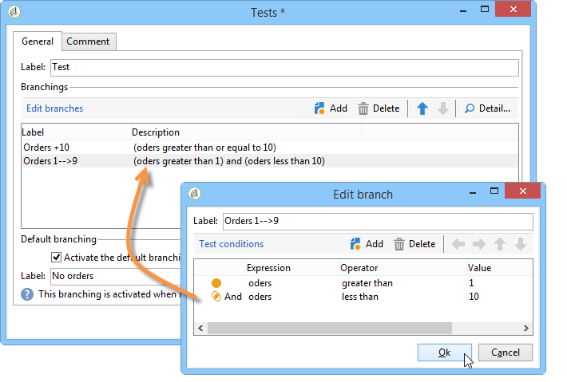

# 定義網路表單頁面順序{#defining-web-forms-page-sequencing}


表單可包含一或多個頁面。 它是透過圖表建置，可讓您排序頁面、測試、指令碼執行、頁面跳轉和錄製步驟。 全域圖表設計模式與Campaign工作流程相同。

## 關於上一頁和下一頁 {#about-previous-page-and-next-page}

對於每個頁面，您可以刪除 **[!UICONTROL Next]** 或 **[!UICONTROL Previous]** 按鈕。 若要這麼做，請選取相關頁面並選取選項 **[!UICONTROL Disable next page]** 或 **[!UICONTROL Disallow returning to the previous page]** .


您可以使用連結來取代這些按鈕。 另請參閱 [插入HTML內容](static-elements-in-a-web-form.md#inserting-html-content).

## 插入跳轉 {#inserting-a-jump}

此 **[!UICONTROL Jump]** 物件可在使用者點按時，提供對另一個頁面或其他表單的存取權 **[!UICONTROL Next]**.

目的地可以是：

* 表單的另一個頁面。 要執行此操作，請選取 **[!UICONTROL Internal activity]** 然後指定所要的頁面，如下所示：

   

* 另一個表單。 若要這麼做，請選取 **[!UICONTROL Explicit]** 選項並指定目的地表單。

   

* 目的地可以儲存在變數中。 在此情況下，請從下拉式清單中選取它，如下所示：

   

* 此 **[!UICONTROL Comment]** tab可讓您輸入當運運算元按一下圖表中的物件時可看到的資訊。

   

## 範例：根據URL的引數存取其他表單 {#example--accessing-another-form-according-to-a-parameter-of-the-url}

在以下範例中，我們要設定一個網頁表單，在核准後將顯示另一個由URL引數指定的表單。 若要這麼做，請套用下列步驟：

1. 在表單結尾插入跳轉：這會取代 **[!UICONTROL End]** 方塊。

   

1. 在表單屬性中，新增引數(**下一個**)儲存在區域變數(**下一個**)。 有關區域變數的詳情，請參閱 [將資料儲存在區域變數中](web-forms-answers.md#storing-data-in-a-local-variable).

   

1. 編輯 **[!UICONTROL Jump]** 物件，選取 **[!UICONTROL Stored in a variable]** 選項並選取 **下一個** 變數。

   

1. 傳遞URL必須包含目的地表單的內部名稱，例如：

   ```
   https://[myserver]/webForm/APP62?&next=APP22
   ```

   當使用者按一下 **[!UICONTROL Approve]** 按鈕，表單 **APP22** 隨即顯示。

## 插入表單其他頁面的連結 {#inserting-a-link-to-another-page-of-the-form}

您可以插入表單其他頁面的連結。 若要這麼做，請新增 **[!UICONTROL Link]** 在頁面中輸入靜態元素。 有關詳細資訊，請參閱 [插入連結](static-elements-in-a-web-form.md#inserting-a-link).

## 條件式頁面顯示 {#conditional-page-display}

### 根據回應顯示 {#display-based-on-responses}

此 **[!UICONTROL Test]** 方塊可讓您設定表單中頁面順序的條件。 它可讓您根據測試結果定義各種分支行。 這可讓您根據使用者提供的回答顯示不同的頁面。

例如，您可以為已線上上訂購的客戶顯示不同的頁面，為已下十份以上訂單的客戶顯示另一個頁面。 若要這麼做，請在表單的第一個頁面中插入 **[!UICONTROL Number]** 輸入輸入欄位，讓使用者說明已下多少訂單。


您可以將此資訊儲存在資料庫的欄位中，或使用本機變數。

>[!NOTE]
>
>儲存模式的詳細資訊，請參閱 [回應儲存欄位](web-forms-answers.md#response-storage-fields).

在我們的範例中，我們想要使用變數：


在表單的圖表中，插入測試方塊以定義條件。 對於每個條件，都會在測試方塊的輸出處新增一個分支。



選取 **[!UICONTROL Activate the default branching]** 選項來新增轉變，以用於沒有任何條件為true的情況。 如果定義的條件涵蓋了每個可能的情況，則不需要使用此選項。

接下來，定義其中一項或多項條件為真時的頁面排序，例如：


### 根據引數顯示 {#display-based-on-parameters}

您也可以根據Web表單的初始化引數或資料庫中儲存的值，將頁面排序個人化。 另請參閱 [表單URL引數](defining-web-forms-properties.md#form-url-parameters).

## 新增指令碼 {#adding-scripts}

此 **[!UICONTROL Script]** 物件可讓您直接輸入JavaScript指令碼，例如修改欄位的值、從資料庫擷取資料，或呼叫Adobe Campaign API。

## 個人化結束頁面 {#personalizing-the-end-page}

您必須在圖表的結尾處放置一個結束頁面。 當使用者按一下 **[!UICONTROL Approve]** 按鈕。

若要個人化此頁面，請按兩下 **[!UICONTROL End]** 並在中央編輯器中輸入頁面內容。


* 您可以複製並貼上現有的HTML內容。 若要這麼做，請按一下 **[!UICONTROL Display source code]** 並插入HTML代碼。
* 您可以使用外部URL；若要這麼做，請選取對應的選項，然後輸入要顯示的頁面URL。
