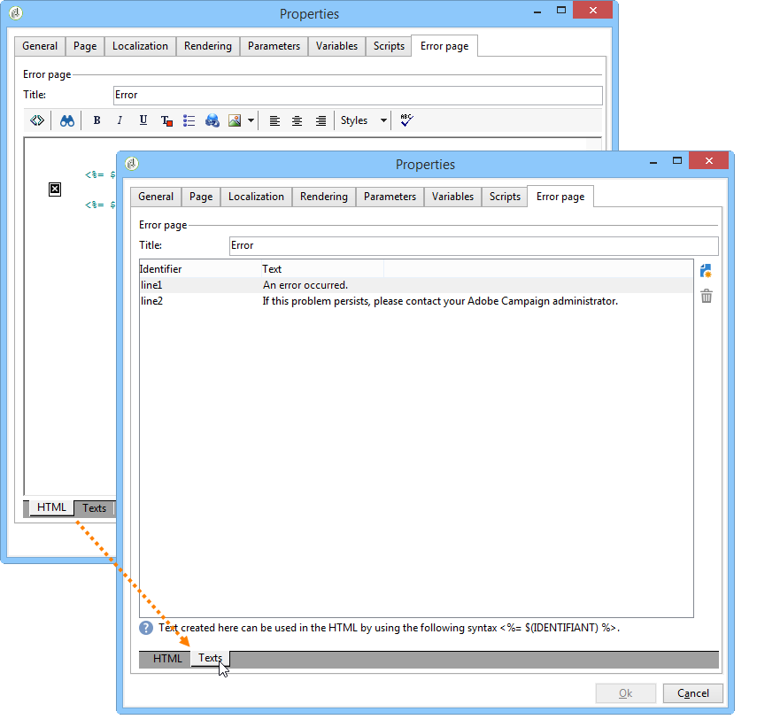

# 定義網路表單屬性{#defining-web-forms-properties}

您可以完全配置和個性化Web表單以滿足您的要求。 必須在屬性窗口中輸入參數。

可通過 **[!UICONTROL Properties]** 的子菜單。 此窗口允許您訪問特定於Web表單的一系列設定。 某些設定可能源於模板配置。

## 整體窗體屬性 {#overall-form-properties}

在 **[!UICONTROL General]** 的子菜單。 **標籤** 的下界。 強烈建議不要更改 **內部名稱**。

在建立表單時選擇表單模板。 以後不能更改。 有關建立和管理表單模板的詳細資訊，請參閱 [使用Web表單模板](using-a-web-form-template.md)。

## 表單資料儲存 {#form-data-storage}

預設情況下，Web表單的欄位儲存在收件人表中。 通過從 **[!UICONTROL Document type]** 的子菜單。 的 **[!UICONTROL Zoom]** 表徵圖，用於查看所選表格的內容。

預設情況下，答案儲存在 **對收件人表單的答復** 的子菜單。

## 設定錯誤頁 {#setting-up-an-error-page}

可以配置錯誤頁：在表單執行過程中出錯時，將顯示此頁。

錯誤頁是在表單屬性窗口的相應頁籤中定義的。

預設情況下，它顯示以下資訊：

顯示的字串的內容在 **[!UICONTROL Error page]** 的子菜單。 的 **[!UICONTROL HTML]** 頁籤顯示呈現和 **[!UICONTROL Texts]** 頁籤，您可以修改文本字串並在必要時添加一些文本：

## 窗體本地化 {#form-localization}

的 **[!UICONTROL Localization]** 頁籤，用於為Web窗體選擇設計和顯示語言。

請參閱 [翻譯Web表單](translating-a-web-form.md)。

## 表單瀏覽和呈現 {#form-browsing-and-rendering}

的 **[!UICONTROL Rendering]** 頁籤，用於定義Web表單的頁面和使用的呈現模板之間的瀏覽類型。

您可以選擇通過連結或按鈕導航。

按鈕預設為導航元素。 它們允許您執行以下操作：

* 通過按一下批准當前頁並顯示下一頁 **[!UICONTROL Next]**。 此按鈕顯示在除最後一頁之外的所有頁面上。
* 通過按一下 **[!UICONTROL Previous]**。 此按鈕顯示在除第一個按鈕之外的所有頁面上。
* 通過按一下 **[!UICONTROL Approve]** 按鈕 此按鈕僅顯示在最後一頁。

這些元素顯示在每頁的底部。 他們的立場可以改變。 為此，必須修改樣式表。

>[!NOTE]
>
>有可能隱藏 **[!UICONTROL Previous]** 按鈕。 要執行此操作，請轉到相關頁面並檢查 **[!UICONTROL Disallow returning to the previous page]** 的雙曲餘切值。 選擇頁面樹的根時，可以訪問此選項。

的 **[!UICONTROL Template]** 的 **[!UICONTROL Rendering]** 頁籤。

主題保存在 **[!UICONTROL Administration>Configuration>Form rendering]** 的子目標。 請參閱 [選擇表單呈現模板](form-rendering.md#selecting-the-form-rendering-template)

在屬性窗口的下部顯示示例渲染。 的 **[!UICONTROL Edit link]** 表徵圖，用於查看所選主題的配置。

## 窗體中的文本 {#texts-in-the-form}

的 **[!UICONTROL Page]** 頁籤中，您可以定義表單頁眉和頁腳的內容。 請參閱 [定義頁眉和頁腳](form-rendering.md#defining-headers-and-footers)。

它還允許您管理翻譯。 請參閱 [翻譯Web表單](translating-a-web-form.md)。

## 表格的可訪問性 {#accessibility-of-the-form}

如果Web表單是 **[!UICONTROL Online]** 當前日期在有效期內的。 在發佈階段修改表單的狀態(請參見 [發佈窗體](publishing-a-web-form.md#publishing-a-form))。 狀態顯示在 **項目** 的下界 **[!UICONTROL General]** 的子菜單。

有效期從 **[!UICONTROL Start]** 日期 **[!UICONTROL End date]**。 如果這些欄位中未指定日期，則表單具有永久有效性。

>[!NOTE]
>
>如果表單已關閉，並且因此其有效期未達到或已過期，或者如果表單由Adobe Campaign操作員關閉，則當用戶嘗試訪問表單時，將顯示一條消息。 您可以通過按一下 **[!UICONTROL Personalize the message displayed if the form is closed...]**。

## 表單訪問控制 {#form-access-control}

預設情況下，訪問Web表單的方式是匿名模式：所有訪問表單的運算子都分配了WebApp運算子權限。

您可以啟用表單顯示的訪問控制，例如在內部網站點上傳送表單時，以驗證用戶。 為此，請顯示 **[!UICONTROL Properties]** ，然後按一下 **[!UICONTROL Enable access control]** 選項，如下所示：

訪問該頁面時，將出現以下驗證表單：

登錄名和密碼是Adobe Campaign操作員使用的。 如需詳細資訊，請參閱[本章節](../../platform/using/access-management.md)。

的 **[!UICONTROL Use a specific account]** 選項，用於限制訪問表單的運算子的讀或寫權限。 使用下拉框選擇將負責授予這些權限的操作員或操作員組。

## 表單URL參數 {#form-url-parameters}

您可以在表單的URL中添加其他參數，以個性化其內容並初始化上下文（語言、加密的收件人ID、公司、儲存在變數中的計算公式等）。 這允許您通過多個不同的URL訪問一個表單，並根據URL中指示的參數值對頁面內容進行個性化。

預設情況下，Adobe Campaign提供預覽表單和檢查錯誤的參數。 您可以建立連結到表單的新設定，該表單可以使用資料庫中某個欄位或本地變數的值。

## 標準參數 {#standard-parameters}

預設情況下，以下參數可用：

* **ID** 以指示加密的標識符。
* **朗** 的子菜單。
* **來源** 來指定被申請人的來源。
* **_uuid** 在發佈和錯誤跟蹤之前啟用表單查看。 此參數供內部使用（建立和調試）:當您通過此URL訪問Web表單時，在跟蹤（報告）中不會考慮建立的記錄。 源被強制 **[!UICONTROL Adobe Campaign]** 值。

   它與 **預覽** 參數和/或 **調試**:

   **預覽** 顯示上次保存的版本。 此參數必須僅在test階段使用。

   **調試** 顯示表單頁面中輸入或計算的資料的跟蹤。 這用於獲取有關錯誤的更多資訊，包括表單發佈後的資訊。

   >[!CAUTION]
   >
   >當通過URL顯示窗體時， **_uuid** 參數， **[!UICONTROL origin]** 參數被強制 **Adobe Campaign**。

## 添加參數 {#adding-parameters}

可以通過 **[!UICONTROL Parameters...]** 的子菜單。 可強制執行，如下所示：

必須指定要從中檢索參數值的儲存位置。 為此，請選擇一個儲存選項，然後按一下 **[!UICONTROL Storage]** 頁籤。 儲存選項的詳細資訊 [響應儲存欄位](web-forms-answers.md#response-storage-fields)。

應答狀態（0、1或任何其他值）隨後可被添加到URL以訪問表單。 此資訊可以在表單的頁面或test框中重新使用。 顯示的頁面可以根據上下文的值進行條件調整，如下所示：

1. 客戶首頁(**狀態=1**):

   

1. 潛在客戶首頁(**狀態=0**):

   

1. 其他配置式的首頁(如 **狀態=12**):

   

要配置此表單，請建立一個test框，並將其置於圖的開頭，如下所示：

test框用於配置頁排序條件：

