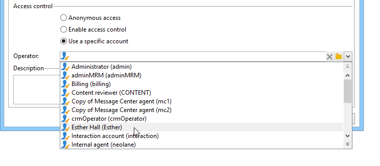
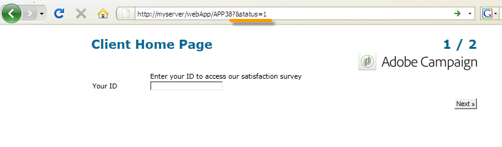

# 定義網路表單屬性{#defining-web-forms-properties}

Web表單可完全設定且可個人化，以符合您的需求。 參數必須在屬性窗口中輸入。

可通過Web表單工具欄中的&#x200B;**[!UICONTROL Properties]**&#x200B;按鈕訪問屬性窗口。 此視窗可讓您存取特定於Web表單的設定範圍。 某些設定可能源自範本設定。

## 整體表單屬性{#overall-form-properties}

在屬性窗口的&#x200B;**[!UICONTROL General]**&#x200B;頁籤中，可以修改表單的&#x200B;**Label**。 強烈建議不要更改&#x200B;**內部名稱**。

表單範本是在建立表單時選擇的。 以後不能更改。 有關建立和管理表單模板的詳細資訊，請參閱[使用Web表單模板](../../web/using/using-a-web-form-template.md)。

## 表單資料儲存{#form-data-storage}

預設情況下，Web表單的欄位儲存在收件人表中。 可以通過從&#x200B;**[!UICONTROL Document type]**&#x200B;欄位中選擇新表來更改使用的表。 **[!UICONTROL Zoom]**&#x200B;圖示可讓您檢視選取表格的內容。

預設情況下，答案儲存在&#x200B;**收件人表單**&#x200B;表中。

## 設定錯誤頁{#setting-up-an-error-page}

您可以設定錯誤頁面：在表單執行期間發生錯誤時，將顯示此頁。

錯誤頁是在表單屬性窗口的相應頁籤中定義的。

依預設，它會顯示下列資訊：

顯示的字串內容在屬性窗口的&#x200B;**[!UICONTROL Error page]**&#x200B;頁籤中定義。 **[!UICONTROL HTML]**&#x200B;標籤會顯示演算，而&#x200B;**[!UICONTROL Texts]**&#x200B;標籤可讓您修改文字字串，並視需要新增一些文字：

## 表單本地化{#form-localization}

**[!UICONTROL Localization]**&#x200B;標籤可讓您選取Web表單的設計和顯示語言。

請參閱[轉換Web表單](../../web/using/translating-a-web-form.md)。

## 表單瀏覽和轉換{#form-browsing-and-rendering}

**[!UICONTROL Rendering]**&#x200B;標籤可讓您定義Web表單頁面與使用的轉換範本之間的瀏覽類型。

您可以選擇透過連結或按鈕來導覽。

按鈕是預設的導覽元素。 它們可讓您執行下列動作：

* 按一下&#x200B;**[!UICONTROL Next]**&#x200B;核准目前頁面並顯示下一頁。 此按鈕會顯示在除最後一頁以外的所有頁面上。
* 按一下&#x200B;**[!UICONTROL Previous]**&#x200B;以顯示上一頁。 除第一個按鈕外，此按鈕會顯示在所有頁面上。
* 按一下&#x200B;**[!UICONTROL Approve]**&#x200B;按鈕以儲存表單回應。 此按鈕僅顯示在最後一頁。

這些元素會顯示在每個頁面的底部。 他們的立場可以改變。 要執行此操作，必須修改樣式表。

>[!NOTE]
>
>有些頁面上的&#x200B;**[!UICONTROL Previous]**&#x200B;按鈕可隱藏。 若要這麼做，請前往相關頁面並勾選&#x200B;**[!UICONTROL Disallow returning to the previous page]**&#x200B;選項。 當選取頁面樹的根目錄時，即可存取此選項。

**[!UICONTROL Rendering]**&#x200B;標籤的&#x200B;**[!UICONTROL Template]**&#x200B;欄位可讓您從可用主題中選取主題。

主題保存在樹的&#x200B;**[!UICONTROL Administration>Configuration>Form rendering]**&#x200B;節點中。 請參閱[選擇表單轉換範本](../../web/using/form-rendering.md#selecting-the-form-rendering-template)

屬性窗口的下半部將顯示示例渲染。 **[!UICONTROL Edit link]**&#x200B;圖示可讓您檢視所選主題的設定。

## 文本格式{#texts-in-the-form}

**[!UICONTROL Page]**&#x200B;標籤可讓您定義表單頁首和頁尾的內容。 請參閱[定義頁首和頁尾](../../web/using/form-rendering.md#defining-headers-and-footers)。

它也可讓您管理翻譯。 請參閱[轉換Web表單](../../web/using/translating-a-web-form.md)。

## {#accessibility-of-the-form}格式的輔助功能

如果Web表單&#x200B;**[!UICONTROL Online]**&#x200B;且目前日期在有效期內，則使用者可存取該表單。 在發佈階段中修改表單的狀態（請參閱[發佈表單](../../web/using/publishing-a-web-form.md#publishing-a-form)）。 狀態顯示在屬性窗口的&#x200B;**[!UICONTROL General]**&#x200B;頁籤的&#x200B;**Project**&#x200B;部分。

有效期從&#x200B;**[!UICONTROL Start]**&#x200B;日期到&#x200B;**[!UICONTROL End date]**。 如果這些欄位中未指定日期，表單就具有永久有效性。

>[!NOTE]
>
>如果表單已關閉，因此其有效期尚未到達或已過期，或者如果表單由Adobe Campaign運算子關閉，當使用者嘗試存取表單時，會顯示訊息。 按一下&#x200B;**[!UICONTROL Personalize the message displayed if the form is closed...]**&#x200B;可個性化此消息。

## 表單訪問控制{#form-access-control}

依預設，Web表格的存取是以匿名模式進行：所有存取表單的運算子都會指派WebApp運算子權限。

您可以啟用表格顯示的存取控制，例如在內部網路網站上傳送表格以驗證使用者。 要執行此操作，請顯示相關表單的&#x200B;**[!UICONTROL Properties]**&#x200B;窗口，然後按一下&#x200B;**[!UICONTROL Enable access control]**&#x200B;選項，如下所示：

存取頁面時，將會出現下列驗證表單：

登入和密碼是Adobe Campaign營運商使用的登入和密碼。 如需詳細資訊，請參閱[本章節](../../platform/using/access-management.md)。

**[!UICONTROL Use a specific account]**&#x200B;選項可讓您限制存取表單之運算子的讀取或寫入權限。 使用下拉式方塊來選取負責授與這些權限的運算元或運算元群組。

## 表單URL參數{#form-url-parameters}

您可以在表單的URL中新增其他參數，以個人化其內容並初始化內容（語言、加密的收件者ID、公司、儲存在變數中的計算公式等）。 這可讓您透過數個不同的URL存取一個表單，並根據URL中指示之參數值個人化頁面內容。

依預設，Adobe Campaign會提供預覽表單和檢查錯誤的參數。 您可以建立連結至表單的新設定，這可能會使用資料庫中欄位或本機變數的值。

## 標準參數{#standard-parameters}

下列參數預設可用：

* **idto** 指出加密的識別碼。
* **語** 言以變更顯示語言。
* **「** 原始」指定回應者的來源。
* **_** uuidenables在發佈和錯誤追蹤前從表單檢視。此參數僅供內部使用（建立和調試）:當您透過此URL存取Web表格時，在追蹤（報表）中不會考慮建立的記錄。 原點被強制為&#x200B;**[!UICONTROL Adobe Campaign]**&#x200B;值。

   它與&#x200B;**_preview**&#x200B;參數和／或&#x200B;**_debug**&#x200B;一起使用：

   **_** previewto會顯示上次儲存的版本。此參數僅能用於測試階段。

   **_** debutgot會顯示表單頁面中輸入或計算的資料追蹤。這可用來取得更多錯誤的相關資訊，包括表單發佈後的錯誤資訊。

   >[!CAUTION]
   >
   >當透過具有&#x200B;**_uuid**&#x200B;參數的URL顯示表單時，**[!UICONTROL origin]**&#x200B;參數的值會強制至&#x200B;**Adobe Campaign**。

## 添加參數{#adding-parameters}

可以通過表單的「屬性」窗口中的&#x200B;**[!UICONTROL Parameters...]**&#x200B;頁籤添加參數。 可強制執行，如下所示：

必須指定從中檢索參數值的儲存位置。 要執行此操作，請選擇一個儲存選項，然後按一下&#x200B;**[!UICONTROL Storage]**&#x200B;頁籤以選擇相關欄位或變數。 儲存選項在[響應儲存欄位](../../web/using/web-forms-answers.md#response-storage-fields)中有詳細說明。

回應者狀態（0、1或任何其他值）隨後可新增至URL以存取表單。 這些資訊可在表單的頁面或測試方塊中重複使用。 顯示的頁面可以根據上下文的值進行條件調整，如下所示：

1. 客戶首頁(**status=1**):

   

1. 潛在客戶的首頁(**status=0**):

   

1. 其他描述檔的首頁（例如&#x200B;**status=12**）:

   

要配置此表單，請建立一個測試框並將其置於圖的開頭，如下所示：

測試方塊可讓您設定頁面順序條件：

