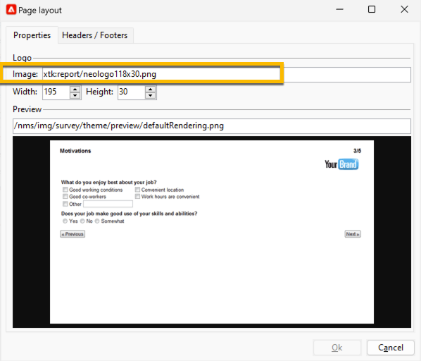

# 定義網路表單屬性{#defining-web-forms-properties}

您可以完全設定並個人化網路表單，以符合您的需求。 必須在屬性視窗中輸入引數。

屬性視窗可透過Web表單工具列中的&#x200B;**[!UICONTROL Properties]**&#x200B;按鈕存取。 此視窗可讓您存取網路表單的一系列特定設定。 某些設定可能來自範本設定。

## 整體表單屬性 {#overall-form-properties}

在屬性視窗的&#x200B;**[!UICONTROL General]**&#x200B;標籤中，您可以修改表單的&#x200B;**標籤**。 強烈建議不要變更&#x200B;**內部名稱**。

在建立表單期間選擇表單範本。 之後無法變更。 有關建立和管理表單範本的詳細資訊，請參閱[使用網頁表單範本](using-a-web-form-template.md)。

## 表單資料儲存 {#form-data-storage}

根據預設，網路表單的欄位會儲存在收件者表格中。 您可以從&#x200B;**[!UICONTROL Document type]**&#x200B;欄位中選取新資料表，以變更使用的資料表。 **[!UICONTROL Zoom]**&#x200B;圖示可讓您檢視所選表格的內容。

依預設，答案會儲存在收件者表單的&#x200B;**答案**&#x200B;資料表中。

## 設定錯誤頁面 {#setting-up-an-error-page}

您可以設定錯誤頁面：在執行表單期間發生錯誤時，會顯示此頁面。

錯誤頁面會在表單屬性視窗的對應標籤中定義。

依預設，它會顯示下列資訊：

顯示的字串內容是在屬性視窗的&#x200B;**[!UICONTROL Error page]**&#x200B;索引標籤中定義。 **[!UICONTROL HTML]**&#x200B;索引標籤會顯示轉譯，而&#x200B;**[!UICONTROL Texts]**&#x200B;索引標籤可讓您修改文字字串並視需要新增一些文字：

## 表單本地化 {#form-localization}

**[!UICONTROL Localization]**&#x200B;索引標籤可讓您選取網頁表單的設計和顯示語言。

請參閱[轉譯網路表單](translating-a-web-form.md)。

## 表單瀏覽與呈現 {#form-browsing-and-rendering}

**[!UICONTROL Rendering]**&#x200B;索引標籤可讓您定義在網頁表單頁面與使用的轉譯範本之間的瀏覽型別。

您可以選擇透過連結或按鈕導覽。

依預設，按鈕是導覽元素。 它們可讓您執行下列動作：

* 按一下&#x200B;**[!UICONTROL Next]**&#x200B;以核准目前頁面並顯示下一頁。 此按鈕會在所有頁面上顯示，最後一個頁面除外。
* 按一下&#x200B;**[!UICONTROL Previous]**&#x200B;以顯示上一頁。 此按鈕會顯示在第一個頁面以外的所有頁面上。
* 按一下&#x200B;**[!UICONTROL Approve]**&#x200B;按鈕以儲存表單回應。 此按鈕只顯示在最後一頁。

這些元素會顯示在每個頁面的底部。 他們的位置可以變更。 要執行此操作，必須修改樣式表。

>[!NOTE]
>
>某些頁面上可能隱藏&#x200B;**[!UICONTROL Previous]**&#x200B;按鈕。 若要這麼做，請移至相關頁面並核取&#x200B;**[!UICONTROL Disallow returning to the previous page]**&#x200B;選項。 選取頁面樹狀結構的根目錄時，即可存取此選項。

**[!UICONTROL Rendering]**&#x200B;索引標籤的&#x200B;**[!UICONTROL Template]**&#x200B;欄位可讓您從可用的主題中選取主題。

主題會儲存在樹狀結構的&#x200B;**[!UICONTROL Administration>Configuration>Form rendering]**&#x200B;節點中。 請參閱[選取表單轉譯範本](form-rendering.md#selecting-the-form-rendering-template)

範例演算會顯示在屬性視窗的下方。 **[!UICONTROL Edit link]**&#x200B;圖示可讓您檢視所選主題的設定。

## 表單中的標誌 {#logo-in-the-form}

您可以透過自己的標誌來變更表單中使用的標誌。

在網頁應用程式&#x200B;**[!UICONTROL Properties]**&#x200B;內的&#x200B;**[!UICONTROL Rendering]**&#x200B;標籤中，按一下範本的玻璃圖示：

在新視窗中，按一下&#x200B;**[!UICONTROL Page layout]**&#x200B;連結：

您可以在這裡變更標誌影像的路徑：

可用的影像位於&#x200B;**[!UICONTROL Administration]** > **[!UICONTROL Configuration]** > **[!UICONTROL Images]**&#x200B;下。 您可以在這裡新增標誌。

這些影像會放置在執行個體&#x200B;*datakit\nms\fra\img\activities*&#x200B;或&#x200B;*datakit\nms\eng\img\activities*&#x200B;的後端目錄中（eng或fra，視執行個體的語言而定）。

若要在此目錄（以及影像中）中使用新影像，請聯絡Adobe支援以變更後端目錄。

對於內部部署執行個體，您可以自行將影像新增至Datakit。

已上傳的影像不需要從Campaign使用者端可見。 正確的路徑足以當作新標誌使用。

## 表單中的文字 {#texts-in-the-form}

**[!UICONTROL Page]**&#x200B;索引標籤可讓您定義表單頁首和頁尾的內容。 請參閱[定義頁首和頁尾](form-rendering.md#defining-headers-and-footers)。

它也可讓您管理翻譯。 請參閱[轉譯網路表單](translating-a-web-form.md)。

## 表單的協助工具 {#accessibility-of-the-form}

如果網頁表單為&#x200B;**[!UICONTROL Online]**&#x200B;且目前日期在其有效期內，則使用者可以存取該表單。 表單的狀態在發佈階段期間被修改（請參閱[發佈表單](publishing-a-web-form.md#publishing-a-form)）。 狀態會顯示在屬性視窗之&#x200B;**[!UICONTROL General]**&#x200B;索引標籤的&#x200B;**專案**&#x200B;區段中。

有效期間從&#x200B;**[!UICONTROL Start]**&#x200B;日期到&#x200B;**[!UICONTROL End date]**&#x200B;執行。 如果這些欄位中未指定日期，則表單具有永久有效性。

>[!NOTE]
>
>如果表單已關閉，因此其有效期尚未到達或已過期，或由Adobe Campaign運運算元關閉，則當使用者嘗試存取該表單時會顯示一則訊息。 您可以按一下&#x200B;**[!UICONTROL Personalize the message displayed if the form is closed...]**&#x200B;以個人化此郵件。

## 表單存取控制 {#form-access-control}

依預設，存取網路表單會以匿名模式執行：存取表單的所有運運算元都會被指派為WebApp運運算元許可權。

您可以啟用表單顯示的存取控制，例如在內部網路網站上傳送表單時，以驗證使用者。 若要這麼做，請顯示相關表單的&#x200B;**[!UICONTROL Properties]**&#x200B;視窗，然後按一下&#x200B;**[!UICONTROL Enable access control]**&#x200B;選項，如下所示：

存取頁面時，將會出現以下驗證表單：

登入和密碼為Adobe Campaign操作者所使用的專案。 如需詳細資訊，請參閱[本章節](../../platform/using/access-management.md)。

**[!UICONTROL Use a specific account]**&#x200B;選項可讓您限制存取表單之操作員的讀取或寫入許可權。 使用下拉式方塊來選取將負責授與這些許可權的運運算元或運運算元群組。

## 表單URL引數 {#form-url-parameters}

您可以在表單的URL中新增其他引數，以個人化其內容並初始化內容（語言、加密的收件者ID、公司、儲存在變數中的計算公式等）。 這可讓您透過數個不同的URL來授予一個表單的存取權，並根據URL中指出的引數值來個人化頁面內容。

依預設，Adobe Campaign會提供引數來預覽表單及檢查錯誤。 您可以建立連結至表單的新設定，這些設定可能會使用資料庫中欄位的值或本機變數的值。

## 標準引數 {#standard-parameters}

下列引數預設為可用：

* **id**&#x200B;表示加密的識別碼。
* **lang**&#x200B;以變更顯示語言。
* **來源**&#x200B;以指定回應者的來源。
* **_uuid**&#x200B;可在發佈和錯誤追蹤之前啟用表單檢視。 此引數供內部使用（建立與偵錯）：當您透過此URL存取網路表單時，所建立的記錄不會納入追蹤（報表）的考量。 來源被強製為&#x200B;**[!UICONTROL Adobe Campaign]**&#x200B;值。

  它與&#x200B;**_preview**&#x200B;引數和/或&#x200B;**_debug**&#x200B;搭配使用：

  **_preview**&#x200B;以顯示上次儲存的版本。 此引數僅能用於測試階段。

  **_debug**&#x200B;以顯示表單頁面中資料輸入或計算的追蹤。 這可用來取得錯誤的詳細資訊，包括表單發佈後的資訊。

  >[!CAUTION]
  >
  >當表單透過具有&#x200B;**_uuid**&#x200B;引數的URL顯示時，**[!UICONTROL origin]**&#x200B;引數的值會強製為&#x200B;**Adobe Campaign**。

## 新增引數 {#adding-parameters}

可以透過表單屬性視窗中的&#x200B;**[!UICONTROL Parameters...]**&#x200B;索引標籤新增引數。 可以將變數設為必要，如下所示：

您必須指定擷取引數值的來源儲存位置。 若要這麼做，請選取其中一個儲存體選項，然後按一下&#x200B;**[!UICONTROL Storage]**&#x200B;索引標籤以選取相關欄位或變數。 儲存選項在[回應儲存欄位](web-forms-answers.md#response-storage-fields)中詳細說明。

回應者狀態（0、1或任何其他值）可接著新增至URL以存取表單。 此資訊可在表單頁面或測試方塊中重複使用。 顯示的頁面可以根據內容的值設定條件，如下所示：

1. 客戶的首頁（**狀態=1**）：

   

1. 潛在客戶首頁（**狀態=0**）：

   

1. 其他設定檔的首頁（例如，**狀態=12**）：

   

若要設定此表單，請建立測試方塊，並將其放在圖表的開頭，如下所示：

測試方塊可讓您設定頁面排序條件：

