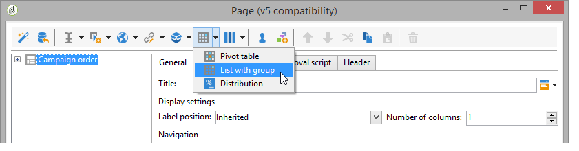

# 設計網站應用程式{#designing-a-web-application}

Web應用程式是依照與[網路表單](about-web-forms.md)相同的原則建立及管理。

>[!CAUTION]
>
>在Web應用程式設計期間使用&#x200B;**[!UICONTROL Preview]**&#x200B;子標籤檢查錯誤。 請注意，用來預覽網頁應用程式的設定檔測試必須位於&#x200B;**[!UICONTROL Web application agent]**&#x200B;運運算元的&#x200B;**[!UICONTROL Access rights]**&#x200B;資料夾中。  在發佈Web應用程式之前，變更不會公開給一般使用者。

## 在網頁應用程式中插入圖表 {#inserting-charts-in-a-web-application}

您可以在Web應用程式中包含圖表。 要執行此操作，請使用工作列中的圖表下拉式清單來選取要插入的圖表型別。

您也可以選取&#x200B;**[!UICONTROL Add a chart]**&#x200B;功能表。

## 在Web應用程式中插入表格 {#inserting-tables-in-a-web-application}

若要新增表格，請使用工作列中的表格下拉式清單來選取要使用的表格型別。

您也可以在下拉式選單中選取表格型別。

## 概觀型別的Web應用程式 {#overview-type-web-applications}

Adobe Campaign介面使用許多網頁應用程式來存取、管理收件者、傳遞、行銷活動、庫存等，並與之互動。

在介面中，這些區段會以儀表板形式顯示，且只有一個頁面。

現成可用的Web應用程式儲存在&#x200B;**[!UICONTROL Administration > Configuration > Web applications]**&#x200B;節點中。

## 編輯表單型別的網頁應用程式 {#edit-forms-type-web-applications}

為外部網路編輯表單Web應用程式的特徵為：

* 預先載入方塊

  在大多數情況下，必須預先載入要顯示的資料。 由於系統會（透過存取控制）識別存取這些表單的使用者，因此預先載入不一定是加密的。

* 儲存方塊
* 新增頁面

  雖然「概觀」型別的網頁應用程式都有單一頁面，但編輯表單可以根據特定條件（測試、選擇、連線運運算元的設定檔等）提供一系列的頁面。

