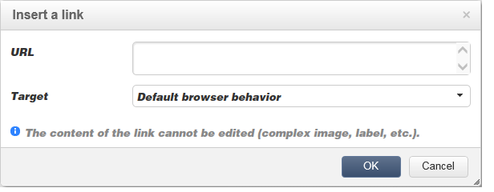

# 編輯內容{#editing-content}

## 定義可見性條件{#defining-a-visibility-condition}

您可以在網頁元素上指定可見性條件：此元素只有在符合條件時才會顯示。

要添加可見性條件，請選擇一個塊，然後使用表達式編輯器在&#x200B;**[!UICONTROL Visibility condition]**&#x200B;欄位中輸入條件。

>[!NOTE]
>
>進階運算式編輯會顯示在[本頁](../../platform/using/defining-filter-conditions.md#list-of-functions)上。

這些條件採用XTK運算式語法（例如&#x200B;**ctx.recipient）。@email != &quot;&quot;**&#x200B;或&#x200B;**ctx.recipient。@status==&quot;0&quot;**)。 依預設，所有欄位皆可顯示。

>[!NOTE]
>
>無法編輯非可見的動態區塊，例如下拉式功能表。

## 添加邊框和背景{#adding-a-border-and-background}

您可以將&#x200B;**border**&#x200B;新增至選取的區塊。 邊框使用三個選項定義：樣式、大小和顏色。

您也可以從顏色圖表中選擇顏色來定義&#x200B;**背景顏色**。

## 編輯表格 {#editing-forms}

### 更改表單的資料屬性{#changing-the-data-properties-for-a-form}

您可以將資料庫欄位與輸入區域、單選按鈕或複選框類型塊連結。

>[!NOTE]
>
>預設欄位是Web應用程式儲存架構中的欄位。

**欄位**&#x200B;輸入區域允許您選擇要與表單欄位連結的資料庫欄位。

預設情況下，提供的欄位是&#x200B;**nms:recipient**&#x200B;表中的欄位。

**必填欄位**&#x200B;選項僅可讓您在使用者已填入欄位時，授權頁面的核准。 如果未填入必要欄位，則會出現錯誤訊息。

對於單選按鈕和複選框，**需要額外配置**。

事實上，如果使用的範本預設不包含值，您必須在編輯器中完成。

操作步驟：

* 按一下&#x200B;**[!UICONTROL Edit]**&#x200B;表徵圖。

   

* 在&#x200B;**[!UICONTROL Value]**&#x200B;欄位中輸入明細清單值（由選取欄位定義）。

   

### 修改表單域{#modifying-form-fields}

表單欄位，例如選項按鈕、輸入區域、下拉式清單等。 可從工具列修改。

這表示您可以：

* 使用&#x200B;**[!UICONTROL Delete]**&#x200B;圖示刪除包含表單欄位的區塊。
* 使用&#x200B;**[!UICONTROL Duplicate]**&#x200B;圖示建立新區塊，以複製選取的欄位。
* 編輯&#x200B;**[!UICONTROL Form data]**&#x200B;窗口，使用&#x200B;**[!UICONTROL Edit]**&#x200B;表徵圖將資料庫欄位連結到表單區域。

   

## 向按鈕添加操作{#adding-an-action-to-a-button}

當使用者按一下按鈕時，您可以定義相關的動作。 若要這麼做，請從下拉式清單中選取要執行的動作。

可用操作如下：

* **[!UICONTROL Refresh]** :重新整理目前頁面。
* **[!UICONTROL Next page]** :建立指向Web應用程式中下一頁的連結。
* **[!UICONTROL Previous page]** :在Web應用程式中建立上一頁的連結。

>[!NOTE]
>
>**[!UICONTROL None]**&#x200B;值允許您不激活按鈕。

您可以在對應欄位中修改連結至按鈕的標籤。

## 添加連結{#adding-a-link}

您可以將連結插入任何頁面元素：影像、單詞、單片語、文本塊等。

若要這麼做，請選取元素，然後使用快顯功能表中的第一個圖示。

此圖示可讓您存取所有可用的連結類型。

個人化區塊和欄位只能插入文字類型區塊。

>[!NOTE]
>
>對於每種類型的連結，您可以設定開啟模式：在&#x200B;**Target**&#x200B;下拉式清單中選取目標視窗。 此值與&#x200B;**`<target>`** HTML標籤相對應。
>
>可用&#x200B;**目標**&#x200B;的清單如下：
>
>* 其他(IFrame)
>* 頂端視窗(_top)
>* 父窗口(_parent)
>* 新視窗(_blank)
>* 目前視窗(_self)
>* 預設瀏覽器行為
>

### 連結至URL {#link-to-a-url}

**連結至外部URL**&#x200B;選項可讓您從來源內容開啟任何URL。

在&#x200B;**URL**&#x200B;欄位中輸入相關的連結位址。 URL欄位應輸入為：**https://www.myURL.com**。

### 連結至Web應用程式{#link-to-a-web-application}

**連結至網頁應用程式**&#x200B;選項可讓您存取Adobe Campaign網頁應用程式。

從相應欄位中選擇Web應用程式。

建議的Web應用程式清單與&#x200B;**[!UICONTROL Resources > Online > Web Applications]**&#x200B;節點中的可用應用程式相對應。

### 連結至動作{#link-to-an-action}

定義動作&#x200B;**選項的**&#x200B;連結可讓您在按一下來源元素時設定動作。

>[!NOTE]
>
>[將操作添加到按鈕](#adding-an-action-to-a-button)部分中詳細介紹了可用操作。

### 刪除連結{#delete-a-link}

插入連結後，工具列會提供兩個新圖示：**編輯連結**&#x200B;和&#x200B;**中斷連結**，讓您與建立的連結互動。

* **[!UICONTROL Edit link]** 可讓您顯示包含連結所有參數的視窗。
* **[!UICONTROL Break the link]** 可讓您在確認後刪除連結和所有相關參數。

>[!NOTE]
>
>如果刪除連結，內容仍會保留。

## 更改字型屬性{#changing-font-attributes}

選擇文本元素時，可以修改字型屬性（樣式、格式）。

可用選項如下：

* **放大** 字型：增加選取文字的大小(新增 ``)
* **減少** 字型：減小選取文字的大小(新增 ``)
* **博** 爾迪孔：將選取的文字設為粗體(以標籤換 `<strong> </strong>` 行文字)
* **斜體** 圖示：使選取的文字變成斜體(以標籤包  `<em> </em>` 住文字)
* **下** 線圖示：使選取的文字加上底線(以標籤換 `` 行文字)
* **左對** 齊：將文字對齊選定塊的左側(add style=&quot;text-align:左；」)
* **中** 心圖示：將選取區塊的文字置中(新增style=&quot;text-align:中；」)
* **右** 對齊：將文字對齊選定塊的右側(add style=&quot;text-align:權利；」)
* **變更背景顏** 色圖示：可讓您變更所選區塊的背景顏色(新增style=&quot;background-color:rgba(170、86、255、0.87)
* **變更文字色** 彩圖示：可讓您變更所選區塊的文字顏色，或只變更所選取的文字(``)

>[!NOTE]
>
>* **刪除** 表徵圖：刪除塊及其所有內容。
>
>* **復** 制表徵圖：複製塊以及與塊相關的所有樣式。

## 管理影像和動畫{#managing-images-and-animations}

數位內容編輯器可讓您處理與瀏覽器相容的&#x200B;**任何影像類型**。

>[!CAUTION]
>
>您不得在HTML頁面的&#x200B;**script**&#x200B;標籤中呼叫外部檔案。 這些檔案不會匯入至Adobe Campaign伺服器。

### 添加／刪除／複製映像{#adding---deleting---duplicating-an-image}

要插入影像，請選擇影像類型塊並按一下&#x200B;**影像**&#x200B;表徵圖。

選取儲存在本機的影像檔案。

**Delete**&#x200B;圖示會刪除包含影像的標籤。

**複製**&#x200B;圖示會複製標籤及其內容。

>[!CAUTION]
>
>複製影像時，與新影像相關的識別碼會被刪除。

### 編輯影像屬性{#editing-image-properties}

當您選取包含影像的區塊時，可存取下列屬性：

* **Caption可** 讓您定義連結至影像的標題(與 **** altHTML屬性相對應)。
* **尺** 寸指定影像大小（以像素為單位）。

   

## 新增個人化內容{#adding-personalization-content}

### 插入個人化欄位 {#inserting-a-personalization-field}

插入表徵圖的&#x200B;**個人化欄位**&#x200B;選項允許您將資料庫欄位添加到內容中，如收件人的名稱。 此選項僅適用於文本類型塊。

預設情況下，提供的欄位來自&#x200B;**[!UICONTROL Recipient]**&#x200B;表。 如有必要，請編輯Web應用程式屬性以選擇另一個表。

欄位名稱會顯示在編輯器中，以黃色反白顯示。 當產生個人化時（例如，在預覽著陸頁面時），會由目標收件者的設定檔取代。

[插入個人化欄位](../../web/using/creating-a-landing-page.md#inserting-a-personalization-field)區段中顯示範例。

### 插入個人化塊{#inserting-a-personalization-block}

**個人化區塊**&#x200B;選項可讓您將動態和個人化區塊插入內容。 例如，您可以新增標誌或問候訊息。 它不適用於文本類型塊。

插入後，個人化區塊名稱會出現在編輯器中，並以黃色反白顯示。 當產生個人化時，它會自動適應收件者描述檔。

有關內建個人化區塊以及如何定義自訂個人化區塊的詳細資訊，請參閱[本頁](../../delivery/using/personalization-blocks.md)。
