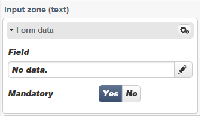
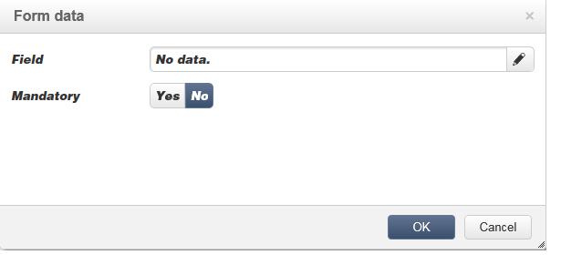

# 編輯內容{#editing-content}

## 定義可見性條件 {#defining-a-visibility-condition}

您可以在網頁元素上指定可見性條件：只有接受條件時，此元素才會顯示。

若要新增可見性條件，請選取區塊，然後使用運算式編輯器在&#x200B;**[!UICONTROL Visibility condition]**&#x200B;欄位中輸入條件。

>[!NOTE]
>
>在[此頁面](../../platform/using/defining-filter-conditions.md#list-of-functions)上顯示進階運算式編輯。

這些條件採用XTK運算式語法（例如&#x200B;**ctx.recipient）。@email != &quot;&quot;**&#x200B;或&#x200B;**ctx.recipient。@status==&quot;0&quot;**)。 依預設，所有欄位皆會顯示。

>[!NOTE]
>
>無法編輯不可見的動態區塊（例如下拉式功能表）。

## 新增邊框和背景 {#adding-a-border-and-background}

您可以將&#x200B;**border**&#x200B;新增至選取的區塊。 邊框使用三個選項來定義：樣式、大小和顏色。

您也可以從顏色圖中選取顏色，以定義&#x200B;**背景顏色**。

## 編輯表單 {#editing-forms}

### 變更表單的資料屬性 {#changing-the-data-properties-for-a-form}

您可以將資料庫欄位與輸入區域、單選按鈕或核取方塊類型區塊連結。

>[!NOTE]
>
>預設欄位是Web應用程式儲存架構中的欄位。

**欄位**&#x200B;輸入區域可讓您選取要與表單欄位連結的資料庫欄位。

預設情況下，提供的欄位為&#x200B;**nms:recipient**&#x200B;表中的欄位。

**必填欄位**&#x200B;選項可讓您僅在使用者已填入欄位時授權頁面的核准。 如果未填入必填欄位，則會顯示錯誤訊息。

對於選項按鈕和複選框，**需要其他配置**。

事實上，如果使用的範本預設不含值，您必須在編輯器中完成它。

操作步驟：

* 按一下&#x200B;**[!UICONTROL Edit]**&#x200B;圖示。

   

* 在&#x200B;**[!UICONTROL Value]**&#x200B;欄位中輸入明細清單值（由所選欄位定義）。

   

### 修改表單欄位 {#modifying-form-fields}

表單欄位，例如選項按鈕、輸入區域、下拉式清單等。 可從其工具欄修改。

這表示您可以：

* 使用&#x200B;**[!UICONTROL Delete]**&#x200B;圖示刪除包含表單欄位的區塊。
* 使用&#x200B;**[!UICONTROL Duplicate]**&#x200B;圖示建立新區塊以複製選取的欄位。
* 編輯&#x200B;**[!UICONTROL Form data]**&#x200B;窗口，使用&#x200B;**[!UICONTROL Edit]**&#x200B;表徵圖將資料庫欄位連結到表單區域。

   

## 新增動作至按鈕 {#adding-an-action-to-a-button}

當使用者按一下按鈕時，您可以定義相關的動作。 若要這麼做，請從下拉式清單中選取要執行的動作。

可用的動作如下：

* **[!UICONTROL Refresh]** :重新整理目前的頁面。
* **[!UICONTROL Next page]** :建立指向Web應用程式中的下一頁的連結。
* **[!UICONTROL Previous page]** :建立指向Web應用程式中上一頁的連結。

>[!NOTE]
>
>**[!UICONTROL None]**&#x200B;值可讓您不啟動按鈕。

您可以在對應欄位中修改連結至按鈕的標籤。

## 新增連結 {#adding-a-link}

您可以將連結插入任何頁面元素中：影像、字、字組、文字區塊等。

若要這麼做，請選取元素，然後從快顯功能表中使用第一個圖示。

此圖示可讓您存取所有可用的連結類型。

個人化區塊和欄位只能插入文字類型區塊中。

>[!NOTE]
>
>對於每種類型的連結，您可以設定開啟模式：在&#x200B;**Target**&#x200B;下拉式清單中選取目標視窗。 此值與&#x200B;**`<target>`** HTML標籤相對應。
>
>可用&#x200B;**targets**&#x200B;的清單如下：
>
>* 其他(IFrame)
>* 頂部窗口(_top)
>* 父窗口(_parent)
>* 新窗口(_blank)
>* 當前窗口(_self)
>* 預設瀏覽器行為

>

### 連結至URL {#link-to-a-url}

**連結至外部URL**&#x200B;選項可讓您從來源內容開啟任何URL。

在&#x200B;**URL**&#x200B;欄位中輸入相關連結地址。 URL欄位應輸入為：**https://www.myURL.com**。

### 連結到Web應用程式 {#link-to-a-web-application}

**連結至Web應用程式**&#x200B;選項可讓您存取Adobe Campaign Web應用程式。

從相應欄位中選擇Web應用程式。

建議的Web應用程式清單與&#x200B;**[!UICONTROL Resources > Online > Web Applications]**&#x200B;節點中的可用應用程式相對應。

### 動作連結 {#link-to-an-action}

定義動作&#x200B;**選項的**&#x200B;連結可讓您在按一下來源元素時設定動作。

>[!NOTE]
>
>在[將動作新增至按鈕](#adding-an-action-to-a-button)區段中會詳細說明可用動作。

### 刪除連結 {#delete-a-link}

插入連結後，工具列會提供兩個新圖示：**編輯連結**&#x200B;和&#x200B;**中斷連結**，讓您與建立的連結互動。

* **[!UICONTROL Edit link]** 可讓您顯示包含連結所有參數的視窗。
* **[!UICONTROL Break the link]** 可讓您在確認後刪除連結和所有相關參數。

>[!NOTE]
>
>如果刪除連結，內容仍會保留。

## 更改字型屬性 {#changing-font-attributes}

選取文字元素時，可以修改字型屬性（樣式、格式）。

可用選項如下：

* **放大** 字型：增加所選取文字的大小(新增 ``)
* **縮** 減：縮小所選取文字的大小(新增 ``)
* **** Boldicon:使選取的文字變為粗體(以標籤括 `<strong> </strong>` 住文字)
* **** 斜體圖示：使選取的文字變為斜體(以標籤括  `<em> </em>` 住文字)
* **** 底線圖示：使選定文本帶下划線(用標籤括 `` 住文本)
* **左** 對齊：將文字對齊所選取區塊的左側(add style=&quot;text-align:左；」
* **** 中心表徵圖：將選取區塊的文字置中對齊(新增style=&quot;text-align:中心；」
* **右** 對齊：將文字對齊所選取區塊的右側(add style=&quot;text-align:右；」
* **變更背景顏** 色圖示：可讓您變更所選取區塊的背景顏色(新增style=&quot;background-color:rgba(170, 86, 255, 0.87)
* **更改文本** 顏色表徵圖：可讓您變更所選取區塊的文字顏色，或僅變更所選取的文字(``)

>[!NOTE]
>
>* **** 刪除圖示：刪除區塊及其所有內容。
>
>* **** 重複圖示：複製區塊以及與區塊相關的所有樣式。

## 管理影像和動畫 {#managing-images-and-animations}

數位內容編輯器可讓您處理與瀏覽器相容的&#x200B;**任何類型的影像**。

>[!CAUTION]
>
>您不得在HTML頁面的&#x200B;**script**&#x200B;標籤中呼叫外部檔案。 這些檔案將不會匯入Adobe Campaign伺服器。

### 新增/刪除/複製影像 {#adding---deleting---duplicating-an-image}

若要插入影像，請選取影像類型區塊並按一下&#x200B;**Image**&#x200B;圖示。

選取儲存於本機的影像檔案。

**Delete**&#x200B;圖示會刪除包含影像的標籤。

**複製**&#x200B;圖示會複製標籤及其內容。

>[!CAUTION]
>
>複製影像時，會刪除與新影像相關的識別碼。

### 編輯影像屬性 {#editing-image-properties}

選取包含影像的區塊時，您會存取下列屬性：

* **** 字幕可讓您定義連結至影像的字幕(與altHTML **** 屬性相對應)。
* **** 維度會指定影像大小（以像素為單位）。

   

## 新增個人化內容 {#adding-personalization-content}

### 插入個人化欄位 {#inserting-a-personalization-field}

插入圖示的&#x200B;**個人化欄位**&#x200B;選項可讓您將資料庫欄位新增至內容，例如收件者的名稱。 此選項僅適用於文本類型塊。

預設情況下，提供的欄位來自&#x200B;**[!UICONTROL Recipient]**&#x200B;表。 如有必要，請編輯Web應用程式屬性以選擇其他表。

欄位名稱會顯示在編輯器中，並以黃色強調顯示。 在產生個人化時（例如，預覽登錄頁面時），會由目標收件者的設定檔取代。

[插入個人化欄位](creating-a-landing-page.md#inserting-a-personalization-field)區段中會顯示範例。

### 插入個人化區塊 {#inserting-a-personalization-block}

**個人化區塊**&#x200B;選項可讓您將動態和個人化區塊插入內容。 例如，您可以新增標誌或問候語訊息。 它不適用於文本類型塊。

插入後，個人化區塊名稱會顯示在編輯器中，並以黃色強調顯示。 系統會在產生個人化時自動調整至收件者設定檔。

如需內建個人化區塊以及如何定義自訂個人化區塊的詳細資訊，請參閱[此頁面](../../delivery/using/personalization-blocks.md)。
