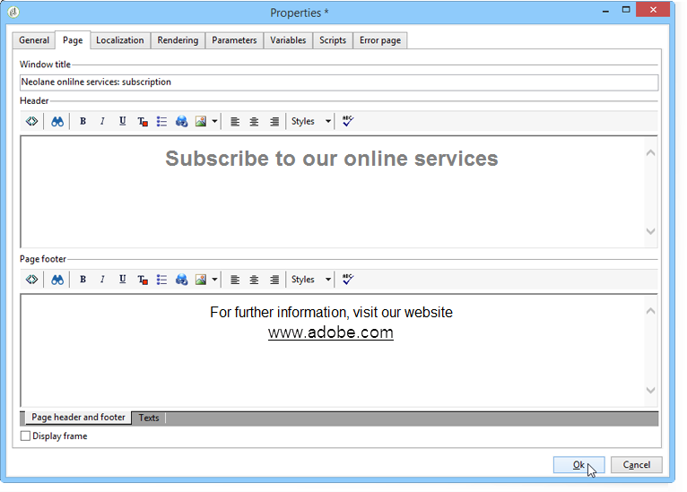
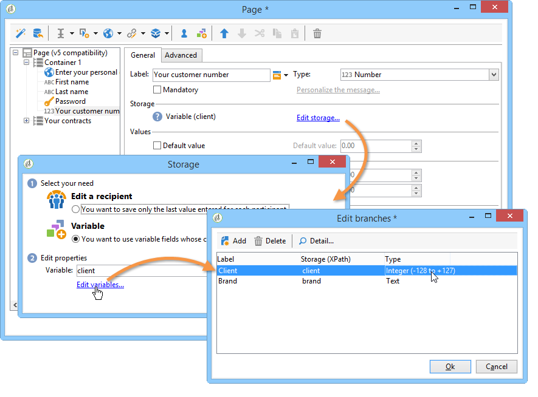
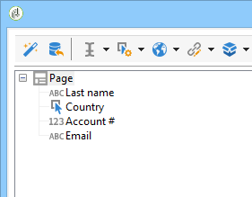

# 表單轉換{#form-rendering}

## 選取表單轉換範本 {#selecting-the-form-rendering-template}

表單設定可讓您選取用來產生頁面的範本。 若要存取這些資訊，請按一 **[!UICONTROL Settings]** 下表單詳細資訊工具列中的按鈕，然後選取標 **[!UICONTROL Rendering]** 簽。 預設有許多範本（樣式表）可供使用。

編輯器的底部部分允許您查看所選模板的渲染。

縮放功能可讓您編輯選取的範本。

您可以修改或覆寫這些範本。 若要這麼做，請按一下連 **[!UICONTROL Page layout...]** 結並個人化資訊。

您可以：

* 變更用作標誌的影像並調整其大小，
* 此外，指定當使用者選取此轉譯範本時，存取預覽影像的路徑。

此標 **[!UICONTROL Headers/Footers]** 簽可讓您使用此範本，變更每個表單頁面頁首和頁尾中顯示的資訊。

和區段的每 **[!UICONTROL Page headers]** 行 **[!UICONTROL Page footers]** 都對應於HTML頁面中的一行。 按一 **[!UICONTROL Add]** 下以建立新的行。

選取現有的行，然後按一下按 **[!UICONTROL Detail]** 鈕以個人化它。

您可以透過相關標籤來變更行的內容、新增邊框和字型屬性。 按一 **[!UICONTROL OK]** 下以確認這些變更。

欄位 **[!UICONTROL Position]** 可讓您定義元素在頁首和頁尾中的位置。

>[!NOTE]
>
>演算範本會儲存在節點 **[!UICONTROL Administration > Configuration > Form rendering]** 中。\
>如需詳細資訊，請參閱自訂表 [單轉換](#customizing-form-rendering)

## 自訂表單轉換 {#customizing-form-rendering}

### 變更元素的版面配置 {#changing-the-layout-of-elements}

您可以過載表單中每個元素的樣式表（輸入欄位、影像、選項按鈕等）。

若要這麼做，請使用標 **[!UICONTROL Advanced]** 簽。

它可讓您定義下列屬性：

* **[!UICONTROL Label position]**:請參 [閱定義標籤的位置](../../web/using/defining-web-forms-layout.md#defining-the-position-of-labels),
* **[!UICONTROL Label format]**:換行或不換行，
* **[!UICONTROL Number of cells]** :請 [參閱定位頁面上的欄位](../../web/using/defining-web-forms-layout.md#positioning-the-fields-on-the-page),
* **[!UICONTROL Horizontal alignment]** （左、右、居中） **[!UICONTROL Vertical alignment]** 和（高、低、中）,
* **[!UICONTROL Width]** 區域：這可以表示為百分比或EMS、點或像素（預設值）,
* 最大 **[!UICONTROL Length]**&#x200B;值：允許的字元數上限（適用於文字、數字和密碼類型控制）,
* **[!UICONTROL Lines]**:類型區域的行 **[!UICONTROL Multi-line text]** 數、
* **[!UICONTROL Style inline]**:可讓您使用其他設定，讓CSS樣式表過載。 **這些是分開的**;字元，如下例所示：

   

### 定義頁首和頁尾 {#defining-headers-and-footers}

在樹結構中對欄位進行排序，樹結構的根與頁同名。 選擇它可修改名稱。

窗口的標題必須輸入到表單屬 **[!UICONTROL Page]** 性窗口的頁籤中。 您也可以新增設定內容至頁首和頁尾（此資訊會顯示在每個頁面）。 此內容會在標籤的相符區段中 **[!UICONTROL Texts]** 輸入，如下所示：

### 新增元素至HTML標題 {#adding-elements-to-html-header}

您可以輸入要插入表單頁面HTML頁首的其他元素。 若要這麼做，請在相關頁面的標 **[!UICONTROL Header]** 簽中輸入元素。

例如，這可讓您參考將顯示在頁面標題列中的圖示。

## 定義控制設定 {#defining-control-settings}

當使用者填入表單時，會根據特定欄位的格式或設定，自動對其執行檢查。 這可讓您將某些欄位設為必填(請參 [閱「定義必填欄位](#defining-mandatory-fields)」)，或檢查所輸入資料的格式(請參閱 [檢查資料格式](#checking-data-format))。 檢查會在頁面核准期間執行（透過按一下啟用輸出轉換的連結或按鈕）。

### 定義必填欄位 {#defining-mandatory-fields}

若要將某些欄位設為必填，請在建立欄位時選取此選項。

如果使用者未輸入欄位即核准此頁面，則會顯示下列訊息：

您可以按一下連結，將此訊息個人 **[!UICONTROL Personalize this message]** 化。

如果使用者未輸入欄位即核准此頁面，則會顯示下列訊息：

### 檢查資料格式 {#checking-data-format}

對於將其值儲存在資料庫現有欄位中的表單檢查，將應用儲存欄位的規則。

對於將值儲存在變數中的表單檢查，核准規則取決於變數的格式。

例如，如果您建立檢查 **[!UICONTROL Number]** 來儲存用戶端號碼，如下所示：

用戶必須在表單欄位中輸入整數。

## 定義欄位條件顯示 {#defining-fields-conditional-display}

您可以根據使用者選擇的值，設定要顯示之頁面上欄位的顯示。 這可套用至一個欄位或一組欄位（當欄位在容器中分組時）。

對於頁面的每個元素，區段 **[!UICONTROL Visibility]** 可讓您定義顯示條件。

條件可以涉及資料庫欄位或變數的值。

在欄位選擇視窗中，您可以從下列資料中選擇：

* 主樹包含表單上下文的參數。 預設參數為「識別碼」（與收件者的加密識別碼相符）、「語言」和「來源」。

   For more on this, refer to this [page](../../web/using/defining-web-forms-properties.md#form-url-parameters).

* 子 **[!UICONTROL Recipients]** 樹包含插入到表單中並儲存在資料庫中的輸入欄位。

   有關詳細資訊，請參 [閱在資料庫中儲存資料](../../web/using/web-forms-answers.md#storing-data-in-the-database)。

* 子 **[!UICONTROL Variables]** 樹包含此表單的可用變數。 有關詳情，請參閱將 [資料儲存在本機變數中](../../web/using/web-forms-answers.md#storing-data-in-a-local-variable)。

有關此功能的詳細資訊，請參閱此處提供的使用案例：根 [據所選值顯示不同的選項](../../web/using/use-cases--web-forms.md#displaying-different-options-depending-on-the-selected-values)。

您也可以使用物件來限制表單頁面的 **[!UICONTROL Test]** 顯示。 For more on this, refer to this [page](../../web/using/defining-web-forms-page-sequencing.md#conditional-page-display).

## 從現有表單匯入元素 {#importing-elements-from-an-existing-form}

您可從其他Web表單匯入欄位或容器。 這可讓您建立可重複使用的區塊庫，這些區塊將插入表單中，例如地址區塊、電子報訂閱區域等。

若要將元素匯入表單，請套用下列步驟：

1. 編輯要插入一或多個元素的頁面，然後按一下工具 **[!UICONTROL Import an existing block]** 列中的。

   

1. 選擇包含要導入的欄位的Web表單，然後選擇要導入的容器和欄位。

   

   >[!NOTE]
   >
   >來 **[!UICONTROL Edit link]** 源表單名稱右側的圖示可讓您檢視選取的Web表單。

1. 按一下 **[!UICONTROL Ok]** 確認插入。

   

