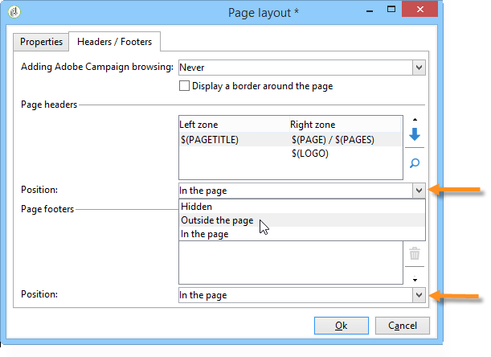
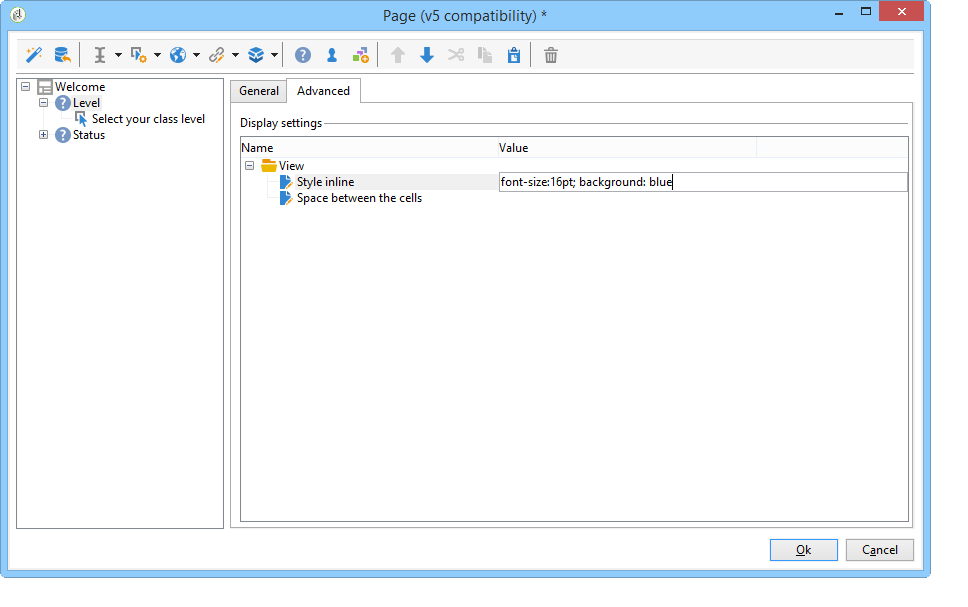

# 表單轉譯{#form-rendering}

## 選取表單轉譯範本 {#selecting-the-form-rendering-template}

表單設定可讓您選取用來產生頁面的範本。 若要存取它們，請按一下表單詳細資料工具列中的&#x200B;**[!UICONTROL Properties]**&#x200B;按鈕，然後選取&#x200B;**[!UICONTROL Rendering]**&#x200B;標籤。 預設有許多範本（樣式表）可供使用。

編輯器的底部區段可讓您檢視所選範本的轉譯。

縮放功能可讓您編輯選取的範本。

您可以修改或覆寫這些範本。 若要這麼做，請按一下&#x200B;**[!UICONTROL Page layout...]**&#x200B;連結並個人化資訊。

您可以：

* 變更用作標誌的影像，並調整其大小，
* 同時指定當使用者選取此演算範本時，存取預覽影像的路徑。

**[!UICONTROL Headers/Footers]**&#x200B;索引標籤可讓您使用此範本變更顯示在每個表單頁面頁首和頁尾的資訊。

**[!UICONTROL Page headers]**&#x200B;和&#x200B;**[!UICONTROL Page footers]**&#x200B;區段的每一行都對應至HTML頁面中的一行。 按一下&#x200B;**[!UICONTROL Add]**&#x200B;以建立新行。

選取現有的行，然後按一下&#x200B;**[!UICONTROL Detail]**&#x200B;按鈕以個人化它。

您可以透過相關標籤變更線條內容、新增框線以及變更字型屬性。 按一下&#x200B;**[!UICONTROL OK]**&#x200B;以確認這些變更。

**[!UICONTROL Position]**&#x200B;欄位可讓您定義頁首與頁尾中的元素位置。

>[!NOTE]
>
>演算範本儲存在&#x200B;**[!UICONTROL Administration > Configuration > Form rendering]**&#x200B;節點中。\
>如需詳細資訊，請參閱[自訂表單轉譯](#customizing-form-rendering)

## 自訂表單轉譯 {#customizing-form-rendering}

### 變更元素版面 {#changing-the-layout-of-elements}

您可以多載表單每個元素（輸入欄位、影像、選項按鈕等）的樣式表。

若要這麼做，請使用&#x200B;**[!UICONTROL Advanced]**&#x200B;標籤。

它可讓您定義下列屬性：

* **[!UICONTROL Label position]**：請參閱[定義標籤的位置](defining-web-forms-layout.md#defining-the-position-of-labels)，
* **[!UICONTROL Label format]**：自動換行或不自動換行，
* **[!UICONTROL Number of cells]** ：請參閱[定位頁面上的欄位](defining-web-forms-layout.md#positioning-the-fields-on-the-page)，
* **[!UICONTROL Horizontal alignment]** （左、右、中央）和&#x200B;**[!UICONTROL Vertical alignment]** （高、低、中），
* 區域的&#x200B;**[!UICONTROL Width]**：這可以用百分比或以ems、點或畫素（預設值）表示，
* **[!UICONTROL Length]**&#x200B;上限：允許的字元數上限（針對文字、數字和密碼型別控制項），
* **[!UICONTROL Lines]**： **[!UICONTROL Multi-line text]**&#x200B;型別區域的行數，
* **[!UICONTROL Style inline]**：可讓您使用其他設定多載CSS樣式表。 這些使用&#x200B;**；**&#x200B;個字元分隔，如下列範例所示：

  

### 定義頁首和頁尾 {#defining-headers-and-footers}

欄位會以樹狀結構排序，其根目錄與頁面同名。 選取它以修改名稱。

視窗的標題必須在表單屬性視窗的&#x200B;**[!UICONTROL Page]**&#x200B;索引標籤中輸入。 您也可以新增一組內容至頁首與頁尾（此資訊會顯示在每個頁面上）。 此內容是在&#x200B;**[!UICONTROL Texts]**&#x200B;標籤的相符區段中輸入，如下所示：

### 將元素新增至HTML標題 {#adding-elements-to-html-header}

您可以輸入要插入表單頁面HTML標頭中的其他元素。 若要這麼做，請在相關頁面的&#x200B;**[!UICONTROL Header]**&#x200B;索引標籤中輸入元素。

例如，這可讓您參照將顯示在頁面標題列中的圖示。

## 定義控制設定 {#defining-control-settings}

當使用者填寫表單時，將會根據其格式或設定自動對特定欄位執行檢查。 這可讓您讓某些欄位成為必要欄位（請參閱[定義必要欄位](#defining-mandatory-fields)）或檢查所輸入資料的格式（請參閱[檢查資料格式](#checking-data-format)）。 在頁面核准期間會執行檢查（按一下可啟用輸出轉換的連結或按鈕）。

### 定義必填欄位 {#defining-mandatory-fields}

若要將某些欄位設為必要欄位，請在建立欄位時選取此選項。

如果使用者未輸入欄位即核准此頁面，將會顯示下列訊息：

您可以按一下&#x200B;**[!UICONTROL Personalize this message]**&#x200B;連結，以個人化此郵件。

如果使用者未輸入欄位即核准此頁面，將會顯示下列訊息：

### 檢查資料格式 {#checking-data-format}

對於其值儲存在資料庫現有欄位中的表單檢查，將會套用儲存欄位的規則。

對於其值儲存在變數中的表單檢查，核准規則取決於變數的格式。

例如，如果您建立&#x200B;**[!UICONTROL Number]**&#x200B;檢查以儲存使用者端號碼，如下所示：

使用者必須在表單欄位中輸入整數。

## 定義欄位條件式顯示 {#defining-fields-conditional-display}

您可以根據使用者選擇的值，設定要在頁面上顯示的欄位顯示。 這適用於一個欄位或一組欄位（當它們分組在容器中時）。

針對頁面的每個元素，**[!UICONTROL Visibility]**&#x200B;區段可讓您定義顯示條件。

條件可能涉及資料庫欄位或變數的值。

在欄位選取視窗中，您可以從下列資料中選擇：

* 主樹狀結構包含表單內容的引數。 預設引數為識別碼（符合收件者的加密識別碼）、語言和來源。

  如需關於此項目的詳細資訊，請參閱此[頁面](defining-web-forms-properties.md#form-url-parameters)。

* **[!UICONTROL Recipients]**&#x200B;子樹狀結構包含插入表單並儲存在資料庫中的輸入欄位。

  如需詳細資訊，請參閱[將資料儲存在資料庫](web-forms-answers.md#storing-data-in-the-database)。

* **[!UICONTROL Variables]**&#x200B;子樹狀結構包含此表單的可用變數。 如需詳細資訊，請參閱[將資料儲存在區域變數](web-forms-answers.md#storing-data-in-a-local-variable)。

如需詳細資訊，請參閱此處提供的使用案例： [根據選取的值顯示不同的選項](use-cases-web-forms.md#displaying-different-options-depending-on-the-selected-values)。

您也可以使用&#x200B;**[!UICONTROL Test]**&#x200B;物件來設定表單頁面的顯示條件。 如需關於此項目的詳細資訊，請參閱此[頁面](defining-web-forms-page-sequencing.md#conditional-page-display)。

## 從現有表單匯入元素 {#importing-elements-from-an-existing-form}

您可以從其他網路表單匯入欄位或容器。 這可讓您建立可重複使用的區塊資料庫，這些區塊會插入至表單中，例如位址區塊、電子報訂閱區域等。

若要將元素匯入表單，請套用下列步驟：

1. 編輯您要插入一或多個元素的頁面，然後按一下工具列中的&#x200B;**[!UICONTROL Import an existing block]**。

   

1. 選取包含要匯入欄位的Web表單，然後選擇要匯入的容器和欄位。

   

   >[!NOTE]
   >
   >來源表單名稱右側的&#x200B;**[!UICONTROL Edit link]**&#x200B;圖示可讓您檢視選取的網頁表單。

1. 按一下&#x200B;**[!UICONTROL Ok]**&#x200B;以確認插入。

   
