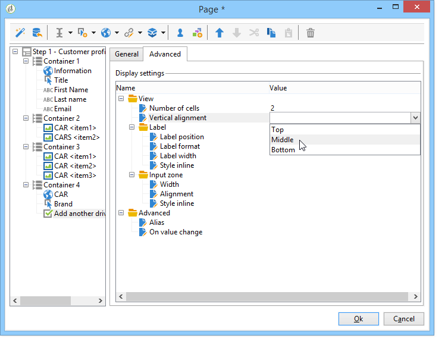

# 表單轉譯{#form-rendering}

## 選取表單呈現範本 {#selecting-the-form-rendering-template}

表單設定可讓您選取用來產生頁面的範本。 若要存取，請按一下 **[!UICONTROL Properties]** 按鈕，然後選擇 **[!UICONTROL Rendering]** 標籤。 預設提供許多範本（樣式表）。

編輯器的底部區域可讓您檢視所選範本的呈現。

縮放功能可讓您編輯選取的範本。

您可以修改或覆寫這些範本。 若要這麼做，請按一下 **[!UICONTROL Page layout...]** 連結並個人化資訊。

您可以：

* 更改用作徽標的影像並調整其大小，
* 還指定當用戶選擇此呈現模板時訪問預覽影像的路徑。

此 **[!UICONTROL Headers/Footers]** 頁簽可讓您使用此範本，變更每個表單頁面的頁首和頁尾中顯示的資訊。

每行 **[!UICONTROL Page headers]** 和 **[!UICONTROL Page footers]** 區段對應至「HTML」頁面中的某行。 按一下 **[!UICONTROL Add]** 來建立新行。

選取現有行，然後按一下 **[!UICONTROL Detail]** 按鈕加以個人化。

您可以透過相關標籤變更行的內容、新增邊框，以及變更字型屬性。 按一下 **[!UICONTROL OK]** 確認這些變更。

此 **[!UICONTROL Position]** 欄位可讓您定義元素在頁首和頁尾中的位置。

>[!NOTE]
>
>轉譯範本會儲存在 **[!UICONTROL Administration > Configuration > Form rendering]** 節點。\
>有關詳細資訊，請參閱 [自訂表單轉譯](#customizing-form-rendering)

## 自訂表單轉譯 {#customizing-form-rendering}

### 變更元素的版面 {#changing-the-layout-of-elements}

您可以過載表單中每個元素的樣式表（輸入欄位、影像、選項按鈕等）。

若要這麼做，請使用 **[!UICONTROL Advanced]** 標籤。

它可讓您定義下列屬性：

* **[!UICONTROL Label position]**:請參閱 [定義標籤的位置](defining-web-forms-layout.md#defining-the-position-of-labels),
* **[!UICONTROL Label format]**:換字或換字，
* **[!UICONTROL Number of cells]** :請參閱 [定位頁面上的欄位](defining-web-forms-layout.md#positioning-the-fields-on-the-page),
* **[!UICONTROL Horizontal alignment]** （左、右、居中）和 **[!UICONTROL Vertical alignment]** （高、低、中）,
* **[!UICONTROL Width]** 區域：這可以以百分比表示，或以ems、點或像素（預設值）表示，
* 最大值 **[!UICONTROL Length]**:允許的字元數上限（對於文本、數字和密碼類型控制項）,
* **[!UICONTROL Lines]**:行數 **[!UICONTROL Multi-line text]** 類型區域，
* **[!UICONTROL Style inline]**:可讓您使用其他設定來過載CSS樣式表。 這些區隔使用 **;** 字元數，如下列範例所示：

   

### 定義頁首和頁尾 {#defining-headers-and-footers}

欄位在樹結構中排序，樹結構的根與頁同名。 選取它以修改名稱。

視窗的標題必須在 **[!UICONTROL Page]** 頁簽。 您也可以將設定的內容新增至頁首與頁尾（此資訊會顯示在每個頁面上）。 此內容會輸入至 **[!UICONTROL Texts]** 標籤，如下所示：

### 新增元素至HTML標題 {#adding-elements-to-html-header}

您可以輸入要插入表單頁面HTML標題的其他元素。 若要這麼做，請在 **[!UICONTROL Header]** 頁簽。

例如，這可讓您參照將顯示在頁面標題列中的圖示。

## 定義控制設定 {#defining-control-settings}

當使用者填入表單時，會根據其格式或設定，對特定欄位自動執行檢查。 這可讓您將某些欄位設為必填欄位(請參閱 [定義必填欄位](#defining-mandatory-fields))或檢查輸入資料的格式(請參閱 [檢查資料格式](#checking-data-format))。 在頁面核准期間會執行檢查（透過按一下可啟用輸出轉變的連結或按鈕）。

### 定義必填欄位 {#defining-mandatory-fields}

若要將某些欄位設為必填欄位，請在建立欄位時選取此選項。

如果使用者未輸入欄位即核准此頁面，則會顯示下列訊息：

您可以按一下 **[!UICONTROL Personalize this message]** 連結。

如果使用者未輸入欄位即核准此頁面，則會顯示下列訊息：

### 檢查資料格式 {#checking-data-format}

對於將其值儲存在資料庫的現有欄位中的表單檢查，將應用儲存欄位的規則。

對於其值儲存在變數中的表單檢查，核准規則取決於變數的格式。

例如，若您建立 **[!UICONTROL Number]** 檢查以儲存用戶端號碼，如下所示：

使用者必須在表單欄位中輸入整數。

## 定義欄位條件式顯示 {#defining-fields-conditional-display}

您可以根據使用者選擇的值，設定要顯示之頁面上的欄位顯示。 這可套用至一個欄位或一組欄位（當這些欄位在容器中分組時）。

對於頁面的每個元素， **[!UICONTROL Visibility]** 區段可讓您定義顯示條件。

條件可能與資料庫欄位或變數的值有關。

在欄位選取視窗中，您可以從下列資料中選擇：

* 主樹包含窗體上下文的參數。 預設參數為Identifier（與收件者的加密識別碼相符）、Language（語言）和Origin（原始）。

   如需關於此項目的詳細資訊，請參閱此[頁面](defining-web-forms-properties.md#form-url-parameters)。

* 此 **[!UICONTROL Recipients]** 子樹包含插入表單中並儲存在資料庫中的輸入欄位。

   有關詳細資訊，請參閱 [將資料儲存在資料庫中](web-forms-answers.md#storing-data-in-the-database).

* 此 **[!UICONTROL Variables]** 子樹包含此表單的可用變數。 有關詳細資訊，請參閱 [將資料儲存在本機變數中](web-forms-answers.md#storing-data-in-a-local-variable).

如需詳細資訊，請參閱以下提供的使用案例： [根據所選值顯示不同的選項](use-cases--web-forms.md#displaying-different-options-depending-on-the-selected-values).

您也可以使用 **[!UICONTROL Test]** 物件。 如需關於此項目的詳細資訊，請參閱此[頁面](defining-web-forms-page-sequencing.md#conditional-page-display)。

## 從現有表單匯入元素 {#importing-elements-from-an-existing-form}

可從其他網路表單匯入欄位或容器。 這可讓您建立可重複使用區塊的程式庫，這些區塊會插入表單中，例如位址區塊、電子報訂閱區域等。

若要將元素匯入表單，請套用下列步驟：

1. 編輯要插入一個或多個元素的頁面，然後按一下 **[!UICONTROL Import an existing block]** 的下一頁。

   

1. 選擇包含要導入的欄位的Web表單，並選擇要導入的容器和欄位。

   

   >[!NOTE]
   >
   >此 **[!UICONTROL Edit link]** 源表單名稱右側的表徵圖允許您查看選定的Web表單。

1. 按一下 **[!UICONTROL Ok]** 確認插入。

   
