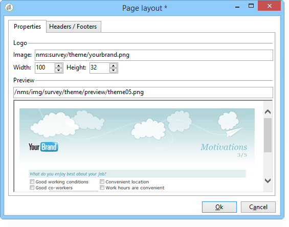

# 表單轉譯{#form-rendering}

## 選擇表單呈現模板 {#selecting-the-form-rendering-template}

表單設定允許您選擇用於生成頁面的模板。 要訪問它們，請按一下 **[!UICONTROL Properties]** 的子菜單。 **[!UICONTROL Rendering]** 頁籤。 預設情況下有許多模板（樣式表）可用。

編輯器的底部部分允許您查看所選模板的呈現。

縮放功能允許您編輯選定模板。

您可以修改或覆蓋這些模板。 要執行此操作，請按一下 **[!UICONTROL Page layout...]** 連結並個性化資訊。

您可以：

* 更改用作徽標的影像並調整其大小，
* 還指定用戶選擇此呈現模板時訪問預覽影像的路徑。

的 **[!UICONTROL Headers/Footers]** 頁籤中，您可以使用此模板更改每個表單頁的頁眉和頁腳中顯示的資訊。

每行 **[!UICONTROL Page headers]** 和 **[!UICONTROL Page footers]** 部分與HTML頁中的行相對應。 按一下 **[!UICONTROL Add]** 來修改標籤元素的屬性。

選擇現有行，然後按一下 **[!UICONTROL Detail]** 按鈕，將其個性化。

您可以通過相關頁籤更改行的內容、添加邊框和更改字型屬性。 按一下 **[!UICONTROL OK]** 確認這些更改。

的 **[!UICONTROL Position]** 欄位中，您可以定義元素在頁眉和頁腳中的位置。

>[!NOTE]
>
>渲染模板儲存在 **[!UICONTROL Administration > Configuration > Form rendering]** 的下界。\
>有關此內容的詳細資訊，請參閱 [自定義窗體呈現](#customizing-form-rendering)

## 自定義窗體呈現 {#customizing-form-rendering}

### 更改元素的佈局 {#changing-the-layout-of-elements}

您可以重載窗體中每個元素（輸入欄位、影像、單選按鈕等）的樣式表。

要執行此操作，請使用 **[!UICONTROL Advanced]** 頁籤。

它使您能夠定義以下屬性：

* **[!UICONTROL Label position]**:見 [定義標籤的位置](defining-web-forms-layout.md#defining-the-position-of-labels)。
* **[!UICONTROL Label format]**:換行或不換行，
* **[!UICONTROL Number of cells]** :見 [定位頁面上的欄位](defining-web-forms-layout.md#positioning-the-fields-on-the-page)。
* **[!UICONTROL Horizontal alignment]** （左、右、居中）和 **[!UICONTROL Vertical alignment]** （高、低、中）,
* **[!UICONTROL Width]** 區域：可以用百分比表示，也可以用ems、points或像素表示（預設值）,
* 最大 **[!UICONTROL Length]**:允許的最大字元數（對於文本、數字和密碼類型控制項）,
* **[!UICONTROL Lines]**:行數 **[!UICONTROL Multi-line text]** 類型區域，
* **[!UICONTROL Style inline]**:使您可以使用其他設定重載CSS樣式表。 這些是分開的 **;** 如下例所示的字元：

   

### 定義頁眉和頁腳 {#defining-headers-and-footers}

在根與頁面同名的樹結構中對欄位進行排序。 選擇它以修改名稱。

必須在 **[!UICONTROL Page]** 的子菜單。 您還可以將設定的內容添加到頁眉和頁腳（此資訊將顯示在每頁上）。 此內容在 **[!UICONTROL Texts]** 頁籤，如下所示：

### 將元素添加到HTML標題 {#adding-elements-to-html-header}

可以輸入要插入表單頁HTML標題的附加元素。 為此，請在 **[!UICONTROL Header]** 的子菜單。

這樣，您就可以引用將顯示在頁面標題欄中的表徵圖。

## 定義控制項設定 {#defining-control-settings}

當用戶填入表單時，會根據特定欄位的格式或配置對其自動執行檢查。 這允許您將某些欄位設定為必填(請參閱 [定義必備欄位](#defining-mandatory-fields))或檢查輸入的資料的格式(請參閱 [檢查資料格式](#checking-data-format))。 在頁面批准期間執行檢查（通過按一下啟用輸出轉換的連結或按鈕）。

### 定義必備欄位 {#defining-mandatory-fields}

要使某些欄位成為必填欄位，請在建立該欄位時選擇此選項。

如果用戶在未輸入該欄位的情況下批准此頁，將顯示以下消息：

通過按一下 **[!UICONTROL Personalize this message]** 的子菜單。

如果用戶在未輸入該欄位的情況下批准此頁，將顯示以下消息：

### 檢查資料格式 {#checking-data-format}

對於其值儲存在資料庫現有欄位中的表單檢查，將應用儲存欄位的規則。

對於其值儲存在變數中的表單檢查，批准規則取決於變數的格式。

例如，如果建立 **[!UICONTROL Number]** 選中以儲存客戶端號，如下所示：

用戶必須在表單欄位中輸入整數。

## 定義欄位條件顯示 {#defining-fields-conditional-display}

您可以根據用戶選擇的值配置要在頁面上顯示的欄位的顯示。 這可以應用於一個欄位或一組欄位（當它們在容器中分組時）。

對於頁面的每個元素， **[!UICONTROL Visibility]** 的子菜單。

條件可以涉及資料庫欄位或變數的值。

在欄位選擇窗口中，可以從以下資料中進行選擇：

* 主樹包含窗體上下文的參數。 預設參數是Identifier（與收件人的加密標識符匹配）、 Language（語言）和Origin（來源）。

   如需關於此項目的詳細資訊，請參閱此[頁面](defining-web-forms-properties.md#form-url-parameters)。

* 的 **[!UICONTROL Recipients]** 子樹包含插入到表單中並儲存在資料庫中的輸入欄位。

   有關此內容的詳細資訊，請參閱 [在資料庫中儲存資料](web-forms-answers.md#storing-data-in-the-database)。

* 的 **[!UICONTROL Variables]** 子樹包含此窗體的可用變數。 有關此內容的詳細資訊，請參閱 [將資料儲存在局部變數中](web-forms-answers.md#storing-data-in-a-local-variable)。

有關詳細資訊，請參閱此處提供的使用案例： [根據所選值顯示不同的選項](use-cases--web-forms.md#displaying-different-options-depending-on-the-selected-values)。

您還可以使用 **[!UICONTROL Test]** 的雙曲餘切值。 如需關於此項目的詳細資訊，請參閱此[頁面](defining-web-forms-page-sequencing.md#conditional-page-display)。

## 從現有窗體導入元素 {#importing-elements-from-an-existing-form}

可以從其他Web表單導入欄位或容器。 這樣，您就可以建立一個可重用塊庫，這些塊將插入表單中，如地址塊、新聞稿訂閱區域等。

要將元素導入表單，請應用以下步驟：

1. 編輯要插入一個或多個元素的頁面，然後按一下 **[!UICONTROL Import an existing block]** 的子菜單。

   

1. 選擇包含要導入的欄位的Web表單，然後選擇要導入的容器和欄位。

   

   >[!NOTE]
   >
   >的 **[!UICONTROL Edit link]** 表徵圖，用於查看選定的Web表單。

1. 按一下 **[!UICONTROL Ok]** 確認插入。

   
