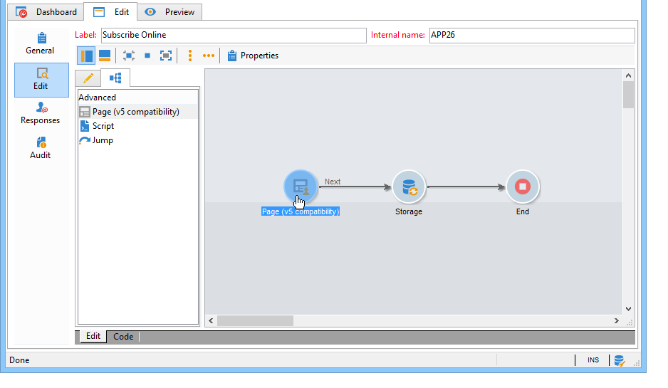
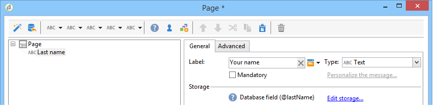

# 調查快速入門{#getting-started-with-surveys}

以下是使用下列範本，快速概述建立簡單調查的主要步驟：

這些步驟包括：

1. [步驟1 —— 建立調查](#step-1---creating-a-survey),
1. [步驟2 —— 選擇範本](#step-2---selecting-the-template),
1. [步驟3 —— 建立調查](#step-3---building-the-survey),
1. [步驟4 —— 建立頁面內容](#step-4---creating-the-page-content),
1. [步驟5 —— 儲存調查資料](#step-5---storing-the-survey-data-),
1. [步驟6 —— 發佈頁面](#step-6---publishing-the-pages),
1. [步驟7 —— 分享您的線上調查](#step-7---sharing-your-online-survey)。

## 步驟1 —— 建立調查 {#step-1---creating-a-survey}

若要建立新調查，請前往或標 **[!UICONTROL Campaigns]** 簽， **[!UICONTROL Profiles and targets]** 然後按一下 **[!UICONTROL Web Applications]** 功能表。 按一下 **[!UICONTROL Create]** 表單清單上方的按鈕。

## 步驟2 —— 選擇範本 {#step-2---selecting-the-template}

選取調查範本，然後為調查指定名稱。 使用者不會看到此名稱，但可讓調查在Adobe Campaign中識別。 按一 **[!UICONTROL Save]** 下，將調查新增至Web應用程式清單。

## 步驟3 —— 建立調查 {#step-3---building-the-survey}

調查是以下元素所在的圖形建立：建立內容的頁面、資料預載和儲存步驟，以及測試階段。 指令碼和查詢也可以插入。

若要建立圖表，請按一下 **[!UICONTROL Edit]** 調查的表單。

調查至少必 **須包含** 下列三個元件：頁面、儲存方塊和結束頁面。

* 要建立頁面，請在編輯 **[!UICONTROL Page]** 器的左側部分中選擇對象，並將其放在中間部分，如下所示：

   

* 接著，選取 **[!UICONTROL Storage]** 物件並將它置於頁面的輸出轉場。
* 最後，選 **[!UICONTROL End]** 擇對象並將其放置在儲存盒的輸出過渡的末尾，以獲得以下圖：

   

## 步驟4 —— 建立頁面內容 {#step-4---creating-the-page-content}

在下列範例中，我們使用文字 **[!UICONTROL Page (v5 compatibility)]** 頁面。 此類型的頁面可透過標籤的進階功能表 **[!UICONTROL Edit]** 存取。

* 新增輸入欄位

   若要建立頁面內容，您必須加以編輯：要執行此操作，請按兩下該對 **[!UICONTROL Page]** 像。 按一下工具列中的第一個圖示，以開啟欄位建立精靈。 要為要儲存在收件人配置檔案的匹配欄位中的用戶名建立輸入欄位，請選擇 **[!UICONTROL Edit a recipient]**。

   

   按一下按 **[!UICONTROL Next]** 鈕以選擇資料庫中資料儲存的欄位。 在本例中，為「姓氏」欄位。

   

   按一 **[!UICONTROL Finish]** 下以確認欄位建立。

   預設情況下，當資訊儲存在資料庫中已存在的欄位中時，該欄位將使用選定欄位的名稱，即：在此範例中為「姓氏」。 您可以修改此標籤，如下所示：

   

   現在，請為使用者帳號建立參加項目欄位。 重複該操作，並選擇「帳戶號」。 欄位。

   請套用相同的程式，為使用者新增欄位以輸入電子郵件地址。

* 若要建立問題，請在樹狀結構的最後一個元素上按一下滑鼠右鍵，然後選取 **[!UICONTROL Containers > Question]** ，或按一下圖 **[!UICONTROL Containers]** 示並選取 **[!UICONTROL Question]**。

   

   輸入問題的標籤，並將答案欄位插入問題的子分支。 若要這麼做，在建立答案欄位時，必須選取連結至問題的節點。 使用圖 **[!UICONTROL drop-down listx]** 示或按一 **[!UICONTROL Selection controls]** 下滑鼠右鍵來新增，如下所示：

   

   選擇儲存空間：選擇枚舉欄位以自動檢索值（在本例中為電子郵件格式）。

   

   在標籤 **[!UICONTROL General]** 中，按一下連 **[!UICONTROL Initialize the list of values from the database]** 結：值表會自動輸入。

   

   按一 **[!UICONTROL OK]** 下以關閉編輯器，並 **[!UICONTROL Save]** 儲存變更。

   >[!NOTE]
   >
   >由於標籤中的選項，您可以針對每個欄位或問題調整頁面版面以符合您的 **[!UICONTROL Advanced]** 需求。 本節將詳述調查畫面 [的配置](../../web/using/about-web-forms.md)。

   在詳細資料畫面中，按一 **[!UICONTROL Preview]** 下標籤，以檢視您剛建立之調查的轉換。

   

## 步驟5 —— 儲存調查資料 {#step-5---storing-the-survey-data-}

儲存方塊可讓您將使用者回應儲存在資料庫中。 必須選擇協調鍵以標識資料庫中已有的配置檔案。

要執行此操作，請編輯該框並選擇儲存資料時將用作協調鍵的欄位。

在以下範例中，在儲存（確認）時，如果描述檔儲存在與表單中輸入的帳戶號碼相同的資料庫中，描述檔將會更新。 如果配置檔案不存在，則將建立該配置檔案。

按一 **[!UICONTROL OK]** 下以確認，然後按一 **[!UICONTROL Save]** 下以儲存調查

## 步驟6 —— 發佈頁面 {#step-6---publishing-the-pages}

若要讓使用者能夠存取HTML頁面，應用程式必須可供使用。 它不再必須處於編輯階段，而是在生產階段。 若要將調查放在生產中，您必須發佈調查。 操作步驟：

* 按一下 **[!UICONTROL Publish]** 調查控制面板上方的按鈕。
* 按一下 **[!UICONTROL Start]** 啟動出版物並關閉嚮導。

   

   調查的狀態會變更為：線 **上**。

   

## 步驟7 —— 分享您的線上調查 {#step-7---sharing-your-online-survey}

調查投入生產後，即可從伺服器存取，而您也可以提供。 存取調查的URL會顯示在控制面板上。

若要傳送調查，您可以傳送包含目標人口之存取連結的訊息，或將調查存取URL放在網頁上。

然後，您可以透過報表和記錄來監控使用者回應。 請參閱 [回應追蹤](../../web/using/publish--track-and-use-collected-data.md#response-tracking)。

>[!CAUTION]
>
>公開URL包含調查的內部名稱。 修改內部名稱時，URL會自動更新：調查的所有連結也必須更新。
>
>如果已傳送包含表單連結的傳送，此連結將不再有效。

