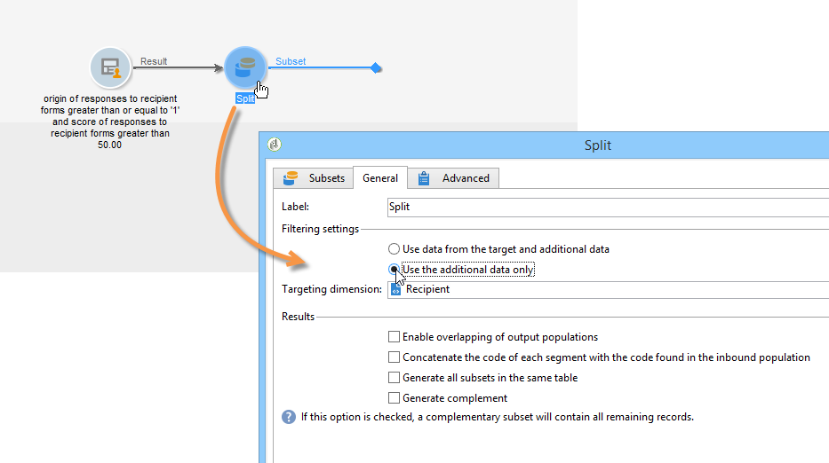

# 發佈、追蹤及使用收集的資料{#publish-track-and-use-collected-data}

建立、設定和發佈表單後，您就可以與對象共用連結並追蹤回應。

>[!NOTE]
>
>Adobe Campaign中調查的生命週期及其發佈和傳送模式與Web表格類似：這些內容詳見[本節](../../web/using/about-web-forms.md)。

## 調查控制面板{#survey-dashboard}

每個調查都有其專屬的控制面板，可讓您檢視其狀態、說明、公用URL和可用性排程。 它也可讓您檢視可用報表。 如需詳細資訊，請參閱調查的[報表](#reports-on-surveys)。

調查的公用URL會顯示在控制面板上：


## 回應追蹤{#response-tracking}

您可以在記錄檔和報表中追蹤對調查的回應。

### 調查記錄{#survey-logs}

對於每個傳送的調查，您可以在&#x200B;**[!UICONTROL Logs]**&#x200B;標籤中追蹤回應。 此標籤會顯示已完成調查的使用者清單及其來源：


連按兩下一行，以顯示回應者填入的調查表單。 您可以完整瀏覽調查，並完整存取答案。 這些檔案可以導出到外部檔案中。 有關詳細資訊，請參閱[導出答案](#exporting-answers)。

調查URL中會新增下列字元來指出來源：

```
?origin=xxx
```

在編輯調查時，其URL包含參數&#x200B;**[!UICONTROL __uuid]**，表示調查處於測試階段且尚未上線。 當您透過此URL存取調查時，在追蹤（報表）中不會考慮建立的記錄。 原點被強制為值&#x200B;**[!UICONTROL Adobe Campaign]**。

有關URL參數的詳細資訊，請參閱[此頁](../../web/using/defining-web-forms-properties.md#form-url-parameters)。

### 調查報告{#reports-on-surveys}

控制面板標籤可讓您存取調查報表。 按一下報表名稱以檢視。


調查的結構會顯示在&#x200B;**[!UICONTROL Documentation]**&#x200B;報表中。

在調查的&#x200B;**[!UICONTROL Reports]**&#x200B;標籤中，可使用另外兩份Web調查的報表：**[!UICONTROL General]**&#x200B;和&#x200B;**[!UICONTROL Breakdown of responses]**。

* 一般

   此報表包含調查的一般資訊：回應數隨時間的變化，以及依來源和語言的分佈。

   一般報表範例：

   

* 回應的劃分

   此報表顯示每個問題的回應劃分。 此劃分僅適用於儲存在&#x200B;**[!UICONTROL Question]**&#x200B;類型容器中的欄位。 它僅適用於選擇控制項（例如，文字欄位上沒有劃分）。

   

## 導出答案{#exporting-answers}

可將調查的答案匯出為外部檔案，以供日後處理。 有兩種方法可以做到：

1. 匯出報表資料

   若要匯出報表資料，請按一下&#x200B;**[!UICONTROL Export]**&#x200B;按鈕並選擇匯出格式。

   有關導出報告資料的詳細資訊，請參閱[本節](../../reporting/using/about-reports-creation-in-campaign.md)。

1. 匯出答案

   若要匯出答案，請按一下調查的&#x200B;**[!UICONTROL Responses]**&#x200B;標籤，然後按一下滑鼠右鍵。 選取 **[!UICONTROL Export...]**。

   

   然後輸入要導出的資訊和儲存檔案。

   您可以在匯出精靈中設定輸出檔案的內容和格式。

   這可讓您：

   * 將列添加到輸出檔案並恢復有關收件人的資訊（儲存在資料庫中）,
   * 格式化匯出的資料，
   * 為檔案中的資訊選擇編碼格式。

   如果您要匯出的調查包含數個&#x200B;**[!UICONTROL Multi-line text]**&#x200B;或&#x200B;**[!UICONTROL HTML text]**&#x200B;欄位，則必須以&#x200B;**[!UICONTROL XML]**&#x200B;格式匯出。 若要這麼做，請在&#x200B;**[!UICONTROL Output format]**&#x200B;欄位的下拉式清單中選取此格式，如下所示：

   

   按一下&#x200B;**[!UICONTROL Start]**&#x200B;以運行導出。

   >[!NOTE]
   >
   >[本節](../../platform/using/about-generic-imports-exports.md)中詳細介紹了資料導出及其配置的階段。

## 使用收集的資料{#using-the-collected-data}

透過線上調查收集的資訊可在定位工作流程的架構中復原。 若要這麼做，請使用&#x200B;**[!UICONTROL Survey responses]**&#x200B;方塊。

在下列範例中，我們希望為至少有兩個孩子並線上上調查中獲得最高分數的五個收件者提供網頁優惠。 此調查的答案為：


在定位工作流程中，**[!UICONTROL Survey responses]**&#x200B;將依下列方式設定：


從選取相關調查開始，然後在視窗中央區段擷取資料。 在這種情況下，我們至少需要擷取分數欄，因為它將用於分割方塊中，以復原五個最高分數。

按一下&#x200B;**[!UICONTROL Edit query...]**&#x200B;連結，指出答案的篩選條件。


啟動定位工作流程。 查詢將恢復8個收件人。


以滑鼠右鍵按一下系列方塊的輸出轉場，即可檢視。


然後，在工作流程中放置分割方塊，以復原分數最高的5個收件者。

編輯拆分框以進行配置：

* 首先，在&#x200B;**[!UICONTROL General]**&#x200B;標籤中選擇適當的架構，然後配置子集：

   

* 前往&#x200B;**[!UICONTROL Sub-sets]**&#x200B;標籤並選取&#x200B;**[!UICONTROL Limit the selected records]**&#x200B;選項，然後按一下&#x200B;**[!UICONTROL Edit...]**&#x200B;連結。

   

* 選擇&#x200B;**[!UICONTROL Keep only the first records after sorting]**&#x200B;選項並選擇排序列。 核取 **[!UICONTROL Descending sort]** 選項。

   

* 按一下&#x200B;**[!UICONTROL Next]**&#x200B;按鈕，將記錄數限制為5。

   

* 按一下&#x200B;**[!UICONTROL Finish]**，然後重新啟動工作流程以核准定位。

## 標準化資料{#standardizing-data}

在Adobe Campaign中，可針對使用別名收集的資料設定標準化程式。 這可讓您標準化儲存在資料庫中的資料：為此，請在包含相關資訊的明細清單中定義別名。

有關詳細資訊，請參見[此頁面](../../platform/using/managing-enumerations.md#about-enumerations)。
