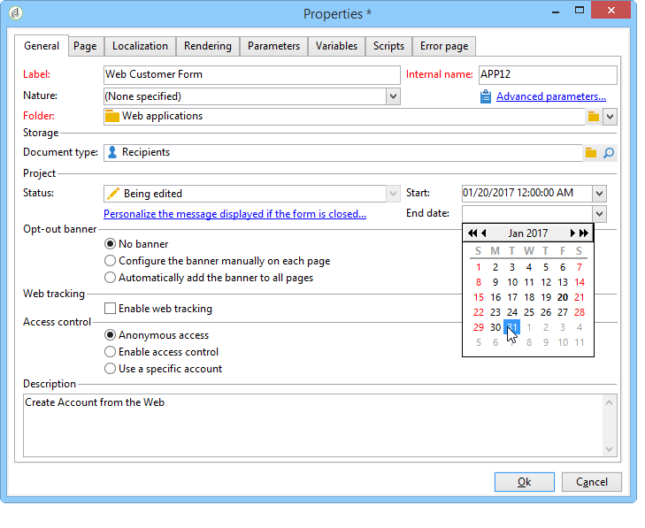

# 發佈網路表單{#publishing-a-web-form}


## 預先載入表單資料 {#pre-loading-the-form-data}

如果您想要透過Web表單更新儲存在資料庫中的設定檔，可以使用預先載入方塊。 預載框允許您指明如何查找要在資料庫中更新的記錄。

可採用下列識別方法：

* **[!UICONTROL Adobe Campaign Encryption]**

   此加密方法使用加密的Adobe Campaign識別碼(ID)。 此方法僅適用於Adobe Campaign物件，且加密的ID只能由Adobe Campaign平台產生。

   使用此方法時，您需要借由新增 **`<%=escapeUrl(recipient.cryptedId) %>`** 參數。 有關詳細資訊，請參閱 [透過電子郵件傳送表單](#delivering-a-form-via-email).

* **[!UICONTROL DES encryption]**

   

   此加密方法使用外部提供的識別碼(ID)，連結至Adobe Campaign和外部提供者共用的金鑰。 此 **[!UICONTROL Des key]** 欄位可讓您輸入此加密金鑰。

* **[!UICONTROL List of fields]**

   此選項可讓您從表單目前內容的欄位中進行選擇，這些欄位將用於在資料庫中尋找對應的設定檔。

   

   欄位可透過 **[!UICONTROL Parameters]** 標籤(請參閱 [新增參數](defining-web-forms-properties.md#adding-parameters))。 它們會放在表單URL或輸入區域中。

   >[!CAUTION]
   >
   >所選欄位中的資料未加密。 不得以加密的形式提供，因為若 **[!UICONTROL Field list]** 選項。

   在下列範例中，設定檔預先載入是根據電子郵件地址。

   URL可包含未加密的電子郵件地址，在此情況下，使用者可直接存取與其相關的頁面。

   

   否則，將要求他們輸入密碼。

   

   >[!CAUTION]
   >
   >如果清單中指定了數個欄位，則 **所有欄位** 必須與資料庫中儲存的資料匹配，才能更新配置檔案。 否則，會建立新的設定檔。
   > 
   >此函式對Web應用程式特別有用，但不建議用於公開表單。 選定的訪問控制選項必須是「啟用訪問控制」。

此 **[!UICONTROL Skip preloading if no ID]** 選項。 在這種情況下，在批准表單後，輸入的每個配置檔案都將添加到資料庫中。 例如，表單張貼至網站時，會使用此選項。

此 **[!UICONTROL Auto-load data referenced in the form]** 選項可讓您自動預先載入與表單中輸入及合併欄位相符的資料。 不過， **[!UICONTROL Script]** 和 **[!UICONTROL Test]** 活動不關心。 如果未選取此選項，您需要使用 **[!UICONTROL Load additional data]** 選項。

此 **[!UICONTROL Load additional data]** 選項可讓您新增未在表單頁面中使用的資訊，但仍會預先載入。

例如，您可以預先載入收件者的性別，並透過測試方塊自動將他們導向至適當的頁面。


## 管理網路表單傳遞和追蹤 {#managing-web-forms-delivery-and-tracking}

建立、設定和發佈表單後，您就可以傳送表單並追蹤使用者回應。

### 表單的生命週期 {#life-cycle-of-a-form}

一種形式的生命週期有三個階段：

1. **正在編輯的表單**

   這是初步設計階段。 建立新表單時，該表單處於編輯階段。 存取表單（僅用於測試用途），則需要參數 **[!UICONTROL __uuid]** 以用於其URL。 此URL可在 **[!UICONTROL Preview]** 頁簽。 請參閱 [表單URL參數](defining-web-forms-properties.md#form-url-parameters).

   >[!CAUTION]
   >
   >只要正在編輯表單，其存取URL就是特殊URL。

1. **線上表單**

   設計階段完成後，即可傳送表單。 首先，它需要發佈。 有關詳細資訊，請參閱 [發佈表單](#publishing-a-form).

   表格會是 **[!UICONTROL Live]** 直到它過期。

   >[!CAUTION]
   >
   >要傳送，調查的URL不得包含 **[!UICONTROL __uuid]** 參數。

1. **表單不可用**

   表單關閉後，傳送階段就會結束，表單將無法使用：使用者無法再存取。

   到期日可在表單屬性視窗中定義。 有關詳細資訊，請參閱 [使表單聯機可用](#making-a-form-available-online)

表單的發佈狀態會顯示在表單清單中。


### 發佈表單 {#publishing-a-form}

若要變更表單的狀態，您必須發佈它。 若要這麼做，請按一下 **[!UICONTROL Publication]** 按鈕，然後在下拉框中選擇狀態。


### 使表單聯機可用 {#making-a-form-available-online}

若要供使用者存取，表單必須在生產環境中並開始，即在有效期內。 有效日期是透過 **[!UICONTROL Properties]** 表單的連結。

* 使用 **[!UICONTROL Project]** 部分，輸入表單的開始和結束日期。

   

* 按一下 **[!UICONTROL Personalize the message displayed if the form is closed...]** 連結以定義當使用者嘗試存取表單無效時要顯示的錯誤訊息。

   請參閱 [表單的協助工具](defining-web-forms-properties.md#accessibility-of-the-form).

### 透過電子郵件傳送表單 {#delivering-a-form-via-email}

當您透過電子郵件傳送邀請時，可以使用 **[!UICONTROL Adobe Campaign Encryption]** 資料協調的選項。 若要這麼做，請前往傳送精靈，並新增下列參數以調整表單的連結：

```
<a href="https://server/webApp/APP264?&id=<%=escapeUrl(recipient.cryptedId) %>">
```

在此情況下，資料儲存的調解金鑰必須是收件者的加密識別碼。 有關詳細資訊，請參閱 [預先載入表單資料](#pre-loading-the-form-data).

在此情況下，您需要檢查 **[!UICONTROL Update the preloaded record]** 選項。 有關詳細資訊，請參閱 [保存網路表單答案](web-forms-answers.md#saving-web-forms-answers).


### 記錄回應 {#log-responses}

您可以在專用索引標籤中啟動回應追蹤，以監控網路表單的影響。 若要這麼做，請按一下 **[!UICONTROL Advanced parameters...]** 連結（在「表單屬性」窗口中），然後選擇 **[!UICONTROL Log responses]** 選項。


此 **[!UICONTROL Responses]** 標籤，以便您檢視回應者的身分。


選取收件者，然後按一下 **[!UICONTROL Detail...]** 按鈕來檢視提供的回應。


您可以處理查詢中提供的回應記錄，例如在傳送提醒時僅鎖定非回應者，或僅向回應者提供特定通訊。
