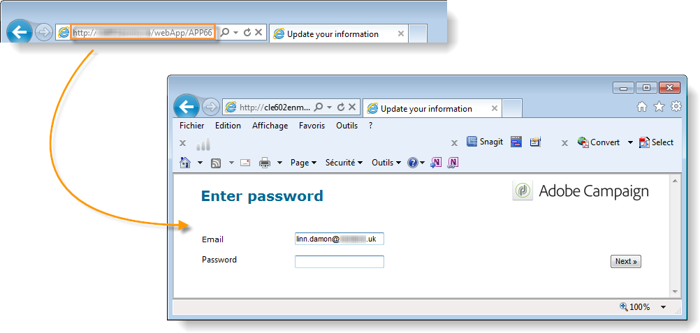

# 發佈網路表單{#publishing-a-web-form}

## 預先載入表單資料{#pre-loading-the-form-data}

如果希望通過Web表單更新儲存在資料庫中的配置檔案，可使用預載框。 通過預載入框，可以指明如何查找要在資料庫中更新的記錄。

可採用下列識別方法：

* **[!UICONTROL Adobe Campaign Encryption]**

   此加密方法使用加密的Adobe Campaign識別碼(ID)。 此方法僅適用於Adobe Campaign物件，且加密的ID只能由Adobe Campaign平台產生。

   使用此方法時，您需要調整表單的URL，以透過新增&#x200B;**`<%=escapeUrl(recipient.cryptedId) %>`**&#x200B;參數傳送至電子郵件地址。 有關詳細資訊，請參閱[通過電子郵件傳送表單](#delivering-a-form-via-email)。

* **[!UICONTROL DES encryption]**

   

   此加密方法使用外部提供的識別碼(ID)，此識別碼會連結至Adobe Campaign和外部提供者共用的金鑰。 **[!UICONTROL Des key]**&#x200B;欄位可讓您輸入此加密金鑰。

* **[!UICONTROL List of fields]**

   此選項可讓您從表單目前內容中的欄位中選擇，這些欄位將用於在資料庫中尋找對應的描述檔。

   

   欄位可透過&#x200B;**[!UICONTROL Parameters]**&#x200B;標籤新增至表單屬性（請參閱[新增參數](../../web/using/defining-web-forms-properties.md#adding-parameters)）。 它們以URL或輸入區域的形式放置。

   >[!CAUTION]
   >
   >選取欄位中的資料不會加密。 它不得以加密的形式提供，因為如果選取&#x200B;**[!UICONTROL Field list]**&#x200B;選項，Adobe Campaign將無法解密。

   在下列範例中，描述檔預先載入是以電子郵件地址為基礎。

   URL可包含未加密的電子郵件地址，在此情況下，使用者可直接存取其相關頁面。

   

   否則，系統會要求他們輸入密碼。

   

   >[!CAUTION]
   >
   >如果在清單中指定了多個欄位，則&#x200B;**ALL FIELDS**&#x200B;的資料必須與資料庫中儲存的資料匹配，以便更新配置檔案。 否則，將建立新配置檔案。
   > 
   >此函式對Web應用程式特別有用，但不建議用於公開表單。 選定的訪問控制選項必須是「啟用訪問控制」。

如果您不想更新配置式，必須選擇&#x200B;**[!UICONTROL Skip preloading if no ID]**&#x200B;選項。 在這種情況下，在批准表單後，輸入的每個配置檔案都將添加到資料庫中。 例如，當表單張貼在網站上時，就會使用這個選項。

**[!UICONTROL Auto-load data referenced in the form]**&#x200B;選項可讓您自動預先載入符合表單中輸入和合併欄位的資料。 但是，**[!UICONTROL Script]**&#x200B;和&#x200B;**[!UICONTROL Test]**&#x200B;活動中引用的資料並不相關。 如果未選取此選項，您需要使用&#x200B;**[!UICONTROL Load additional data]**&#x200B;選項來定義欄位。

**[!UICONTROL Load additional data]**&#x200B;選項可讓您新增未用於表單頁面但仍會預先載入的資訊。

例如，您可以預先載入收件者的性別，並透過測試方塊自動將其導向至適當的頁面。


## 管理Web表單傳送和追蹤{#managing-web-forms-delivery-and-tracking}

建立、設定和發佈表單後，您就可以傳送並追蹤使用者回應。

### 表單{#life-cycle-of-a-form}的生命週期

表單生命週期有三個階段：

1. **正在編輯的表單**

   這是初始設計階段。 建立新表單時，它正處於編輯階段。 存取表單（僅供測試之用），則需要在其URL中使用參數&#x200B;**[!UICONTROL __uuid]**。 此URL可在&#x200B;**[!UICONTROL Preview]**&#x200B;子標籤中存取。 請參閱[表單URL參數](../../web/using/defining-web-forms-properties.md#form-url-parameters)。

   >[!CAUTION]
   >
   >只要正在編輯表單，其存取URL就是特殊的URL。

1. **線上表單**

   設計階段完成後，就可傳送表格。 首先，它需要發佈。 有關詳細資訊，請參閱[發佈表單](#publishing-a-form)。

   表單將為&#x200B;**[!UICONTROL Live]**，直到過期。

   >[!CAUTION]
   >
   >若要傳送，調查的URL不得包含&#x200B;**[!UICONTROL __uuid]**&#x200B;參數。

1. **表單無法使用**

   表單關閉後，傳送階段即告結束，表單將無法使用：使用者無法再存取。

   到期日可在表單屬性視窗中定義。 有關詳細資訊，請參閱[使表單聯機](#making-a-form-available-online)

表單的發佈狀態顯示在表單清單中。


### 發佈表單{#publishing-a-form}

若要變更表單的狀態，您必須發佈表單。 若要這麼做，請按一下Web表格清單上方的&#x200B;**[!UICONTROL Publication]**&#x200B;按鈕，並在下拉式方塊中選取狀態。


### 線上上提供表單{#making-a-form-available-online}

若要讓使用者存取，表單必須在生產中並開始，即在有效期內。 有效日期是透過表單的&#x200B;**[!UICONTROL Properties]**&#x200B;連結輸入。

* 使用&#x200B;**[!UICONTROL Project]**&#x200B;部分中的欄位輸入表單的開始和結束日期。

   

* 按一下&#x200B;**[!UICONTROL Personalize the message displayed if the form is closed...]**&#x200B;連結，以定義當使用者嘗試存取表單無效時要顯示的錯誤訊息。

   請參閱[表單](../../web/using/defining-web-forms-properties.md#accessibility-of-the-form)的協助功能。

### 透過電子郵件傳送表格{#delivering-a-form-via-email}

當您透過電子郵件傳送邀請時，可以使用&#x200B;**[!UICONTROL Adobe Campaign Encryption]**&#x200B;選項進行資料協調。 若要這麼做，請前往傳送精靈，並新增下列參數，將連結調整為表格：

```
<a href="https://server/webApp/APP264?&id=<%=escapeUrl(recipient.cryptedId) %>">
```

在這種情況下，資料儲存的協調密鑰必須是收件人的加密標識符。 有關詳細資訊，請參閱[預載入表單資料](#pre-loading-the-form-data)。

在這種情況下，您必須勾選記錄方塊中的&#x200B;**[!UICONTROL Update the preloaded record]**&#x200B;選項。 有關詳細資訊，請參閱[保存Web表單答案](../../web/using/web-forms-answers.md#saving-web-forms-answers)。


### 記錄響應{#log-responses}

您可以在專用標籤中啟動回應追蹤，以監控Web表單的影響。 要執行此操作，請按一下表單屬性窗口中的&#x200B;**[!UICONTROL Advanced parameters...]**&#x200B;連結，然後選擇&#x200B;**[!UICONTROL Log responses]**&#x200B;選項。


**[!UICONTROL Responses]**&#x200B;標籤會讓您檢視回應者的身分。


選擇收件者，然後按一下&#x200B;**[!UICONTROL Detail...]**&#x200B;按鈕以檢視所提供的回應。


您可以處理查詢中提供的回應記錄，例如，在傳送提醒時僅鎖定非回應者，或僅向回應者提供特定的通訊。

>[!NOTE]
>
>如需完整追蹤提供的回應、匯出回應並檢視或建立專屬報表，請使用選用的&#x200B;**Survey**&#x200B;模組。 如需詳細資訊，請參閱[本章節](../../web/using/about-surveys.md)。

