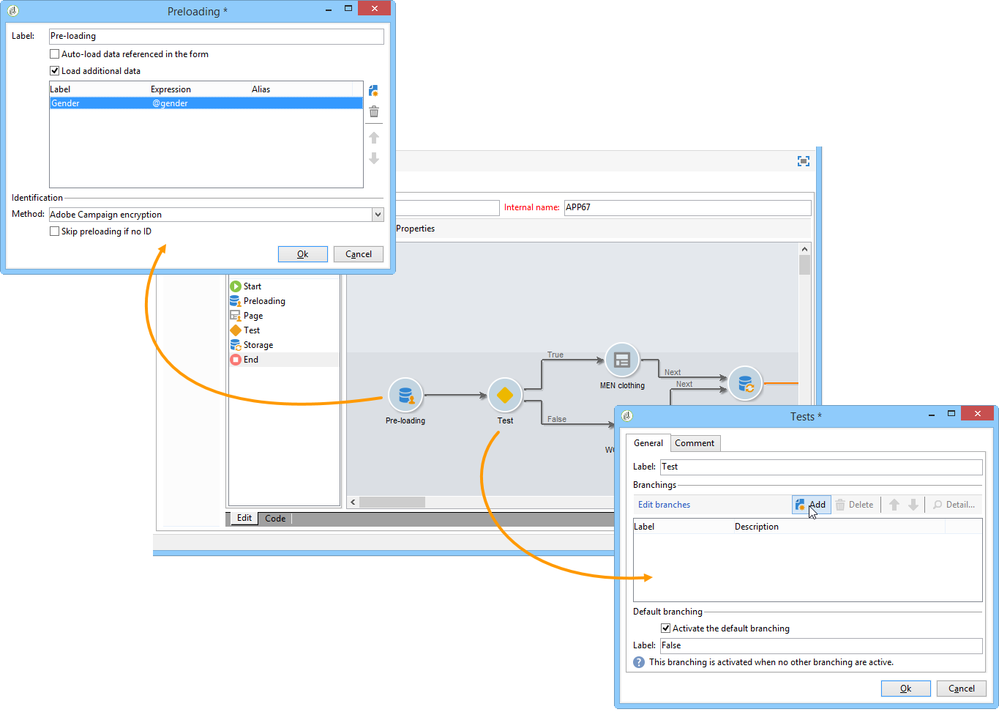

# 發佈網路表單{#publishing-a-web-form}


## 預載入表單資料 {#pre-loading-the-form-data}

如果希望通過Web表單更新儲存在資料庫中的配置檔案，則可以使用預載入框。 通過預載入框可以指示如何查找要在資料庫中更新的記錄。

可以使用以下識別方法：

* **[!UICONTROL Adobe Campaign Encryption]**

   此加密方法使用加密的Adobe Campaign標識符(ID)。 此方法僅適用於Adobe Campaign對象，加密ID只能由Adobe Campaign平台生成。

   使用此方法時，您需要通過添加 **`<%=escapeUrl(recipient.cryptedId) %>`** 的下界。 有關此內容的詳細資訊，請參閱 [通過電子郵件提交表單](#delivering-a-form-via-email)。

* **[!UICONTROL DES encryption]**

   

   此加密方法使用外部提供的標識符(ID)，該標識符連結到由Adobe Campaign和外部提供方共用的密鑰。 的 **[!UICONTROL Des key]** 的子菜單。

* **[!UICONTROL List of fields]**

   此選項允許您從窗體當前上下文中的欄位中進行選擇，這些欄位將用於在資料庫中查找相應的配置檔案。

   

   可以通過 **[!UICONTROL Parameters]** 頁籤(請參閱 [添加參數](defining-web-forms-properties.md#adding-parameters))。 它們以URL或輸入區域的形式放置。

   >[!CAUTION]
   >
   >所選欄位中的資料未加密。 不能以加密形式提供它，因為如果 **[!UICONTROL Field list]** 的雙曲餘切值。

   在以下示例中，配置檔案預載入是基於電子郵件地址的。

   該URL可以包括未加密的電子郵件地址，在這種情況下，用戶可以直接訪問與他們有關的頁面。

   

   否則，將要求他們提供密碼。

   

   >[!CAUTION]
   >
   >如果在清單中指定了多個欄位，則 **所有欄位** 必須匹配儲存在資料庫中的資料才能更新配置檔案。 否則，將建立新的配置檔案。
   > 
   >此函式對Web應用程式特別有用，但不建議用於公共表單。 選定的訪問控制選項必須是「啟用訪問控制」。

的 **[!UICONTROL Skip preloading if no ID]** 選項。 在這種情況下，在批准表單後，輸入的每個配置檔案都將添加到資料庫。 例如，在網站上發佈表單時，會使用此選項。

的 **[!UICONTROL Auto-load data referenced in the form]** 選項可自動預載入與窗體中輸入和合併欄位匹配的資料。 但是，中引用的資料 **[!UICONTROL Script]** 和 **[!UICONTROL Test]** 活動不關心。 如果未選擇此選項，則需要使用 **[!UICONTROL Load additional data]** 的雙曲餘切值。

的 **[!UICONTROL Load additional data]** 選項，您可以添加在窗體頁面中未使用但仍將預先載入的資訊。

例如，您可以預載入收件人的性別，並通過test框自動將其定向到相應的頁面。



## 管理Web表單交付和跟蹤 {#managing-web-forms-delivery-and-tracking}

建立、配置和發佈表單後，您就可以交付它並跟蹤用戶響應。

### 表單的生命週期 {#life-cycle-of-a-form}

表單的生命週期有三個階段：

1. **正在編輯的窗體**

   這是初始設計階段。 建立新窗體時，該窗體處於編輯階段。 訪問表單（僅用於測試），然後需要參數 **[!UICONTROL __uuid]** 的下界。 此URL可在 **[!UICONTROL Preview]** 的子菜單。 請參閱 [表單URL參數](defining-web-forms-properties.md#form-url-parameters)。

   >[!CAUTION]
   >
   >只要正在編輯表單，其訪問URL就是特殊URL。

1. **聯機窗體**

   一旦設計階段完成，就可以交付表格。 首先，它需要發表。 有關此內容的詳細資訊，請參閱 [發佈窗體](#publishing-a-form)。

   窗體將 **[!UICONTROL Live]** 直到它過期。

   >[!CAUTION]
   >
   >要傳送，調查的URL不得包含 **[!UICONTROL __uuid]** 的下界。

1. **窗體不可用**

   一旦表單關閉，交貨階段就結束，表單將不可用：用戶無法再訪問它。

   到期日可以在窗體屬性窗口中定義。 有關此內容的詳細資訊，請參閱 [使表單聯機可用](#making-a-form-available-online)

表單的發佈狀態顯示在表單清單中。


### 發佈窗體 {#publishing-a-form}

要更改表單的狀態，需要發佈它。 要執行此操作，請按一下 **[!UICONTROL Publication]** 的子菜單。


### 使表單聯機可用 {#making-a-form-available-online}

要供用戶訪問，表格必須在生產中並開始，即在有效期內。 有效日期通過 **[!UICONTROL Properties]** 的子菜單。

* 使用中的欄位 **[!UICONTROL Project]** 的子菜單。

   

* 按一下 **[!UICONTROL Personalize the message displayed if the form is closed...]** 連結，以定義當用戶嘗試訪問表單時顯示的錯誤消息。

   請參閱 [表格的可訪問性](defining-web-forms-properties.md#accessibility-of-the-form)。

### 通過電子郵件提交表單 {#delivering-a-form-via-email}

通過電子郵件發送邀請時，您可以使用 **[!UICONTROL Adobe Campaign Encryption]** 選項。 為此，請轉至交付嚮導，通過添加以下參數來調整指向表單的連結：

```
<a href="https://server/webApp/APP264?&id=<%=escapeUrl(recipient.cryptedId) %>">
```

在這種情況下，資料儲存的協調密鑰必須是收件人的加密標識符。 有關此內容的詳細資訊，請參閱 [預載入表單資料](#pre-loading-the-form-data)。

在這種情況下，你需要檢查 **[!UICONTROL Update the preloaded record]** 的子菜單。 有關此內容的詳細資訊，請參閱 [保存Web表單答案](web-forms-answers.md#saving-web-forms-answers)。


### 記錄響應 {#log-responses}

可以在專用頁籤中激活響應跟蹤，以監控Web表單的影響。 要執行此操作，請按一下 **[!UICONTROL Advanced parameters...]** 連結，然後選擇 **[!UICONTROL Log responses]** 的雙曲餘切值。


的 **[!UICONTROL Responses]** 頁籤


選擇收件人，然後按一下 **[!UICONTROL Detail...]** 按鈕，查看提供的響應。


您可以處理查詢中提供的響應日誌，例如，在發送提醒時僅針對非應答者，或僅向應答者提供特定通信。
