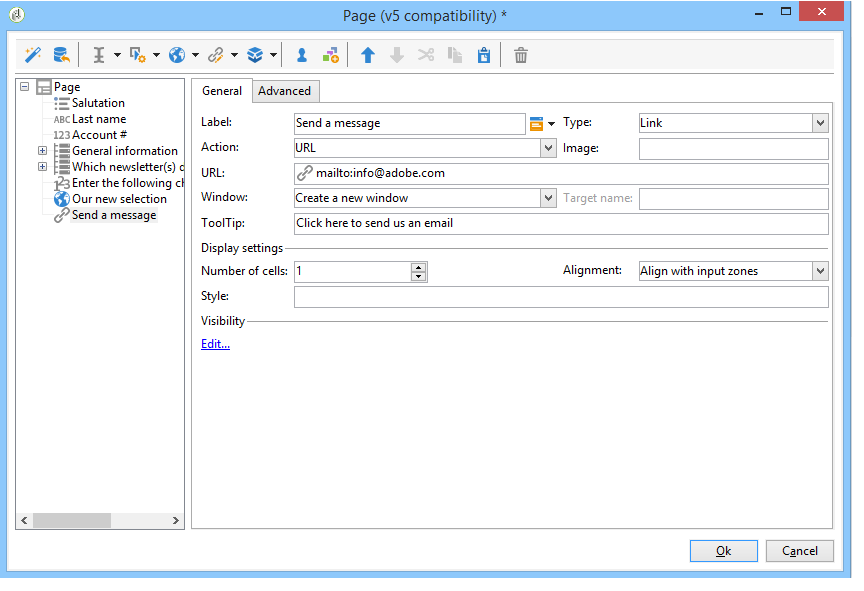
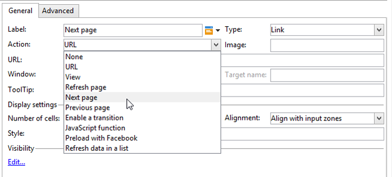
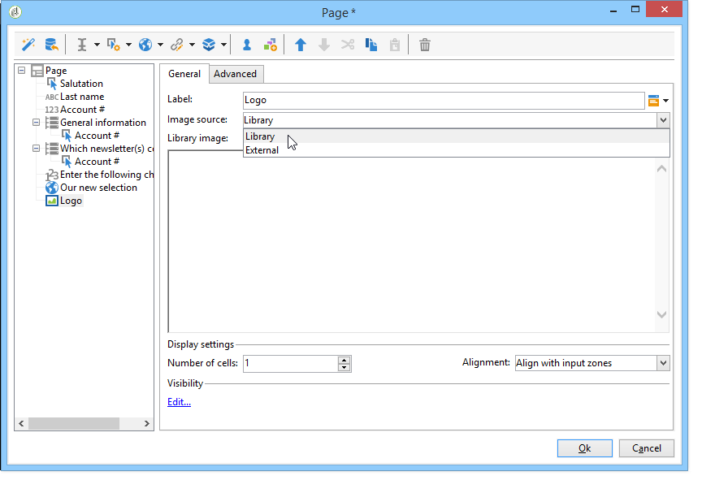

# 網路表單中的靜態元素{#static-elements-in-a-web-form}


您可以在表單的頁面中加入使用者不會互動的元素；這些是靜態元素，例如影像、HTML內容、水準列或超文字連結。 這些元素是透過工具列中的第一個按鈕建立，方法是選取 **[!UICONTROL Static elements]**.


可使用下列欄位型別：

* 以先前提供的答案（在表單的情境中）或資料庫為基礎的值。
* 超文字連結、HTML、橫條圖。 另請參閱 [插入HTML內容](#inserting-html-content).
* 儲存在資源庫或使用者可存取之伺服器上的影像。 另請參閱 [插入影像](#inserting-images).
* 在使用者端和/或伺服器端執行的指令碼。 它必須使用JavaScript撰寫並與大多數瀏覽器相容，以確保在使用者端正確執行。

  >[!NOTE]
  >
  >在伺服器端，指令碼可以使用中定義的函式 [Campaign JSAPI檔案](https://experienceleague.adobe.com/developer/campaign-api/api/index.html?lang=zh-Hant).

## 插入HTML內容 {#inserting-html-content}

您可以在表單頁面中加入HTML內容：超文字連結、影像、格式化段落、影片等。

HTML編輯器可讓您輸入要插入表單頁面的內容。 若要開啟編輯器，請按一下「 」 **[!UICONTROL Static elements]** > **[!UICONTROL HTML]** .

您可以直接輸入並格式化內容，或顯示原始程式碼視窗以貼入某些外部內容。 若要切換至「原始程式碼」模式，請按一下工具列中的第一個圖示：


若要插入資料庫欄位，請使用個人化按鈕。


>[!NOTE]
>
>在HTML編輯器中輸入的字串只有在 **[!UICONTROL Texts]** 子標籤。 否則，將不會收集這些值。 有關詳細資訊，請參閱 [轉譯網路表單](translating-a-web-form.md).

### 插入連結 {#inserting-a-link}

在編輯視窗中填寫欄位，如下列範例所示：

若要新增超文字連結，請前往 **[!UICONTROL Static elements]** > **[!UICONTROL Link]**.



* 此 **[!UICONTROL Label]** 是超文字連結的內容，會顯示在表單頁面上。
* 此 **[!UICONTROL URL]** 是所需的位址，例如： [https://www.adobe.com](https://www.adobe.com) 針對網站，或 [info@adobe.com](mailto:info@adobe.com) 以傳送訊息。
* 此 **[!UICONTROL Window]** 欄位可讓您選取網站中連結的顯示模式。 您可以決定在新視窗、目前視窗或其他視窗中開啟連結。
* 您可以新增工具提示，如下所示：

  

* 您可以選擇將連結顯示為按鈕或影像。 若要這麼做，請選取 **[!UICONTROL Type]** 欄位。

### 連結型別 {#types-of-links}

依預設，連結會與URL型別的動作相關聯，以便可以在URL欄位中輸入連結目的地位址。


您可以定義連結的其他動作，讓使用者可以按一下連結進行下列操作：

* 重新整理頁面

  若要這麼做，請選取 **[!UICONTROL Refresh page]** 的下拉式方塊中的選項 **[!UICONTROL Action]** 欄位。

  

* 顯示下一頁/上一頁

  若要這麼做，請選取 **[!UICONTROL Next page]** 或 **[!UICONTROL Previous page]** 的下拉式方塊中的選項 **[!UICONTROL Action]** 欄位。

  

  您可以隱藏 **[!UICONTROL Next]** 和/或 **[!UICONTROL Back]** 按鈕取代為連結。 請參閱此 [頁面](defining-web-forms-page-sequencing.md).

  連結會取代 **[!UICONTROL Next]** 預設使用的按鈕。

  

* 顯示其他頁面

  此 **[!UICONTROL Enable a transition]** 選項可讓您顯示與中選取之外寄轉變關聯的特定頁面。 **[!UICONTROL Transition]** 欄位。

  

  依預設，一個頁面只有一個輸出轉變。 若要建立新的轉變，請選取頁面，然後按一下 **[!UICONTROL Add]** 中的按鈕 **[!UICONTROL Output transitions]** 區段，如下所示：

  

  在圖表中，這項新增內容如下所示：

  

  >[!NOTE]
  >
  >如需網頁表單中頁面順序的詳細資訊，請參閱 [定義網路表單頁面排序](defining-web-forms-page-sequencing.md).

### 個人化HTML內容 {#personalizing-html-content}

您可以使用上一頁所記錄的資料，個人化表單頁面的HTML內容。 例如，您可以建立汽車保險網路表單，其第一頁可讓您提供聯絡資訊和汽車品牌。


使用個人化欄位，將使用者名稱和選取的品牌重新插入下一頁。 要使用的語法取決於資訊儲存模式。 有關詳細資訊，請參閱 [使用收集的資訊](web-forms-answers.md#using-collected-information).

>[!NOTE]
>
>基於安全理由，在 **`<%=`** 公式會以逸出字元取代。

在我們的範例中，收件者的名字和姓氏儲存在資料庫的欄位中，而他們的汽車品牌儲存在變數中。 第2頁個人化訊息的語法如下：


```
<P>Welcome <%= ctx.recipient.@firstName %> <%= ctx.recipient.@lastName %>,</P>
<P>To start your customized study, please select your car <%=ctx.vars.marque%> and its year of purchase.</P>
```

這會產生下列結果：


### 使用文字變數 {#using-text-variables}

此 **[!UICONTROL Text]** tab可讓您建立變數欄位，這些欄位可用於&lt;%=和%>字元之間的HTML，語法如下： **$（識別碼）**.

使用此方法可輕鬆將字串當地語系化。 另請參閱 [轉譯網路表單](translating-a-web-form.md)

例如，您可以建立 **連絡人** 可讓您在HTML內容中顯示「上次連絡日期：」字串的欄位。 要執行此操作，請遵循下列步驟：

1. 按一下 **[!UICONTROL Text]** HTML文字的索引標籤。
1. 按一下 **[!UICONTROL Add]** 圖示。
1. 在 **[!UICONTROL Identifier]** 欄，輸入變數的名稱
1. 在 **[!UICONTROL Text]** 欄，輸入預設值。

   

1. 在HTML內容中，透過 **&lt;%= $（連絡人） %>** 語法。

   

   >[!CAUTION]
   >
   >如果您在HTML編輯器中輸入這些字元， **&lt;** 和 **>** 欄位將替換為其逸出字元。 在這種情況下，您需要透過按一下 **[!UICONTROL Display source code]** 圖示來顯示HTML文字編輯器。

1. 開啟 **[!UICONTROL Preview]** 表單標籤，用於檢視HTML中輸入的值：

   

此作業模式可讓您僅定義一次網路表單文字，並使用整合式翻譯工具管理翻譯。 有關詳細資訊，請參閱 [轉譯網路表單](translating-a-web-form.md).

## 插入影像 {#inserting-images}

若要將影像包含在表單中，影像必須儲存在可從外部存取的伺服器上。

選取 **[!UICONTROL Static elements]** > **[!UICONTROL Image]** 功能表。

選取要插入的影像來源：它可以來自公用資源庫，或儲存在可從外部存取的外部伺服器上。



如果這是資料庫中的影像，請在欄位的下拉式方塊中選取影像；如果影像位於外部檔案中，請輸入存取路徑。 將游標移到影像上時(與HTML中的ALT欄位一致)，或是影像未顯示時，就會顯示標籤。

您可在編輯器的中央區段中檢視影像。
