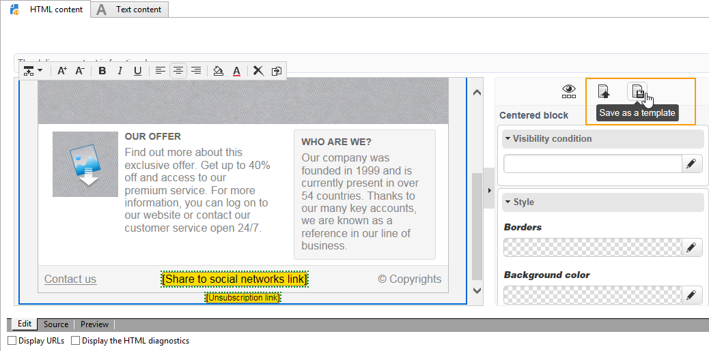

# 範本管理{#template-management}

數位內容編輯器提供 **標準範本** 用於網頁應用程式和傳送。

建立登錄頁面類型Web應用程式時，使用者可以選擇其中一個範本。 您也可以匯入在Adobe Campaign以外建立的HTML範本。

若要新增範本，請參閱 [全域選項](content-editor-interface.md#global-options).

## 將傳送儲存為範本 {#saving-a-delivery-as-a-template}

設定傳送後，您可以將其儲存為範本，以便在未來傳送時重複使用。

在 **行銷活動** 標籤，開啟所選的傳送。 按一下 **另存為範本** 按鈕，命名模板，然後保存。

新範本會儲存在 **資源>範本>內容範本** 節點。
