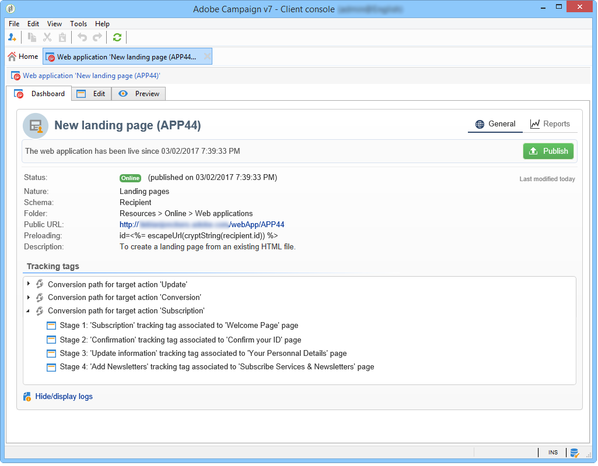

# 追蹤網站應用程式的瀏覽次數{#tracking-a-web-application}

Adobe Campaign可讓您插入追蹤標籤，藉此追蹤和測量網頁應用程式頁面上的造訪次數。 此功能可用於所有網頁應用程式型別（表單、網頁等）。

因此，您可以定義數個導覽路徑並評估其成功與否。 然後，每個應用程式的報表中便可使用復原的資料。

此版本的主要改善專案如下：

* 可以在相同頁面上插入多個追蹤標籤，以便導覽路徑定義（例如購買、訂閱、回訪等）。
* 在Web應用程式儀表板中檢視不同頁面的導覽路徑和追蹤標籤。

   

* 產生完整追蹤報告。

   

   主要指標如下：

   * **轉換率**：顯示導覽路徑所有步驟的人數。
   * **跳出率**：僅顯示第一個步驟的人數
   * **轉換漏斗**：每個步驟之間的流失率。

   此外， **扇區** 型別圖表會根據其來源顯示母體。

## 識別流量來源 {#identifying-the-traffic-source}

在存取Web應用程式時，可使用兩種不同的模式來識別訪客的來源：

1. 傳送特定傳遞以授予對網頁應用程式頁面的存取權：在此案例中，流量來源為此傳遞，
1. 將Web應用程式與專用流量來源建立關聯：在這種情況下，它必須是外部「流量來源」型別的傳送。 您可以從Web應用程式屬性或目標對應中選取它。

   

為了識別網頁應用程式中的流量來源，Adobe Campaign會連續尋找下列資訊：

1. 來源傳遞識別碼（如果存在） (nlId Cookie)，
1. 在Web應用程式屬性中定義的外部傳遞識別碼（如果存在），
1. 目標對應中定義的外部傳遞的識別碼（如果存在）。

>[!NOTE]
>
>只有在安裝Campaign時已在部署精靈中啟動選項的情況下，才能使用匿名追蹤。

## 使用數位內容編輯器(DCE)設計的網頁應用程式 {#web-applications-designed-with-digital-content-editor--dce-}

使用HTML內容編輯器建立Web應用程式時 —  **數位內容編輯器(DCE)**  — 追蹤標籤會插入 **[!UICONTROL Properties]** 標籤內的任何專案。 如需數位內容編輯器(DCE)的詳細資訊，請參閱 [本節](about-campaign-html-editor.md).

使用網頁介面時，必須從頁面屬性插入追蹤標籤。

此 **[!UICONTROL Display blocks]** 圖示可讓您檢視針對頁面定義的追蹤標籤數目。

